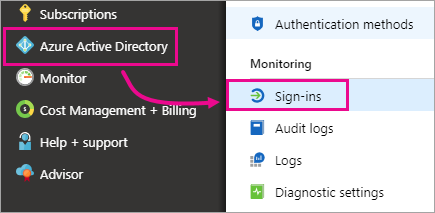
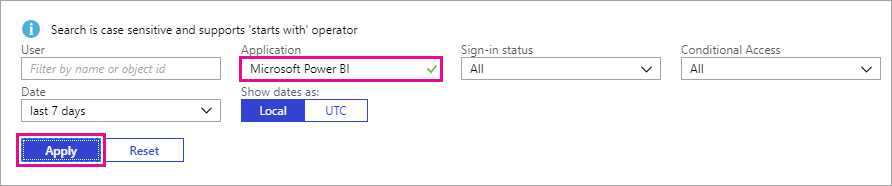

# Find Power BI users that have signed in

If you are a tenant admin, and want to see who has signed into Power BI, use the [Azure Active Directory access and usage reports](/azure/active-directory/reports-monitoring/concept-sign-ins) to gain visibility.

<iframe width="640" height="360" src="https://www.youtube.com/embed/1AVgh9w9VM8?showinfo=0" frameborder="0" allowfullscreen></iframe>

> [!NOTE]
> The activity report provides useful information, but it doesn't identify the type of license each user has. Use the Office 365 admin center to view licenses.

## Requirements

Any user (including non-admins) can see a report of their own sign-ins, but you must meet the following requirements to see a report for all users.

* Your tenant must have an Azure AD Premium license associated with it.

* You must be in one of the following roles: Global Admin, Security Admin, or Security Reader.

## Use the Azure portal to view sign-ins

To view sign-in activity, follow these steps.

1. In the **Azure portal**, select **Azure Active Directory**.

1. Under **Monitoring**, select **Sign-ins**.
   
    

1. Filter the application by either **Microsoft Power BI** or **Power BI Gateway**, and select **Apply**.

    **Microsoft Power BI** filters to sign-in activity related to the service, whereas **Power BI Gateway** filters to sign-in activity specific to the On-premises data gateway.
   
    

## Export the data

You have two options to export the sign-in data: download a csv file, or use PowerShell. At the top of the sign-in report, select one of the following options:

* **Download** to download a csv file for the currently filtered data.

* **Script** to download a PowerShell script for the currently filtered data. You can update the filter in the script as necessary.

## Data retention

Sign-in related data is available for up to 30 days. For more information, see [Azure Active Directory report retention policies](/azure/active-directory/reports-monitoring/reference-reports-data-retention).

## Next steps

[Using auditing within your organization](service-admin-auditing.md)

More questions? [Try asking the Power BI Community](https://community.powerbi.com/)

