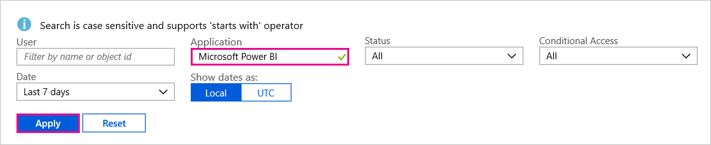

# Find Power BI users that have signed in
If you are a tenant admin, and want to see who has signed into Power BI, you can use the Azure Active Directory access and usage reports to gain visibility.

<iframe width="640" height="360" src="https://www.youtube.com/embed/1AVgh9w9VM8?showinfo=0" frameborder="0" allowfullscreen></iframe>

You can access the activity report within the [new](https://docs.microsoft.com/azure/active-directory/active-directory-reporting-activity-sign-ins) and the [classic](https://docs.microsoft.com/azure/active-directory/active-directory-view-access-usage-reports) Azure Active Directory (Azure AD) portals. While the video above uses the classic portal as an example, this article will highlight the new portal.

> [!NOTE]
> This activity report includes both Power BI (Free) and Pro users but does not identify them by which license they have.
> 
> 

## Requirements
The following are requirements to view the sign-in activity report.

* Users in the Global Admin, Security Admin or Security Reader role can access the access the data.
* Any user (non-admins) can access their own sign-ins.
* Your tenant must have an Azure AD Premium license associated with it to see the all up sign-in activity report.

## Using the Azure portal to view sign-ins
You can use the Azure AD portal to view sign-in activity.

1. Browse to the **Azure portal** and select **Azure Active Directory**.
2. Under **Activity**, select **Sign-ins**.
   
    
3. Filter the application by either **Microsoft Power BI** or **Power BI Gateway** and select **Apply**.
   
    **Microsoft Power BI** is for sign-in activity related to the service whereas **Power BI Gateway** are specific sign-ins for the On-premises data gateway.
   
    

## Export the data
You have two options to export the sign-in data. This can be done by either downloading a csv file or you can use PowerShell.

### Download csv
Within the Activity screen, you can select **Download** in the toolbar. This will download a csv file for the currently filtered data.

### PowerShell
You can use PowerShell to export the sign-in data. A [sample](https://docs.microsoft.com/azure/active-directory/active-directory-reporting-api-sign-in-activity-samples#powershell-script) is available within the Azure AD documentation.

> [!NOTE]
> For the PowerShell sample to work, be sure to follow the [prerequisites to access the Azure AD reporting API](https://docs.microsoft.com/en-us/azure/active-directory/active-directory-reporting-api-prerequisites).
> 
> 

## Data retention
Sign-in related data can be available for up to 30 days. For more information, see [Azure Active Directory report retention policies](https://docs.microsoft.com/azure/active-directory/active-directory-reporting-retention).

## Next steps
[Sign-in activity reports in the Azure Active Directory portal (New Portal)](https://docs.microsoft.com/azure/active-directory/active-directory-reporting-activity-sign-ins)  
[View your access and usage reports (Classic Portal)](https://docs.microsoft.com/azure/active-directory/active-directory-view-access-usage-reports#view-or-download-a-report)  
[Sign-in sample PowerShell script](https://docs.microsoft.com/azure/active-directory/active-directory-reporting-api-sign-in-activity-samples#powershell-script)  
[Azure Active Directory report retention policies](https://docs.microsoft.com/azure/active-directory/active-directory-reporting-retention)  
[Using auditing within your organization](service-admin-auditing.md)  
[Extended Pro Trial activation](service-extended-pro-trial.md)

More questions? [Try asking the Power BI Community](https://community.powerbi.com/)

