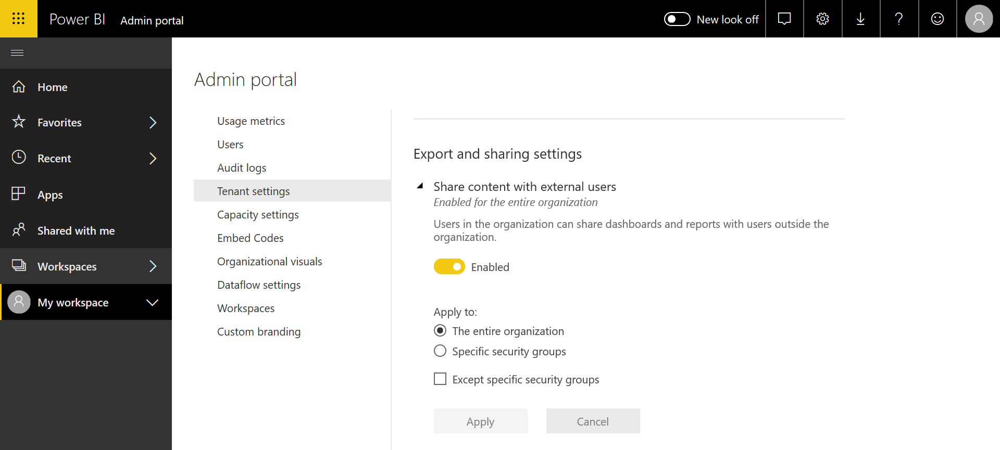

# What is Power BI administration?

Power BI administration is the management of a Power BI tenant, including the configuration of governance policies, usage monitoring, and provisioning of licenses, capacities, and organizational resources. This article provides an overview of administration roles, tasks, and tools; and links to articles that go into more detail.

Power BI is designed for self-service business intelligence, and the administrator is the guardian of data, processes, and policies in the Power BI tenant. A Power BI administrator is a key member of a team that includes BI developers, analysts, and other roles. The administrator can help support an organization to make sure that critical goals are met:

- Understand the KPIs and metrics that users _actually_ need
- Decrease the time to delivery for IT-led corporate reporting
- Increase adoption and return on investment from a Power BI deployment

The job is to make business users productive and ensure security and compliance with laws and regulations. Responsibilities may include help and support and, in many cases, assisting business users to do the right thing.

## Administrator roles related to Power BI

There are several roles related to Power BI administration, which are covered in the following table.

| **Type of administrator** | **Administrative scope** | **Power BI scope** |
| --- | --- | --- |
| Office 365 Global Administrator | Office 365 | Can manage all aspects of a Power BI tenant and other services. |
| Office 365 Billing Administrator | Office 365 | Can acquire Power BI licenses through Office 365 subscriptions. |
| Power BI Service Administrator | Power BI tenant | Has full control over a Power BI tenant and its administrative features (except for licensing). |
| Power BI Premium Capacity Administrator | A single Premium capacity | Has full control over a premium capacity and its administrative features. |
| Power BI Embedded Capacity Administrator | A single Embedded capacity | Has full control over an embedded capacity and its administrative features. |

Global Administrators in Office 365 or Azure Active Directory have administrator rights in Power BI. An Office 365 Global Administrator can assign other users to the Power BI Service Administrator role, which grants administrative rights over Power BI features only.

Power BI Service Administrators have access to the Power BI admin portal which includes various tenant-level settings regarding functionality, security, and monitoring. Service Administrators have full access to all resources of a Power BI tenant. In most cases, Service Administrators identify issues and then follow up with the resource owners to take corrective actions.

The Power BI Service Administrator role does not grant the ability to assign licenses to users or view audit logs in Office 365. Therefore, the task of administering Power BI cannot currently be performed by users who are solely members of the Power BI Service Administrator role.

## Administrative tasks

Administrators perform many tasks to support the Power BI tenant for their organization, which are covered in the following table.

| **Task area** | **Typical tasks** |
| --- | --- |
| Manage the Power BI tenant |<ul><li>Enable and disable key Power BI features <li>Report on usage and performance <li>Review and manage auditing of events</ul>|
| Acquire and assign Power BI licenses |<ul><li>Manage user signup <li>Purchase and assign Pro licenses <li>Block users from accessing Power BI</ul>|
| Manage Premium capacity |<ul><li>Acquire and work with Premium capacity <li>Ensure quality of service|
| Manage Embedded capacity |<ul><li>Acquire Embedded capacity to simplify how ISVs and developers use Power BI capabilities</ul>|
| Ensure compliance with internal policies, laws, and regulations | <ul><li>Manage classification of business data <li>Help to enforce content publishing and sharing policies</ul>|
| Manage Power BI resources |<ul><li>Manage workspaces <li>Publish custom visuals <li>Verify codes used to embed Power BI in other applications|
| Provide help and support to tenant users |<ul><li>Troubleshoot data access and other issues</ul>|
| Other tasks |<ul><li>Deploy Power BI Desktop, e.g. using System Center Configuration Manager <li>Manage Power BI mobile app deployment with Intune <li>Manage data privacy and security, such as source data security</ul>|

## Administrative tools

There are several tools related to Power BI administration, which are covered in the following table. Administrators typically spend most of their time in the Power BI Admin portal and use other tools as necessary.

| **Tool** | **Typical tasks** |
| --- | --- |
| Power BI Admin portal |<ul><li>Acquire and work with Premium capacity</li><li>Ensure quality of service</li><li>Manage classification of business data</li><li>Help to enforce content publishing and sharing policies</li><li>Manage workspaces <li>Publish custom visuals</li><li>Verify codes used to embed Power BI in other applications</li><li>Troubleshoot data access and other issues</li></ul>|
| Office 365 Admin Center |<ul><li>Manage user signup</li><li>Purchase and assign Pro licenses</li><li>Block users from accessing Power BI</li></ul>|
| Office 365 Security & Compliance Center |<ul><li>Review and manage auditing of events</li></ul>|
| Azure Active Directory (AAD) in the Azure portal |<ul><li>Configure conditional access to Power BI resources through AAD</li><li>Provision Power BI Embedded capacity</li></ul>|
| PowerShell cmdlets |<ul><li>Manage workspaces and other aspects of Power BI through scripts</li></ul>|
| Administrative APIs and SDK |<ul><li>Build custom administrative tools to facilitate the work of a Power BI admin. For example, Power BI Desktop can use these APIs to build reports based on data related to administration</li></ul>|

## Next steps

We hope this article gave you some quick insights into the job of the Power BI administrator, and the specific roles, tasks, and tools that are involved. We recommend the follow articles topics to deepen your understanding.

[Use the Power BI admin portal](service-admin-portal.md)

[Use PowerShell cmdlets](/powershell/power-bi/overview?toc=%2Fen-us%2Fpower-bi%2FTOC.json&bc=%2Fen-us%2Fpower-bi%2Fbreadcrumb%2Ftoc.json&view=powerbi-ps)

[Power BI administration FAQ](service-admin-faq.md)

More questions? [Try asking the Power BI Community](http://community.powerbi.com/)