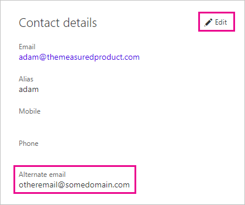

# Using an alternate email address

When you sign up for Power BI, you provide an email address. By default, Power BI uses this address to send you updates about activity in the service. For example, when someone sends you a sharing invitation, it goes to this address.

In some cases, you might want these emails delivered to an alternate email address rather than the one you signed up with. This article explains how to specify an alternate address in Office 365 and in PowerShell. The article also explains how an email address is resolved in Azure Active Directory (Azure AD).

> [!NOTE]
> Specifying an alternate address doesn't affect which email address Power BI uses for service updates, newsletters, and other promotional communications.  Those communications are always be sent to the email address you used when you signed up for Power BI.

## Use Office 365

To specify an alternate address in Office 365, follow these steps.

1. Open the [Office 365 personal info page](https://portal.office.com/account/#personalinfo). If you are prompted to, sign in with the email address and password you use for Power BI.

1. On the left menu, select **Personal info**.

1. In the **Contact details** section, select **Edit**.

    If you cannot edit your details, this means your email address is managed by your Office 365 administrator. Contact your administrator to update your email address.

    

1. In the **Alternate email** field, enter the email address you would like Power BI updates to be sent to.

## Use PowerShell

To specify an alternate address in PowerShell, use the [Set-AzureADUser](/powershell/module/azuread/set-azureaduser/) command.

```powershell
Set-AzureADUser -ObjectId john@contoso.com -OtherMails "otheremail@somedomain.com"
```

## Email address resolution in Azure AD

When capturing an Azure AD embed token for Power BI, you can use three different types of email:

* The main email address that is associated with a user’s Azure AD account

* The UserPrincipalName (UPN) email address

* The *other email address* array attribute

Power BI selects which email to use based on the following sequence:

1. If the mail attribute in the Azure AD user object is present, then Power BI uses that mail attribute for the email address.

1. If the UPN email is *not* a **\*.onmicrosoft.com** domain email address (the information after the "\@" symbol), then Power BI uses that mail attribute for the email address.

1. If the *other email address* array attribute in the Azure AD user object is present, then the first email in that list (since there can be a list of emails in this attribute) is used.

1. If none of the above conditions are present, then the UPN address is used.

More questions? [Try the Power BI Community](http://community.powerbi.com/)

