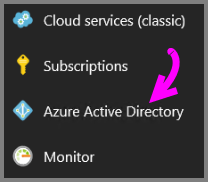
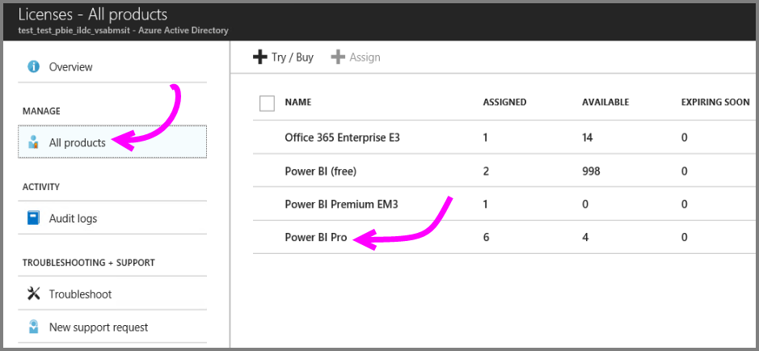
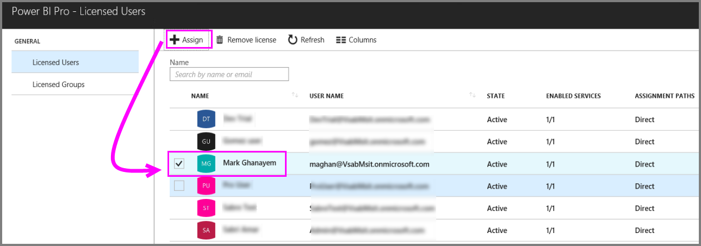
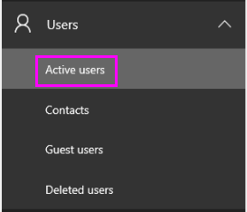
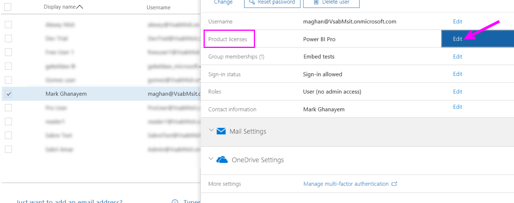
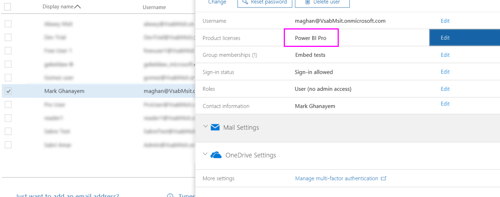

# Assigning Power BI Pro licenses

Administrators can choose from a variety of management portals and PowerShell cmdlets to assign Power BI Pro licenses to users. Power BI license management is backed by Azure Active Directory (Azure AD).

* Azure subscription owners can use the Azure Active Directory blade in the [Azure Portal](https://ms.portal.azure.com/#@microsoft.onmicrosoft.com/dashboard/private/39bc3cf7-31a4-43f6-954c-f2d69ca2f0). 

* Global admins and User Account administrators can use the [Office 365 admin center](https://portal.office.com/AdminPortal/Home#/homepage).

## Managing Power BI Pro licenses in the Azure Portal

Power BI uses Azure AD as a foundational service. Azure AD stores user accounts and groups, while storing other settings such as information about purchased products.

### Assigning licenses to individual user accounts

Follow these steps to assign Pro licenses to individual user accounts if you are an Azure subscription owner:

1. Navigate to the [Azure Portal](https://ms.portal.azure.com/#@microsoft.onmicrosoft.com/dashboard/private/39bc3cf7-31a4-43f6-954c-f2d69ca2f0). 

2. In the left navigation bar, click on Azure Active Directory.

    

3. On the Azure Active Directory blade, click on Licenses.

    

4. On the Licenses blade, click on All products then click on Power BI Pro to display the list of licensed users.

    

5. Click on Assign to add a Power BI Pro license to an additional user account.

    

> [!NOTE]
> While most licensing aspects can be managed, it is not possible to purchase Power BI Pro licenses in the Azure Portal. Use Office 365 admin center to purchase a Power BI Pro subscription. For more information, see [Purchasing Power BI Pro](https://docs.microsoft.com/en-us/power-bi/service-admin-purchasing-power-bi-pro).
>

## Managing Power BI Pro licenses in the Office 365 admin center

If you are a global administrator then the Office 365 admin center is where you purchase a Power BI Pro subscription and manage the associated licenses for the organization.

Follow these steps to assign Pro licenses to individual user accounts if you are an Office 365 admin:

1. Navigate to the Office 365 admin center.

2. On the left navigation pane, expand Users, and then click on Active users.

    

3. Select one or multiple users and then click on Edit product licenses.

    

4. Under Power BI Pro, toggle the setting to On then click Save.

    

5. Verify under Status for the selected account(s) that the Power BI Pro license has been assigned successfully.

    

> [!NOTE]
> If your subscription has run out of licenses, add more by expanding Billing in the left navigation pane and then clicking on Subscriptions. On the Subscriptions page, select the Power BI Pro subscription, and then click on Add/Remove licenses.
>

## Next steps
[Extended Pro Trial activation](service-extended-pro-trial.md)
 
[Power BI Service agreement for individual users](https://powerbi.microsoft.com/terms-of-service/)
 
[Power BI Premium announcement](https://aka.ms/pbipremium-announcement)
 
[Find Power BI users that have signed in](service-admin-access-usage.md)

More questions? [Try asking the Power BI Community](https://community.powerbi.com/)