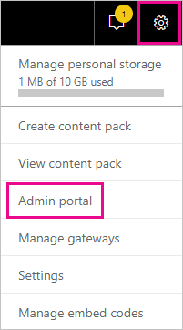
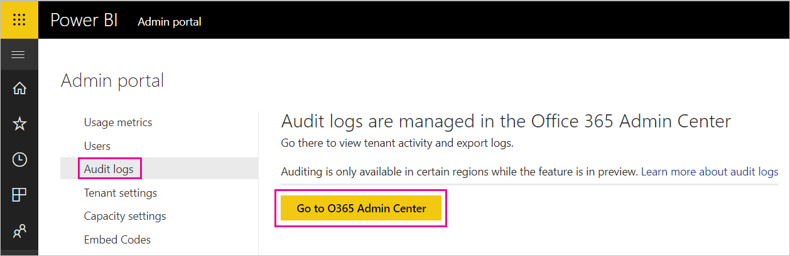
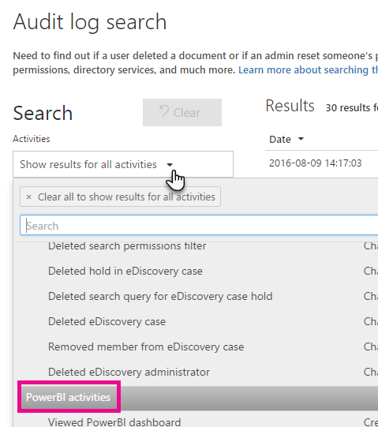
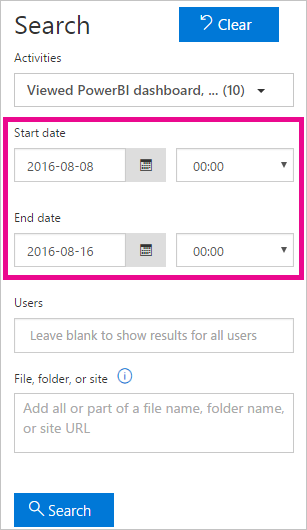
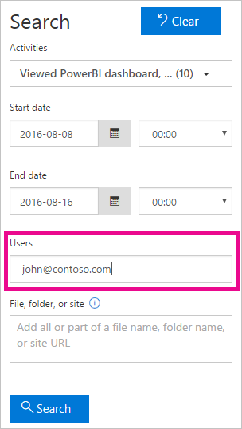
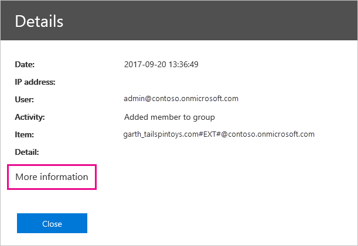
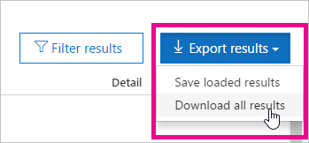

# Using auditing within your organization

Knowing who is taking what action on which item in your Power BI tenant can be critical in helping your organization fulfill its requirements, such as meeting regulatory compliance and records management. Use Power BI auditing to audit actions performed by users, such as "View Report" and "View Dashboard". You cannot use auditing to audit permissions.

You work with auditing in the Office 365 Security and Compliance Center or use PowerShell. We cover both in this article. You can filter the audit data by date range, user, dashboard, report, dataset and activity type. You can also download the activities in a csv (comma separated value) file to analyze offline.

## Requirements

You must meet these requirements to access audit logs:

- To access the auditing section of the Office 365 Security & Compliance Center, you must have an Exchange Online license (included with Office 365 Enterprise E3 and E5 subscriptions).

- You must either be a global admin or have an Exchange admin role that provides access to the audit log. Exchange admin roles are controlled through the Exchange admin center. For more information, see [Permissions in Exchange Online](/exchange/permissions-exo/permissions-exo/).

- If you have access to the audit log but are not a global admin or Power BI Service admin, you will not have access to the Power BI Admin portal. In this case, you must get a direct link to the [Office 365 Security & Compliance Center](https://sip.protection.office.com/#/unifiedauditlog).

- To view audit logs for Power BI in your tenant, you need at least one exchange mailbox license in your tenant.

## Accessing your audit logs

To access logs, first make sure that logging is enabled in Power BI. For more information, see [Audit logs](service-admin-portal.md#audit-logs) in the admin portal documentation. There can be up to a 48 hour delay between enabling auditing and being able to view audit data. If you don't see data immediately, check the audit logs later. There can be a similar delay between getting permission to view audit logs and being able to access the logs.

The Power BI audit logs are available directly through the [Office 365 Security & Compliance Center](https://sip.protection.office.com/#/unifiedauditlog). There is also a link from the Power BI admin portal:

1. In Power BI, select the **gear icon** in the upper right, then select **Admin portal**.

   

1. Select **Audit logs**.

1. Select **Go to O365 Admin Center**.

   

To provide non-administrator accounts with access to the audit log, you must assign permissions within the Exchange Online Admin Center. For example, you could assign a user to an existing role group, such as Organization Management, or you could create a new role group with the Audit Logs role. For more information, see [Permissions in Exchange Online](/exchange/permissions-exo/permissions-exo/).

## Search only Power BI activities

Restrict results to only Power BI activities by following these steps. For a list of activities, see the [list of activities audited by Power BI](#list-of-activities-audited-by-power-bi) later in this article.

1. On the **Audit log search** page, under **Search**, select the drop down for **Activities**.

2. Select **Power BI activities**.

   

3. Select anywhere outside of the selection box to close it.

Your searches will now be filtered to only Power BI activities.

## Search the audit logs by date

You can search the logs by date range using the **Start date** and **End date** fields. The last seven days are selected by default. The date and time are presented in Coordinated Universal Time (UTC) format. The maximum date range that you can specify is 90 days. 

An error is displayed if the selected date range is greater than 90 days. If you're using the maximum date range of 90 days, select the current time for **Start date**. Otherwise, you'll receive an error saying that the start date is earlier than the end date. If you've turned on auditing within the last 90 days, the date range can't start before the date that auditing was turned on.



## Search the audit logs by users

You can search for audit log entries for activities performed by specific users. To do this, enter one or more user names in the **Users** field. The user name looks like an email address; it's the account that users log into Power BI with. Leave this box blank to return entries for all users (and service accounts) in your organization.



## View search results

After you select **Search**, the search results are loaded and after a few moments they are displayed under **Results**. When the search is finished, the number of results found is displayed. A maximum of 1000 events is displayed, If more than 1000 events meet the search criteria, the newest 1000 events are displayed.

### View the main results

The **Results** area contains the following information for each event returned by the search. Select a column header under **Results** to sort the results.

| **Column** | **Definition** |
| --- | --- |
| Date |The date and time (in UTC format) when the event occurred. |
| IP address |The IP address of the device that was used when the activity was logged. The IP address is displayed in either an IPv4 or IPv6 address format. |
| User |The user (or service account) who performed the action that triggered the event. |
| Activity |The activity performed by the user. This value corresponds to the activities that you selected in the **Activities** drop down list. For an event from the Exchange admin audit log, the value in this column is an Exchange cmdlet. |
| Item |The object that was created or modified as a result of the corresponding activity. For example, the file that was viewed or modified, or the user account that was updated. Not all activities have a value in this column. |
| Detail |Additional detail about an activity. Again, not all activities will have a value. |

### View the details for an event

You can view more details about an event by clicking the event record in the list of search results. A **Details** page is displayed that contains the detailed properties from the event record. The properties that are displayed depend on the Office 365 service in which the event occurs. 

To display these details, select **More information**. All Power BI entries have a value of 20 for the RecordType property. For information about other properties, see [Detailed properties in the audit log](/office365/securitycompliance/detailed-properties-in-the-office-365-audit-log/).

   

## Export search results

To export the Power BI audit log to a csv file, follow these steps.

1. Select **Export results**.

1. Select either **Save loaded results** or **Download all results**.

    

## Use PowerShell to search audit logs

You can also use PowerShell to access the audit logs based on your login. The following example shows how to use the [Search-UnifiedAuditLog](/powershell/module/exchange/policy-and-compliance-audit/search-unifiedauditlog?view=exchange-ps/) command to pull Power BI audit log entries.

To use the [New-PSSession](/powershell/module/microsoft.powershell.core/new-pssession/) command, your account must have an Exchange Online license assigned to it, and you need access to the audit log for your tenant. For more information on connecting to Exchange Online, see [Connect to Exchange Online PowerShell](/powershell/exchange/exchange-online/connect-to-exchange-online-powershell/connect-to-exchange-online-powershell/).

```powershell
Set-ExecutionPolicy RemoteSigned

$UserCredential = Get-Credential

$Session = New-PSSession -ConfigurationName Microsoft.Exchange -ConnectionUri https://outlook.office365.com/powershell-liveid/ -Credential $UserCredential -Authentication Basic -AllowRedirection

Import-PSSession $Session
Search-UnifiedAuditLog -StartDate 9/11/2018 -EndDate 9/15/2018 -RecordType PowerBI -ResultSize 1000 | Format-Table | More
```

For another example of using PowerShell with audit logs, see [Using Power BI audit log and PowerShell to assign Power BI Pro licenses](https://powerbi.microsoft.com/blog/using-power-bi-audit-log-and-powershell-to-assign-power-bi-pro-licenses/).

## Activities audited by Power BI

The following activities are audited by Power BI.

* AddDatasourceToGateway
* AddGroupMembers
* AnalyzedByExternalApplication
* AnalyzeInExcel
* AttachDataflowStorageAccount
* BindToGateway
* ChangeCapacityState
* ChangeGatewayAdministrators
* ChangeGatewayDatasourceUsers
* CreateApp
* CreateDashboard
* CreateDataflow
* CreateDataset
* CreateEmailSubscription
* CreateFolder
* CreateGateway
* CreateGroup
* CreateOrgApp
* CreateReport
* DeleteComment
* DeleteDashboard
* DeleteDataflow
* DeleteDataset
* DeleteEmailSubscription
* DeleteFolder
* DeleteGateway
* DeleteGroup
* DeleteGroupMembers
* DeleteOrgApp
* DeleteReport
* DownloadReport
* EditDataset
* EditReport
* ExportDataflow
* ExportReport
* ExportTile
* GenerateDataflowSasToken
* GenerateEmbedToken
* GetDatasources
* Import
* InstallApp
* MigrateWorkspaceIntoCapacity
* OptInForProTrial
* PostComment
* PrintDashboard
* PrintReport
* PublishToWebReport
* RefreshDataset
* RemoveDatasourceFromGateway
* RemoveWorkspacesFromCapacity
* RenameDashboard
* SetAllConnections
* SetScheduledRefresh
* SetScheduledRefreshOnDataflow
* ShareDashboard
* ShareReport
* TakeOverDataset
* TakeOverDatasource
* UnpublishApp
* UpdateApp
* UpdateCapacityAdmins
* UpdateCapacityDisplayName
* UpdateCapacityResourceGovernanceSettings
* UpdateCapacityUsersAssignment
* UpdatedAdminFeatureSwitch
* UpdateDataflow
* UpdateDatasetParameters
* UpdateDatasourceCredentials
* UpdateDatasources
* UpdateEmailSubscription
* UpdateFolder
* UpdateFolderAccess
* ViewDashboard
* ViewDataflow
* ViewReport
* ViewTile
* ViewUsageMetrics

## Next steps

[What is Power BI administration?](service-admin-administering-power-bi-in-your-organization.md)  

[Power BI Admin Portal](service-admin-portal.md)  

More questions? [Try asking the Power BI Community](http://community.powerbi.com/)
