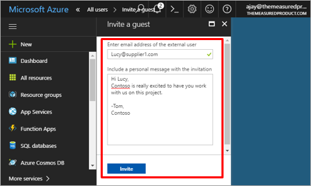
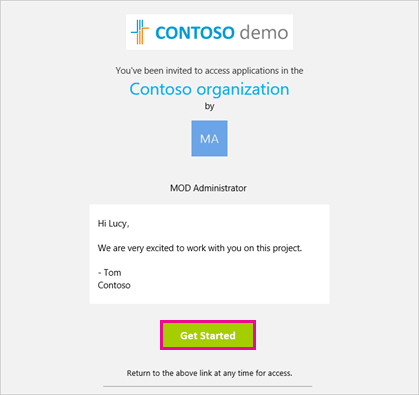
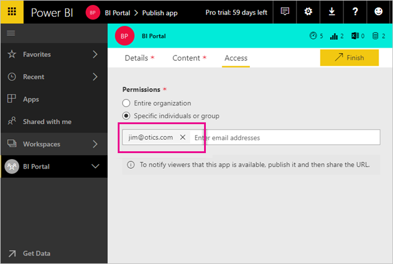
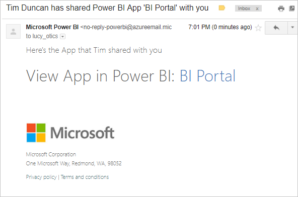
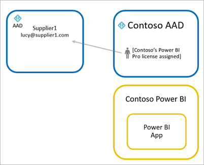
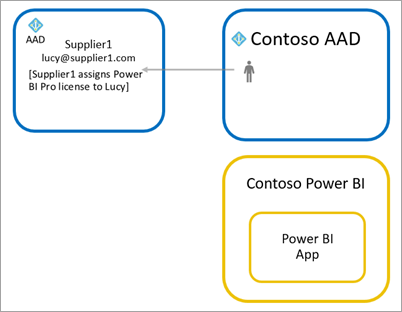
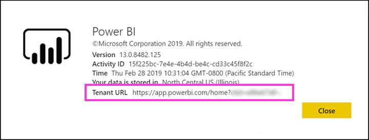

# Distribute Power BI content to external guest users with Azure AD B2B

Power BI integrates with Azure Active Directory business-to-business (Azure AD B2B) to allow secure distribution of Power BI content to guest users outside your organization, while still maintaining control over the internal data.  

Additionally, you can allow guest users outside your organization to edit and manage content within your organization.

## Enable access

Make sure the [Share content with external users](service-admin-portal.md#export-and-sharing-settings) feature is enabled in the Power BI admin portal before inviting guest users.

You can also use the [Allow external guest users to edit and manage content in the organization](service-admin-portal.md#export-and-sharing-settings) feature. It lets you select which guest user can see and create content in workspaces, including browsing your organization's Power BI.

## Who can you invite?

You can invite guest users with any email address, including personal accounts like gmail.com, outlook.com, and hotmail.com. In Azure AD B2B, these addresses are called *social identities*.

## Invite guest users

Invitations are required only for the first time an external guest user is invited to your organization. There are two ways to invite users: planned invites and unplanned invites.

### Planned invites

Use a planned invite if you know which users to invite. You can send the invite using the Azure portal or PowerShell. You must be a tenant admin to unplanned people.

Follow these steps to send an invite in the Azure portal.

1. In the [Azure portal](https://portal.azure.com), select **Azure Active Directory**.

1. Under **Manage**, go to **Users** > **All users** > **New guest user**.

    

1. Enter an **email address** and **personal message**.

    

1. Select **Invite**.

To invite more than one guest user, use PowerShell. For more information, see [Azure AD B2B collaboration code and PowerShell samples](/azure/active-directory/b2b/code-samples/).

The guest user needs to select **Get Started** in the email invitation they receive. The guest user is then added to the tenant.

### Unplanned invites

To invite an external user at any time, add them to your dashboard or report through the share UI, or your app through the access page. Here is an example of what to do when inviting an external user to use an app.

The guest user will receive an email indicating that the app has been shared with them.

The guest user must sign in with their organization email address. They'll be prompted to accept the invitation after signing in. After sign in, the guest user is redirected to the app content. To return to the app, they can bookmark the link or save the email.

## Licensing

The guest user must have the proper licensing in place to view the content that was shared. There are three ways to make sure the user has a proper license: use Power BI Premium, assign a Power BI Pro license, or use the guest's Power BI Pro license.

When using the [Allow external guest users to edit and manage content in the organization](service-admin-portal.md#export-and-sharing-settings) feature, guest users contributing content to workspaces or sharing content with others require a Power BI Pro license.

### Use Power BI Premium

Assigning the app workspace to [Power BI Premium capacity](service-premium-what-is.md) lets the guest user to use the app without requiring a Power BI Pro license. Power BI Premium also lets apps to take advantage of other capabilities like increased refresh rates, dedicated capacity, and large model sizes.

### Assign a Power BI Pro license to guest user

Assigning a Power BI Pro license to the guest user, within your tenant, lets that guest user to view content in the tenant.

### Guest user brings their own Power BI Pro license

The guest user already has a Power BI Pro license assigned within their tenant.

## Guest users who can edit and manage content 

When using the [Allow external guest users to edit and manage content in the organization](service-admin-portal.md#export-and-sharing-settings), the specified guest users get access to your organization's Power BI and see any content to which they have permission. They can access Home, browse workspaces, install apps that where they are on the access list, and contribute content to workspaces. They can create or be an Admin of workspaces that use the new workspace experience. Some limitations apply and are listed in the Considerations and Limitations section.

To help these users login to Power BI, provide them with the Tenant URL. To find the tenant URL, follow these steps.

1. In the Power BI service, in the top menu, select help (**?**) then **About Power BI**.

2. Look for the value next to **Tenant URL**. This is the tenant URL you can share with your guest users.

## Considerations and Limitations

* By default, External B2B guests are limited to consumption of content only. External B2B guests can view apps, dashboards, reports, export data and create email subscriptions for dashboards and reports. They can't access workspaces or publish their own content. However, these restrictions do not apply to guest users who are allowed through the [Allow external guest users to edit and manage content in the organization](service-admin-portal.md#export-and-sharing-settings) tenant setting.

* For guest users users enabled through the [Allow external guest users to edit and manage content in the organization](service-admin-portal.md#export-and-sharing-settings) tenant setting, some experiences are not available to them. To update or publish reports, they need to use the Power BI service web UI, including Get Data to upload Power BI Desktop files.  The following experiences are not supported:
    * Direct publishing from Power BI desktop to the Power BI service
    * Guest users cannot use Power BI desktop to connect to service datasets in the Power BI service
    * Classic workspaces tied to Office 365 Groups: Guest user cannot create or be Admins of these workspaces. They can be members.
    * Sending unplanned invites is not supported for workspace access lists
    * Power BI Publisher for Excel is not supported for guest users
    * Guest users cannot install a Power BI Gateway and connect it to your organization
    * Guest users cannot install apps publish to the entire organization
    * Guest users cannot use, create, update, or install organizational content packs
    * Guest users cannot use Analyze in Excel
    * Guest users cannot be @mentioned in commenting
    * Guest users cannot use subscriptions
    * Guest users who use this capability should have a work or school account. Guest users using Personal accounts will experience more limitations due ot sign-in restrictions.

* This feature is not currently available with the Power BI SharePoint Online report web part.

* There are Active Directory Settings that can limit what external guest users can do within your overall organization and that also apply to your Power BI environment. The following documentation discusses the settings:
    * [Manage External Collaboration Settings](https://docs.microsoft.com/azure/active-directory/b2b/delegate-invitations#control-who-can-invite)
    * [Allow or block invitations to B2B users from specific organizations](https://docs.microsoft.com/azure/active-directory/b2b/allow-deny-list)  

## Next steps

For more detailed information, including how row-level security works, check out the whitepaper: [Distribute Power BI content to external guest users using Azure AD B2B](https://aka.ms/powerbi-b2b-whitepaper).

For information regarding Azure AD B2B, see [What is Azure AD B2B collaboration?](/azure/active-directory/active-directory-b2b-what-is-azure-ad-b2b/).
