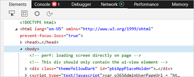
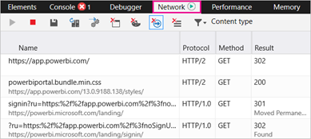
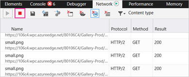
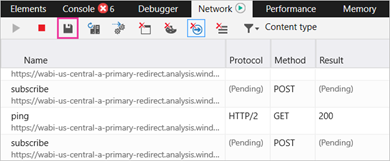

# Capture additional diagnostic information

## CaptureAdditional Diagnostic Information for Power BI

These instructions provide two potential options for manually collecting additional diagnostic information from the Power BI web client. You only need to follow one of the options.

## Network Capture - Microsoft Edge & Internet Explorer

1. Browse to [Power BI](https://app.powerbi.com) with Microsoft Edge or Internet Explorer.

1. Press **F12** to open the Microsoft Edge developer tools.

   

1. Select the **Network** tab. It will list traffic it has already captured.

   

    You can:

    * Browse within the window and reproduce any problem you may come across.

    * Hide and show the developer tools window at any time during the session by pressing F12.

1. To stop profiling the session, you can select the red square on the **Network** tab of the developer tools area.

   

1. Select on the diskette icon to export the data as an HTTP Archive (HAR) file.

   

1. Provide a file name and save the HAR file.

    The HAR file will contain all the information about network requests between the browser window and Power BI including:

    * The activity IDs for each request.

    * The precise timestamp for each request.

    * Any error information returned to the client.

    This trace will also contain the data used to populate the visuals shown on the screen.

1. You can provide the HAR file to support for review.

More questions? [Try asking the Power BI Community](http://community.powerbi.com/)