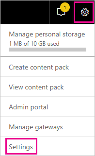
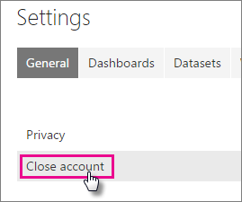
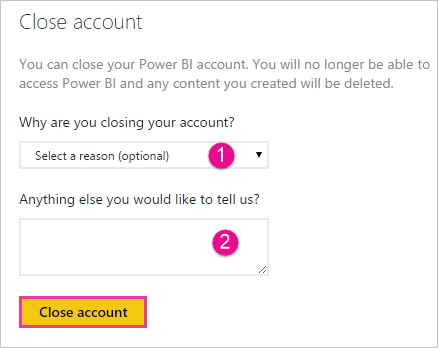

# Closing your Power BI Account

If you don't want to use Power BI any longer, you can close your Power BI account.  After your account is closed, you can no longer sign in to Power BI. Any customer data you uploaded or created in Power BI is deleted, according to the data retention policy in the Power BI Terms of Service.

## Individual Power BI users

If you signed up for Power BI as an individual, you can close your account from the **Settings** screen.

1. In Power BI, select the gear in the upper right, then select **Settings**.

    

1. On the **General** tab, select **Close Account**.

    

1. Select a reason for closing the account (1). You can also provide further information (2). Then select **Close account**.

    

1. Confirm that you want to close your account.

    

    You should see a confirmation that your account is closed. You can reopen your account from here if necessary.

    

## Managed tenant users

If your organization signed you up for Power BI, contact your tenant admin. Ask them to unassign the license from your account.

More questions? [Try asking the Power BI Community](http://community.powerbi.com/)