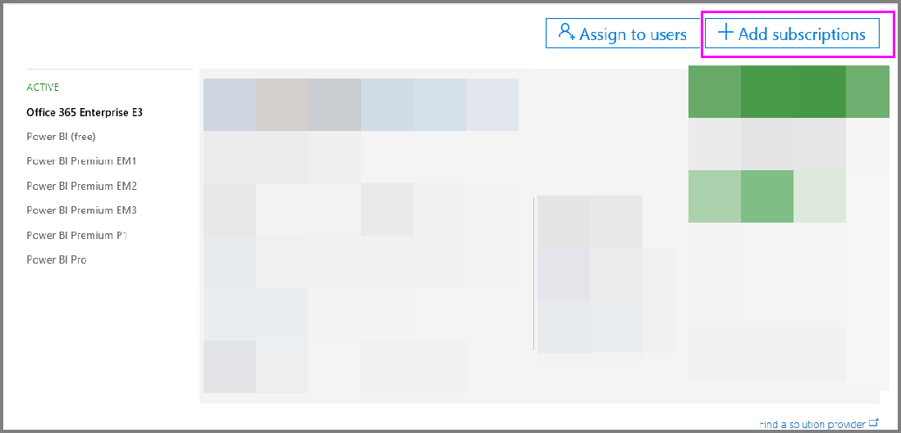
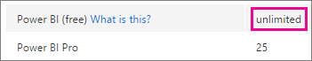
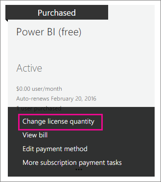

# Power BI licensing in your organization

[!INCLUDE [license-capabilities](includes/license-capabilities.md)]

This article focuses on per-user licensing from an administrator perspective.

## Manage Power BI Pro licenses

As an administrator, you can purchase and assign Power BI Pro licenses; and you can sign up for a Power BI Pro trial for your organization. Individuals can also sign up for a Power BI Pro trial.

### Purchasing Power BI Pro

You purchase Power BI Pro licenses through Microsoft Office 365 or through a certified Microsoft partner. After you purchase the licenses, you assign them to individual users. For more information, see [Purchase and assign Power BI Pro licenses](service-admin-purchasing-power-bi-pro.md).

### Power BI Pro trial for individuals

Individuals in your organization can sign up for a Power BI Pro trial. For more information, see [Signing up for Power BI as an individual](service-self-service-signup-for-power-bi.md).

Users who take advantage of the in-product Power BI Pro trial do not appear in the Office 365 admin portal as Power BI Pro Trial users (they appear as Power BI free users). They do, however, show up as Power BI Pro Trial users in the manage storage page in Power BI.

### Power BI Pro trial for organizations

If you want to acquire and deploy Power BI trial licenses to multiple users in your organization without users accepting trial terms individually, sign up for a Power BI Pro trial for your organization.

Keep the following in mind before you follow the steps to sign up:

* To sign up, you must be a member of the [**Global administrator** or **Billing administrator**](https://support.office.com/article/about-office-365-admin-roles-da585eea-f576-4f55-a1e0-87090b6aaa9d?ui=en-US&rs=en-US&ad=US) role in Office 365.

* There is a limit of one organizational trial per tenant. This means that if someone has already applied the Power BI Pro Trial to your tenant, you cannot do it again. If you need assistance with this, contact [Office 365 Billing support](https://support.office.microsoft.com/article/contact-support-for-business-products-admin-help-32a17ca7-6fa0-4870-8a8d-e25ba4ccfd4b?CorrelationId=552bbf37-214f-4202-80cb-b94240dcd671&ui=en-US&rs=en-US&ad=US).

1. Navigate to the [Office 365 admin center](https://portal.office.com/adminportal/home#/homepage).

1. On the left navigation pane, select **Billing** then **Subscriptions**.

   

1. On the right side, select **Add subscriptions**.

   

1. Under **Other Plans**, hover over the ellipsis (**. . .**) for Power BI Pro and select **Start free trial**.

    

1. On the order confirmation screen, select **Try now**.

1. On the order receipt, select **Continue**.

Now you can [assign licenses in Office 365](https://support.office.com/article/assign-licenses-to-users-in-office-365-for-business-997596b5-4173-4627-b915-36abac6786dc).

## Manage Power BI free licenses

Users within your organization can gain access to Power BI free licenses in two different ways:

* You can assign a Power BI license to them within the Office 365 admin portal.

* If a user [signs up for a Power BI Pro trial](service-self-service-signup-for-power-bi.md) and the trial expires, they are assigned a free license.

### Requesting and assigning free licenses

If you plan to manage license requests and assignments centrally, first check whether you already have the unlimited Power BI (free) license block.

This block of licenses is available after the first time someone signs up for Power BI as an individual. During that process, this license block is attached to your organization, and a license is assigned to the user who is signing up.

1. In the Office 365 admin center, under **Billing** > **Licenses**, check for **unlimited**.

    

1. If the block is available, you can now [assign licenses in Office 365](https://support.office.com/article/assign-licenses-to-users-in-office-365-for-business-997596b5-4173-4627-b915-36abac6786dc). If the block isn't available, you have two choices:

    * Have a member of your organization sign up individually, which triggers the creation of the unlimited block.

    * Go to the next procedure, where you can sign up for a fixed number of licenses.

If the unlimited Power BI (free) license block isn't available and you don't want to do an individual sign up, follow this procedure.

1. Navigate to the [Office 365 admin center](https://portal.office.com/admin/default.aspx).

1. On the left navigation pane, select **Billing** > **Subscriptions**.

1. On the right side, select **Add subscriptions +**.

1. Under **Other Plans**, hover over the ellipsis (**. . .**) for Power BI (free) and select **Buy now**.

    

1. Enter the number of licenses you want to add and select **Check out now** or **Add to cart**.

1. Enter the required information in the check out flow.

    There is no purchase when using this approach, although you will need to either enter your credit card information for billing, or choose to be invoiced.

1. You can now [assign licenses in Office 365](https://support.office.com/article/assign-licenses-to-users-in-office-365-for-business-997596b5-4173-4627-b915-36abac6786dc).

1. If you decide later that you want to add more licenses, you can go back to **Add subscriptions**, and select **Change license quantity** for Power BI (free).

    

### Enable or disable individual user sign up in Azure Active Directory

As an administrator, you can choose to enable or disable individual user sign ups through Azure Active Directory (AAD). This section of the article shows you how to manage sign ups with PowerShell commands. For more information about Azure PowerShell, see [Overview of Azure PowerShell](/powershell/azure/overview).

The AAD setting that controls sign up is **AllowAdHocSubscriptions**. In most tenants, this is set to *true*, which means it is enabled. If you acquired Power BI through a partner, this might be set to *false*, which means it is disabled. If you change the setting from *true* to *false*, new users in your organization are blocked from signing up individually. Users that signed up for Power BI prior to the setting change retain their licenses.

1. Sign into Azure Active Directory using your Office 365 credentials. The first line of the following PowerShell script prompts you for your credentials. The second line connects to Azure Active Directory.

    ```powershell
     $msolcred = get-credential
     connect-msolservice -credential $msolcred
    ```

   

1. Once you are signed in, run the following command to see how your tenant is currently configured.

    ```powershell
     Get-MsolCompanyInformation | fl AllowAdHocSubscriptions
    ```
1. Run the following command to enable ($true) or disable ($false) **AllowAdHocSubscriptions**.

    ```powershell
     Set-MsolCompanySettings -AllowAdHocSubscriptions $true
    ```

> [!NOTE]
> The AllowAdHocSubscriptions flag is used to control several user capabilities in your organization, including the ability for users to sign up for the Azure Rights Management Service. Changing this flag affects all of these capabilities.

## Next steps

[Self-service sign up for Power BI](service-self-service-signup-for-power-bi.md)  

[Purchase and assign Power BI Pro licenses](service-admin-purchasing-power-bi-pro.md)

More questions? [Try asking the Power BI Community](http://community.powerbi.com/)