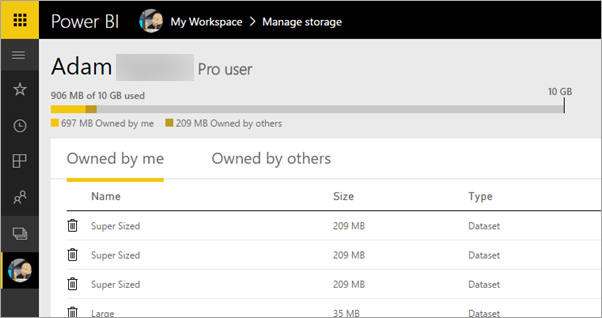

# Manage data storage in Power BI workspaces

Learn how you can manage data storage in your individual or app workspace to make sure you can continue to publish reports and datasets.

Users and app workspaces have their own data capacities:

* All users have a maximum 10 GB data storage.
* Users with a Power BI Pro license can create app workspaces, with a maximum 10 GB data storage each.
* An app workspace in a Premium capacity doesn't count toward the storage of a Power BI Pro user.

At the tenant level, total usage can’t exceed 10 GB per Pro user across all Pro users and app workspaces in the tenant.

Read about other features of the [Power BI pricing model](https://powerbi.microsoft.com/pricing).

Included in your data storage are your own datasets and Excel reports, and those that someone has shared with you. Datasets are any of the data sources you’ve uploaded or connected to, including Power BI Desktop files and Excel workbooks you’re using. The following are also included in your data capacity.

* Excel ranges pinned to dashboard.
* Reporting Services on-premises visualizations pinned to a Power BI dashboard.
* Uploaded images.

The size of a dashboard that you share varies depending on what is pinned to it. For example, if you pin items from two reports that are part of two different datasets, the size includes both datasets.

<a name="manage"/>

## Manage items you own

See how much data storage you’re using in your Power BI account, and manage your account.

1. To manage your own storage, go to **My Workspace** on the left navigation pane.
   
    
2. Select the gear icon  in the upper-right corner \> **Manage personal storage**.
   
    The top bar shows how much of your storage limit you’ve used.
   
    
   
    The datasets and reports are separated onto two tabs:
   
    **Owned by Me:** These are reports and datasets you’ve uploaded to your Power BI account, including service datasets such as Salesforce and Dynamics CRM.  
    **Owned by Others:** Others have shared these reports and datasets with you.
3. To delete a dataset or report, select the trash can icon .

Keep in mind that you or someone else may have reports and dashboards based on a dataset. If you delete the dataset, those reports and dashboards won’t work anymore.

## Manage your app workspace
1. Select the arrow next to **Workspaces** \> select the name of the app workspace.
   
    
2. Select the gear icon  in the upper-right corner \> **Manage group storage**.
   
    The top bar shows how much of the group’s storage limit is used.
   
    
   
    The datasets and reports are separated onto two tabs:
   
    **Owned by Us:** These are reports and datasets you or someone else has uploaded to the group’s Power BI account, including service datasets such as Salesforce and Dynamics CRM.
    **Owned by Others:** Others have shared these reports and datasets with your group.
3. To delete a dataset or report, select the trash can icon .
   
   > [!NOTE]
   > Any member, with edit permissions, of an app workspace has permissions to delete datasets and reports from the app workspace.
   > 
   > 

Keep in mind that you or someone else in the group may have reports and dashboards based on a dataset. If you delete the dataset, those reports and dashboards won’t work anymore.

## Dataset limits
There is a 1 GB limit, per dataset, that is imported into Power BI. If you have chosen to keep the Excel experience, instead of importing the data, the limit is 250 MB for the dataset.

## What happens when you reach a limit
When you reach the data capacity limit of what you can do, you see prompts within the service. 

When you select the gear icon , you see a red bar indicating you are over your data capacity limit.

![Storage limit reached]](media/service-admin-manage-your-data-storage-in-power-bi/manage-storage-limit.png)

You also see this indicated within **Manage personal storage**.

 

 When you try to perform an action that will reach one of the limits, you see a message you are over the limit. You can [manage](#manage) your storage to reduce your storage amount and get past the limit.

 

 More questions? [Try asking the Power BI Community](http://community.powerbi.com/)

