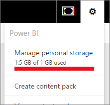

# Manage data storage in Power BI workspaces

Learn how to manage data storage in your individual or workspace so you can keep publishing reports and datasets.

## Capacity limits

Workspace storage limits, whether for My Workspace or an app workspace, depend on whether the workspace is in [shared or Premium capacity](service-basic-concepts.md#capacities).

### Shared capacity limits
For workspaces in shared capacity: 

- There is a per-workspace storage limit of 10 GB.
- For app workspaces, the total usage can’t exceed the tenant storage limit of 10 GB multiplied by the number of Pro licenses in the tenant.

### Premium capacity limits
For workspaces in Premium capacity:
- There is a limit of 100 TB per Premium capacity.
- There is no per-user storage limit.

Read about other features of the [Power BI pricing model](https://powerbi.microsoft.com/pricing).

## What's included in storage

Included in your data storage are your own datasets and Excel reports, and those items that someone has shared with you. Datasets are any of the data sources you’ve uploaded or connected to. These data sources include Power BI Desktop files and Excel workbooks you’re using. The following are also included in your data capacity.

* Excel ranges pinned to a dashboard.
* Reporting Services on-premises visualizations pinned to a Power BI dashboard.
* Uploaded images.

The size of a dashboard that you share varies, depending on what's pinned to it. For example, if you pin items from two reports that are part of two different datasets, the size includes both datasets.

<a name="manage"/>

## Manage items you own

See how much data storage you’re using in your Power BI account, and manage your account.

1. To manage your own storage, go to **My Workspace** on the navigation pane.
   
    

2. Select the gear icon  in the upper-right corner \> **Manage personal storage**.
   
    The top bar shows how much of your storage limit you’ve used.
   
    
   
    The datasets and reports are separated onto two tabs:
   
    **Owned by me:** You’ve uploaded these reports and datasets to your Power BI account, including service datasets such as Salesforce and Dynamics CRM.  

    **Owned by others:** Others have shared these reports and datasets with you.
1. To delete a dataset or report, select the trash can icon .

Keep in mind that you or someone else may have reports and dashboards based on a dataset. If you delete the dataset, those reports and dashboards won’t work anymore.

## Manage your workspace
1. Select the arrow next to **Workspaces** \> select the name of the workspace.
   
    
2. Select the gear icon  in the upper-right corner \> **Manage group storage**.
   
    The top bar shows how much of the group’s storage limit is used.
   
    
   
    The datasets and reports are separated onto two tabs:
   
    **Owned by us:** You or someone else has uploaded these reports and datasets to the group’s Power BI account, including service datasets such as Salesforce and Dynamics CRM.

    **Owned by others:** Others have shared these reports and datasets with your group.

3. To delete a dataset or report, select the trash can icon .
   
   > [!NOTE]
   > Keep in mind that you or someone else in the group may have reports and dashboards based on a dataset. If you delete the dataset, those reports and dashboards won’t work anymore.
   
   Any member in a workspace with the admin, member, or contributor role has permissions to delete datasets and reports from the workspace.

## Dataset limits
There is a 1 GB limit per dataset that is imported into Power BI. If you have chosen to keep the Excel experience, instead of importing the data, the limit is 250 MB for the dataset.

## What happens when you reach a limit
When you reach the data capacity limit of what you can do, you see prompts within the service. 

When you select the gear icon , you see a red bar indicating you are over your data capacity limit.

This limit also is indicated within **Manage personal storage**.

 

 When you try to perform an action that will reach one of the limits, you see a message you are over the limit. You can [manage](#manage) your storage to reduce your storage amount and get past the limit.

 

 ## Next steps

 More questions? [Try asking the Power BI Community](https://community.powerbi.com/)

