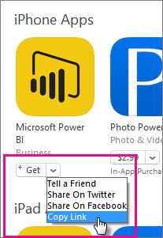
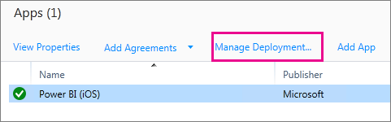
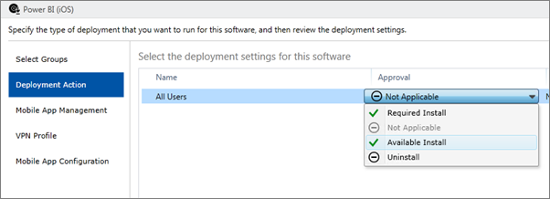
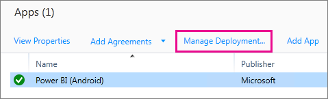

# Configure mobile apps with Microsoft Intune

Microsoft Intune enables organizations to manage devices and applications. The Power BI mobile applications for iOS and Android integrate with Intune. This integration enables you to manage the application on your devices, and to control security. Through configuration policies, you can control items like requiring an access pin, how data is handled by the application, and even encrypting application data when the app is not in use.

## General mobile device management configuration

This article assumes that Intune is configured properly and you have devices enrolled with Intune. The article is not meant as a full configuration guide for Microsoft Intune. For more information on Intune, see [What is Intune?](/intune/introduction-intune/).

Microsoft Intune can co-exist with Mobile Device Management (MDM) within Office 365. If you're using MDM, the device will show enrolled within MDM, but is available to manage within Intune.

> [!NOTE]
> After you configure Intune, background data refresh is turned off for the Power BI mobile app on your iOS or Android device. Power BI refreshes the data from the Power BI service on the web when you enter the app.

## Step 1: Get the URL for the application

Before we create the application within Intune, we need to get the URLs for the apps. For iOS, we will get this from iTunes. For Android, you can get it from the Power BI mobile page.

Save the URL, as you will need it when we create the application.

### Get iOS URL

To get the app URL for iOS, we will need to get it from iTunes.

1. Open iTunes.

1. Search for *Power BI*.

1. You should see **Microsoft Power BI** listed under **iPhone Apps** and **iPad Apps**. You can use either, as you will get the same URL.

1. Select the **Get** drop down and select **Copy Link**.

    

It should look similar to the following: *https://itunes.apple.com/us/app/microsoft-power-bi/id929738808?mt=8*.

### Get Android URL

You can get the URL to Google Play from the [Power BI mobile page](https://powerbi.microsoft.com/mobile/). Select **Download from Google Play** to take you to the app page. You can copy the URL from the browser address bar. It should look similar to the following: *https://play.google.com/store/apps/details?id=com.microsoft.powerbim*.

## Step 2: Create a mobile application management policy

The mobile application management policy allows you to enforce items like an access pin. You can create one within the Intune portal.

You can create the application, or the policy first. The order in which they are added doesn't matter. They will just need to both exist for the deploy step.

1. In the Intune portal, select **Policy** > **Configuration Policies**.

    

1. Select **Add...**.

1. Under **Software** you can select Mobile Application Management for either Android or iOS. To get started quickly, you can select **Create a policy with the recommended settings**, or you can create a custom policy.

1. Edit the policy to configure the restrictions you want on the application.

## Step 3: Create the application

The application is a reference, or package, that is saved into Intune for deployment. We will need to create an application and reference the app URL that we got from either Google Play or iTunes.

You can create the application, or the policy first. The order in which they are added doesn't matter. They will just need to both exist for the deploy step.

1. Go to the Intune portal and select **Apps** from the left menu.

1. Select **Add App**. This will launch the **Add Software** application.

### Create for iOS

1. Select **Managed iOS App from the App Store** from the drop down.

1. Enter the app URL, that we got from [Step 1](#step-1-get-the-url-for-the-application), and select **Next**.

    

1. Provide a **Publisher**, **Name** and **Description**. You can optionally provide an **Icon**. The **Category** is for the Company Portal app. Once you are done, select **Next**.

1. You can decide if you want the publish the app as **Any** (default), **iPad** or **iPhone**. By default it will show **Any** and will work for both device types. The Power BI app is the same URL for both iPhone and iPad. Select **Next**.

1. Select **Upload**.

1. If you don't see the app in the list, refresh the page: Go to **Overview** then back to **Apps**.

    

### Create for Android

1. Select **External Link** from the drop down.

1. Enter the app URL, that we got from [Step 1](#step-1-get-the-url-for-the-application), and select **Next**.

    

1. Provide a **Publisher**, **Name** and **Description**. You can optionally provide an **Icon**. The **Category** is for the Company Portal app. Once you are done, select **Next**.

1. Select **Upload**.

1. If you don't see the app in the list, refresh the page: Go to **Overview** then back to **Apps**.

    

## Step 4: Deploy the application

After you have added the application, you will need to deploy it so that it is available to your end users. This is the step where you will bind the policy you created with the app.

### Deploy for iOS

1. On the apps screen, select the app you created. Then select the **Manage Deployment...** link.

    

1. In the **Select Groups** screen, you can choose which groups you want to deploy this app to. Select **Next**.

1. In the **Deployment Action** screen, you can choose how you want to deploy this app. Selecting **Available Install**, or **Required Install**, will make the app available in the Company Portal for users to install on-demand. After you are done making your selection, select **Next**.

    

1. In the **Mobile App Management** screen, you can select the Mobile App Management policy that we created in [Step 2](#step-2-create-a-mobile-application-management-policy). It will default to the policy you made, if that is the only iOS policy available. Select **Next**.

    

1. In the **VPN Profile** screen, you can select a policy if you have one for your organization. It defaults to **None**. Select **Next**.

1. In the **Mobile App Configuration** screen, you can select an **App Configuration Policy** if you created one. It defaults to **None**. This is not required. Select **Finish**.

After you have deployed the app, it should show **Yes** for deployed, in the apps page.

### Deploy for Android

1. On the apps screen, select the app you created. Then select the **Manage Deployment...** link.

    
1. In the **Select Groups** screen, you can choose which groups you want to deploy this app to. Select **Next**.

1. In the **Deployment Action** screen, you can choose how you want to deploy this app. Selecting **Available Install**, or **Required Install**, will make the app available in the Company Portal for users to install on-demand. After you are done making your selection, select **Next**.

    

1. In the **Mobile App Management** screen, you can select the Mobile App Management policy that we created in [Step 2](#step-2-create-a-mobile-application-management-policy). It will default to the policy you made, if that is the only Android policy available. Select **Finish**.

    

After you have deployed the app, it should show **Yes** for deployed, in the apps page.

## Step 5: Install the application on a device

You install the application through the *Company Portal* app. If you haven't installed the Company Portal, you can get it through the app store on either iOS or Android platforms. You will sign into the Company Portal with your organizational login.

1. Open the Company Portal app.

1. If you don't see the Power BI app listed as a featured app, select **Company Apps**.

    

1. Select the Power BI app that you deployed.

    

1. Select **Install**.

    

1. If you are on iOS, it will push the app to you. Select **Install** on the push dialog.

    

1. After the app is installed, you will see that it is **Managed by your company**. If you enabled access with a pin, in the policy, you will see the following.

    

## Next steps

[Configure and deploy mobile application management policies in the Microsoft Intune console](/intune/app-protection-policies/)  

[Power BI apps for mobile devices](consumer/mobile/mobile-apps-for-mobile-devices.md)  

More questions? [Try asking the Power BI Community](http://community.powerbi.com/)  
