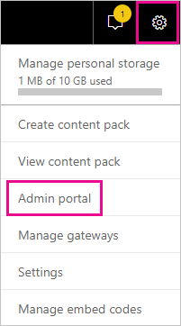
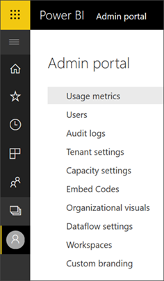
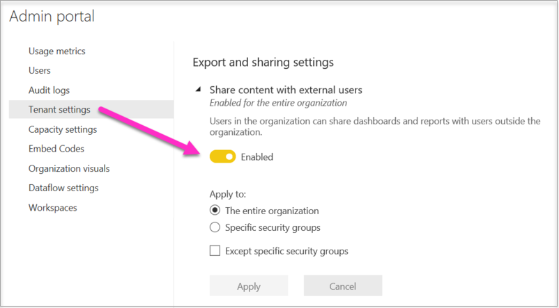
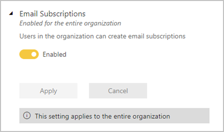
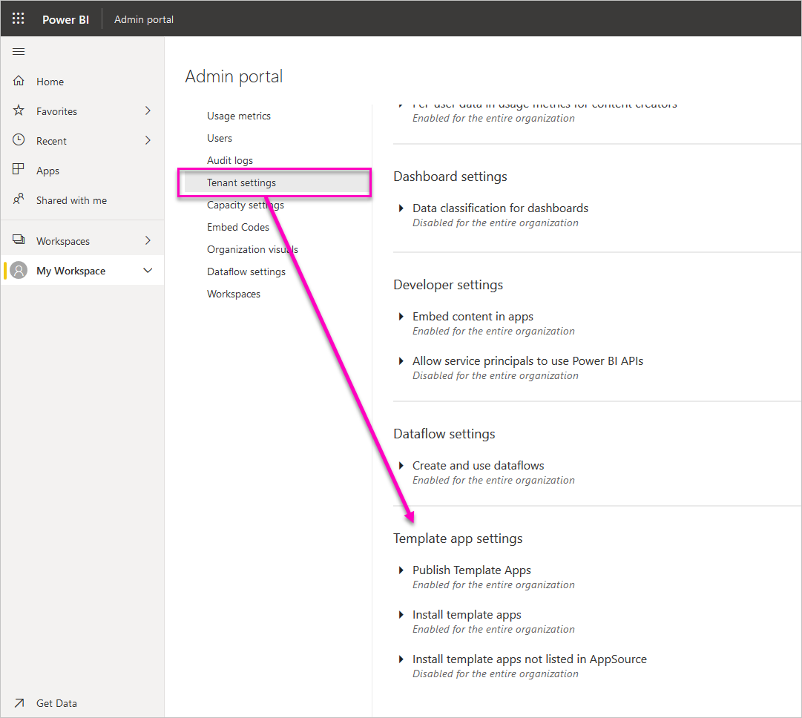
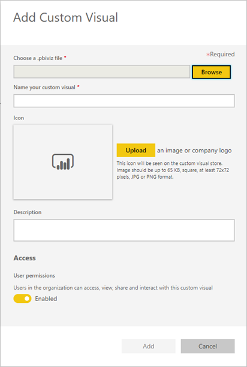

# Administering Power BI in the admin portal

The admin portal enables you to manage a Power BI *tenant* for your organization. The portal includes items such as usage metrics, access to the Microsoft 365 admin center, and settings.

The full admin portal is accessible to all users who are Global Admins in Office 365 or have been assigned the Power BI service administrator role. If you're not in one of these roles, you only see **Capacity settings** in the portal. For more information about the Power BI service administrator role, see [Understanding the Power BI admin role](service-admin-role.md).

## How to get to the admin portal

Your account needs to be marked as a **Global Admin**, within Office 365 or Azure Active Directory, or have been assigned the Power BI service administrator role, to get access to the Power BI admin portal. For more information about the Power BI service administrator role, see [Understanding the Power BI admin role](service-admin-role.md). To get to the Power BI admin portal, do the following.

1. Select the settings gear in the top right of the Power BI service.

1. Select **Admin portal**.

    

There are nine tabs in the portal. The rest of this article provides information about each of these tabs.

* [Usage metrics](#usage-metrics)
* [Users](#users)
* [Audit logs](#audit-logs)
* [Tenant settings](#tenant-settings)
* [Capacity settings](#capacity-settings)
* [Embed codes](#embed-codes)
* [Organization visuals](#organization-visuals)
* [Dataflow storage (preview)](#dataflowStorage)
* [Workspaces](#workspaces)

## Usage metrics

The **Usage metrics** enables you to monitor Power BI usage for your organization. It also provides the ability to see which users, and groups, are the most active within Power BI for your organization.

> [!NOTE]
> The first time you access the dashboard, or after you visit again after a long period of not viewing the dashboard, you'll likely see a loading screen while we load the dashboard.

Once the dashboard loads, you see two sections of tiles. The first section includes usage data for individual users, and the second section has similar information for groups in your organization.

Here’s a breakdown of what you can see in each tile:

* Distinct count of all dashboards, reports, and datasets in the user workspace
  
    

* Most consumed dashboard by number of users who can access it. For example, if you have a dashboard that you shared with 3 users, and you also added it to a content pack that two different users connected to, its count would be 6 (1 + 3 + 2)
  
    

* The most popular content users connected to. This would be anything the users could reach through the Get Data process, so SaaS content packs, Organizational content packs, files or databases.
  
    

* A view of your top users based on how many dashboards they have, both dashboards they created themselves and dashboards shared to them.
  
    

* A view of your top users based on how many reports they have
  
    

The second section shows the same type of information, but based on groups. This lets you see which groups in your organization are most active and what kind of content they are consuming.

With this information, you can get real insights into how people are using Power BI across your organization, and be able to recognize those users and groups who are very active in your organization.

## Users

You manage Power BI users, groups, and admins in the Microsoft 365 admin center. The **Users** tab provides a link to the admin center for your tenant.

## Audit logs

You manage Power BI audit logs in the Office 365 Security & Compliance center. The **Audit logs** tab provides a link to the Security & Compliance center for your tenant. [Learn more](service-admin-auditing.md)

To use audit logs, make sure the [**Create audit logs for internal activity auditing and compliance**](#create-audit-logs-for-internal-activity-auditing-and-compliance) setting is enabled.

## Tenant settings

The **Tenant settings** tab enables fine-grained control over the features that are made available to your organization. If you have concerns around sensitive data, some of our features may not be right for your organization, or you may only want a particular feature to be available to a specific group.

The following image shows the first two sections of the **Tenant settings** tab.

> [!NOTE]
> It can take up to 10 minutes for a setting change to take effect for everyone in your tenant.

Settings can have three states:

* **Disabled for the entire organization**: No one in your organization can use this feature.

    

* **Enabled for the entire organization**: Everyone in your organization can use this feature.

    

* **Enabled for a subset of the organization**: A specific subset of users or groups in your organization can use this feature.

    You can enable the feature for your entire organization, except for a specific group of users.

    

    You can also enable the feature only for a specific group of users and also disable it for a group of users. Using this approach ensures that certain users do not have access to the feature even if they are in the allowed group.

    

The next few sections provide an overview of the different types of tenant settings.

## Help and support settings

### Publish "Get Help" information

Users in the organization can go to internal help and support resources from the Power BI help menu. Specifically, these parameters change the behavior of the Learn, Community, and Get help menu items.

It is also possible to specify a URL to direct users to a custom solution for licensing requests. This parameter customizes the target URL of the Upgrade account button that a user without a Power BI Pro license can find in the Update to Power BI Pro dialog box as well as in the Manage personal storage page.

## Workspace settings

### Create workspaces

Admins use the **Create workspaces** setting to indicate which users in the organization can create app workspaces to collaborate on dashboards, reports, and other content. Learn more about [app workspaces](service-create-the-new-workspaces.md).

The admin portal has another section of settings about the workspaces in your tenant. In that section, you can sort and filter the list of workspaces and display the details for each workspace. See [Workspaces](#workspaces) for details.

In the admin portal, you also control which users have permissions to distribute apps to the organization. See [Publish content packs and apps to the entire organization](#publish-content-packs-and-apps-to-the-entire-organization) in this article for details.

## Export and sharing settings

### Share content with external users

Users in the organization can share dashboards with users outside the organization. [Learn more](service-share-dashboards.md#share-a-dashboard-or-report-with-people-outside-your-organization)

The following image shows the message that appears when you share with an external user.

  

### Publish to web

Users in the organization can publish reports to the web. [Learn more](service-publish-to-web.md)

The following image shows the **File** menu for a report when the **Publish to web** setting is enabled.

Users see different options in the UI based on what the **Publish to web** setting is.

|Feature |Enabled for entire organization |Disabled for entire organization |Specific security groups   |
|---------|---------|---------|---------|
|**Publish to web** under report's **File** menu.|Enabled for all|Not visible for all|Only visible for authorized users or groups.|
|**Manage embed codes** under **Settings**|Enabled for all|Enabled for all|Enabled for all  * **Delete** option only for authorized users or groups. * **Get codes** enabled for all.|
|**Embed codes** within admin portal|Status reflects one of the following: * Active * Not supported * Blocked|Status displays **Disabled**|Status reflects one of the following: * Active * Not supported * Blocked  If a user is not authorized based on the tenant setting, status displays as **infringed**.|
|Existing published reports|All enabled|All disabled|Reports continue to render for all.|

### Export data

Users in the organization can export data from a tile or visualization. [Learn more](visuals/power-bi-visualization-export-data.md)

The following image shows the option to export data from a tile.

> [!NOTE]
> Disabling **Export Data** also prevents users from using the **Analyze in Excel** feature, as well as using the Power BI service live connection.

### Export reports as PowerPoint presentations or PDF documents

Users in the organization can export Power BI reports as PowerPoint files or PDF documents. [Learn more](consumer/end-user-powerpoint.md)

The following image shows the **File** menu for a report when the **Export reports as PowerPoint presentations or PDF documents** setting is enabled.

### Print dashboards and reports

Users in the organization can print dashboards and reports. [Learn more](consumer/end-user-print.md)

The following image shows the option to print a dashboard.

The following image shows the **File** menu for a report when the **Print dashboards and reports** setting is enabled.

### Allow external guest users to edit and manage content in the organization
Azure B2B guest users can edit and manage content in the organization. [Learn more](service-admin-azure-ad-b2b.md)

The following image shows the option to Allow external guest users to edit and manage content in the organization.

### Email Subscriptions
Users in the organization can create email subscriptions

## Content pack and app settings

### Publish content packs and apps to the entire organization

Admins use this setting to decide which users can publish content packs and apps to the entire organization, rather than just specific groups. Learn more about [publishing apps](service-create-distribute-apps.md).

The following image shows the **My entire organization** option when creating a content pack.

### Create template apps and organizational content packs

Users in the organization can create template apps and organizational content packs that use datasets built on one data source in Power BI Desktop. Learn more about [template apps](template-content-pack-authoring.md).

### Push apps to end users

Report creators can share apps directly with end users without requiring installation from [AppSource](https://appsource.microsoft.com). Learn more about [automatically installing apps for end users](service-create-distribute-apps.md#automatically-install-apps-for-end-users).

## Integration settings

### Ask questions about data using Cortana

Users in the organization can ask questions about their data using Cortana. [Learn more](service-cortana-enable.md)

> [!NOTE]
> This setting applies to the entire organization and cannot be limited to specific groups.

### Use Analyze in Excel with on-premises datasets

Users in the organization can use Excel to view and interact with on-premises Power BI datasets. [Learn more](service-analyze-in-excel.md)

> [!NOTE]
> Disabling **Export Data** also prevents users from using the **Analyze in Excel** feature.

### Use ArcGIS Maps for Power BI

Users in the organization can use the ArcGIS Maps for Power BI visualization provided by Esri. [Learn more](visuals/power-bi-visualization-arcgis.md)

### Use global search for Power BI (Preview)

Users in the organization can use external search features that rely on Azure Search. For example, users can use Cortana to retrieve key information directly from Power BI dashboards and reports. [Learn more](service-cortana-intro.md)

## Custom visuals settings

### Add and use custom visuals

Users in the organization can interact with and share custom visuals. [Learn more](power-bi-custom-visuals.md)

> [!NOTE]
> This setting can be applied to the entire organization or can be limited to specific groups.

Power BI Desktop (starting from March '19 release) supports using **Group Policy** to disable the usage of custom visuals across an organization's deployed computers.

<table>
<tr><th>Attribute</th><th>Value</th>
</tr>
<td>key</td>
    <td>Software\Policies\Microsoft\Power BI Desktop\</td>
<tr>
<td>valueName</td>
<td>EnableCustomVisuals</td>
</tr>
</table>

A value of 1 (decimal) enables the use of custom visuals in Power BI (This is the default).

A value of 0 (decimal) disable the use of custom visuals in Power BI.

### Allow only certified visuals

Users in the organization who have been granted permissions to add and use custom visuals, denoted by the setting "Add and use custom visuals", will only be able to use [certified custom visuals](https://go.microsoft.com/fwlink/?linkid=2002010) (uncertified visuals will be blocked and will display an error message when used). 

Power BI Desktop (starting from March '19 release) supports using **Group Policy** to disable the usage of uncertified custom visuals across an organization's deployed computers.

<table>
<tr><th>Attribute</th><th>Value</th>
</tr>
<td>key</td>
    <td>Software\Policies\Microsoft\Power BI Desktop\</td>
<tr>
<td>valueName</td>
<td>EnableUncertifiedVisuals</td>
</tr>
</table>

A value of 1 (decimal) enables the use of uncertified custom visuals in Power BI (This is the default).

A value of 0 (decimal) disable the use of uncertified custom visuals in Power BI (This option enables only the use of [certified custom visuals](https://go.microsoft.com/fwlink/?linkid=2002010)).

## R visuals settings

### Interact with and share R visuals

Users in the organization can interact with and share visuals created with R scripts. [Learn more](visuals/service-r-visuals.md)

> [!NOTE]
> This setting applies to the entire organization and cannot be limited to specific groups.

## Audit and usage settings

### Create audit logs for internal activity auditing and compliance

Users in the organization can use auditing to monitor actions taken in Power BI by other users in the organization. [Learn more](service-admin-auditing.md)

This setting must be enabled for audit log entries to be recorded. There can be up to a 48 hour delay between enabling auditing and being able to view audit data. If you don't see data immediately, check the audit logs later. There can be a similar delay between getting permission to view audit logs and being able to access the logs.

> [!NOTE]
> This setting applies to the entire organization and cannot be limited to specific groups.

### Usage metrics for content creators

Users in the organization can see usage metrics for dashboards and reports they create. [Learn more](service-usage-metrics.md)

### Per-user data in usage metrics for content creators

Usage metrics for content creators will expose display names and email addresses of users who are accessing content. [Learn more](service-usage-metrics.md)

Per-user data is enabled for usage metrics by default, and content creator account information is included in the metrics report. If you don’t want to include this information for some or all users, disable the feature for specified security groups or for an entire organization. Account information will then show in the report as *Unnamed*.

## Dashboard settings

### Data classification for dashboards

Users in the organization can tag dashboards with classifications that indicate dashboard security levels. [Learn more](service-data-classification.md)

> [!NOTE]
> This setting applies to the entire organization and cannot be limited to specific groups.

## Developer settings

### Embed content in apps

Users in the organization can embed Power BI dashboards and reports in Software as a Service (SaaS) applications. Disabling this setting prevents users from being able to use the REST APIs to embed Power BI content within their application. [Learn more](developer/embedding.md)

### Allow service principals to use Power BI APIs

Web apps registered in Azure Active Directory (Azure AD) will use an assigned service principal to access Power BI APIs without a signed in user. To allow an app to use service principal authentication its service principal must be included in an allowed security group. [Learn more](developer/embed-service-principal.md)

> [!NOTE]
> Service principals inherit the permissions for all Power BI tenant settings from their security group. To restrict permissions, create a dedicated security group for service principals and add it to the 'Except specific security groups' list for the relevant, enabled Power BI settings.

## Dataflow settings

### Create and use dataflows

Users in the organization can create and use dataflows. For an overview of dataflows, see [Self-service data prep in Power BI](service-dataflows-overview.md). To enable dataflows in a Premium capacity, see [Configure workloads](service-admin-premium-workloads.md).

> [!NOTE]
> This setting applies to the entire organization and cannot be limited to specific groups.

## Template apps settings (preview)

Two settings control template apps. 

### Create Template Apps (preview)

Users in the organization can create template apps. Template app creators can then distribute them to clients outside your organization by way of [AppSource](https://appsource.microsoft.com) or other distribution methods.

### Install template apps (preview)

Users in the organization can download and install template apps from [AppSource](https://appsource.microsoft.com) or another source.

> [!NOTE]
> This setting determines which users can install template apps on their Power BI accounts.

## Capacity settings

### Power BI Premium

The **Power BI Premium** tab enables you to manage any Power BI Premium capacities (EM or P SKU) that have been purchased for your organization. All users within your organization can see the **Power BI Premium** tab, but they only see contents within it if they are assigned as either a *Capacity admin* or a user that has assignment permissions. If a user does not have any permissions, the following message appears.

### Power BI Embedded

The **Power BI Embedded** tab enables you to view your Power BI Embedded (A SKU) capacities that you've purchased for your customer. Since you can only purchase A SKUs from Azure, you [manage embedded capacities in Azure](developer/azure-pbie-create-capacity.md) from **the Azure portal**.

For more information about how to manage Power BI Embedded (A SKU) settings, see [What is Power BI Embedded](developer/azure-pbie-what-is-power-bi-embedded.md).

## Embed codes

As an administrator, you can view the embed codes that are generated for your tenant. You can also revoke or delete codes. [Learn more](service-publish-to-web.md)

## <a name="organizational-visuals">Organization visuals</a>

The **Organization visuals** tab enables you to deploy and manage custom visuals inside your organization. With organizational visuals, you can easily deploy proprietary visuals in your organization, which report authors can then discover and import into their reports from Power BI Desktop. [Learn more](power-bi-custom-visuals-organization.md)

> [!WARNING]
> A custom visual could contain code with security or privacy risks; make sure you trust the author and the source of the custom visual before deploying to the organization's repository.

The following image shows all the custom visuals that are currently deployed in an organization's repository.

### Add a new custom visual

To add a new custom visual to the list, follow these steps. 

1. In the right pane, select **Add a custom visual**.

    

1. Fill in the **Add custom visual** form:

    * **Choose a .pbiviz file** (required): select a custom visual file to upload. Only versioned API custom visuals are supported (read here what this means).

    Before you upload a custom visual, you should review that visual for security and privacy to make sure it fits your organization's standards.

    * **Name your custom visual** (required): give a short title to the visual so Power BI Desktop users easily understand what it does

    * **Icon**: The icon file that is shown in the Power BI Desktop UI.

    * **Description**: a short description of the visual to provide more context and education to the user

1. Select **Add** to initiate the upload request. If successful you can see the new item in the list. If failed, you can get an appropriate error message

### Delete a custom visual from the list

To permanently delete a visual, select the trash bin icon for the visual in the repository.

> [!IMPORTANT]
> Deletion is irreversible. Once deleted, the visual immediately stops rendering in existing reports. Even if you upload the same visual again, it won't replace the previous one that was deleted. However, users can import the new visual again and replace the instance they have in their reports.

### Disable a custom visual in the list

To disable the visual from the organizational store, select the gear icon. In the **Access** section, disable the custom visual.

After you disable the visual, the visual won't render in existing reports, and it displays the error message below.

*This custom visual is no longer available. Please contact your administrator for details.*

However, visuals that are bookmarked still work.

After any update or administrator change, Power BI Desktop users should restart the application or refresh the browser in the Power BI service to see the updates.

### Update a visual

To update the visual from the organizational store, select the gear icon. Browse and upload a new version of the visual.

Make sure the Visual ID remains unchanged. The new file replaces the previous file for all the reports throughout the organization. However, if the new version of the visual might break any usage or data structure of the previous version of the visual, then do not replace the previous version. Instead, you should create a new listing for the new version of the visual. For example, add a new version number (version X.X) to the title of the new listed visual. This way it is clear that it is the same visual just with an updated version number, so existing reports do not break their functionality. Again, make sure the Visual ID remains unchanged. Then the next time users enter the organization repository from Power BI Desktop, they can import the new version, which prompts them to replace the current version that they have in the report.

For more information, visit [Frequently asked questions about organizational custom visuals](https://docs.microsoft.com/power-bi/power-bi-custom-visuals-faq#organizational-custom-visuals)

## <a name="dataflowStorage">Dataflow storage (preview)</a>

By default, data used with Power BI is stored in internal storage provided by Power BI. With the integration of dataflows and Azure Data Lake Storage Gen2 (ADLS Gen2), you can store your dataflows in your organization's Azure Data Lake Storage Gen2 account. For more information, see [Dataflows and Azure Data Lake integration (Preview)](service-dataflows-azure-data-lake-integration.md).

## Workspaces

As an administrator, you can view the workspaces that exist in your tenant. You can sort and filter the list of workspaces and display the details for each workspace. The table columns correspond to the properties returned by the [Power BI admin Rest API](/rest/api/power-bi/admin) for workspaces. Personal workspaces are of type **PersonalGroup**, classic workspaces are of type **Group**, and the new workspace experience workspaces are of type **Workspace**. For more information, see [Create the new workspaces in Power BI](service-create-the-new-workspaces.md).

## Next steps

[Administering Power BI in your Organization](service-admin-administering-power-bi-in-your-organization.md)  
[Understanding the Power BI admin role](service-admin-role.md)  
[Auditing Power BI in your organization](service-admin-auditing.md)  

More questions? [Try asking the Power BI Community](https://community.powerbi.com/)
