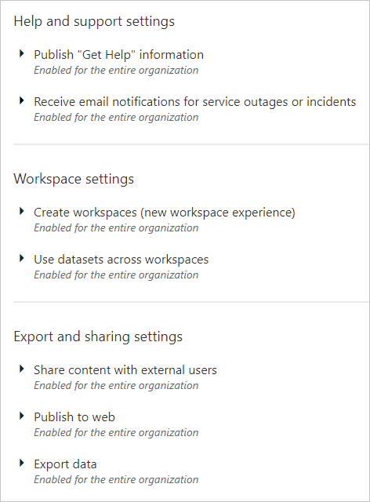
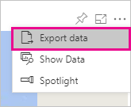
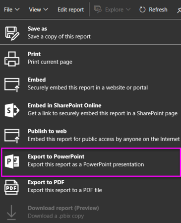
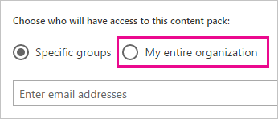

# Power BI admin portal

The admin portal allows for tenant management of Power BI in your organization. It includes items such as usage metrics, access to the Office 365 admin center, and settings.

Tenant management of Power BI for your company is done through the Power BI admin portal. The admin portal is accessible to all users who are Global Admins in Office 365 or have been assigned the Power BI service administrator role. For more information about the Power BI service administrator role, see [Understanding the Power BI admin role](service-admin-role.md).

All users will see **Admin portal** under the gear icon. If they are not an admin, they will only see the **Premium settings** section, and they will only see the capacities they have rights to manage.

## How to get to the admin portal

Your account needs to be marked as a **Global Admin**, within Office 365 or Azure Active Directory, or have been assigned the Power BI service administrator role, to get access to the Power BI admin portal. For more information about the Power BI service administrator role, see [Understanding the Power BI admin role](service-admin-role.md). To get to the Power BI admin portal, do the following.

1. Select the settings gear in the top right of the Power BI service.
2. Select **Admin Portal**.

Within the portal, there are five tabs. These are described below.

* [Usage metrics](#usage-metrics)
* [Users](#users)
* [Audit logs](#audit-logs)
* [Tenant settings](#tenant-settings)
* [Premium settings](#premium-settings)

## Usage metrics
The first tab, in the admin portal, is **Usage metrics**. The usage metrics report gives you the ability to monitor usage within Power BI for your organization. It also provides the ability to see which users, and groups, are the most active within Power BI for your organization.

> [!NOTE]
> The first time you access the dashboard, or after you visit again after a long period of not viewing the dashboard, you'll likely see a loading screen while we load the dashboard.

Once the dashboard loads, you will see two sections of tiles. The first section includes usage data for individual users and the second section has similar information for groups in your organization.

Here’s a breakdown of what you will see in each tile:

* Distinct count of all dashboards, reports, and datasets in the user workspace
  
    

* Most consumed dashboard by number of users who can access it. For example, if you have a dashboard that you shared with 3 users, and you also added it to a content pack two different users connected to, its count would be 6 (1 + 3 + 2)
  
    

* The most popular content users connected to. This would be anything the users could reach through the Get Data process, so SaaS content packs, Organizational content packs, files or databases.
  
    

* A view of your top users based on how many dashboards they have, both dashboards they created themselves and dashboards shared to them.
  
    

* A view of your top users based on how many reports they have
  
    

The second section shows the same type of information, but based on groups. This will let you see which groups in your organization are most active and what kind of information they are using.

With this information, you will be able to get real insights into how people are using Power BI across your organization, and be able to recognize those users, and groups, who are very active in your organization.

## Users

The second tab, in the admin portal, is **Manage Users**. User management, for Power BI, is done in the Office 365 admin center, so this section allows you to quickly reach the area to manage users, admins, and groups within Office 365.

When you click **Go to O365 Admin Center**, you go directly to the Office 365 admin center landing page, to manage the users of your tenant.

## Audit logs

The third tab, in the admin portal, is **Audit logs**. The logs are located within the Office 365 Security & Compliance center. This section allows you to quickly access that area within Office 365. 

For more information about audit logs, see [Auditing Power BI in your organization](service-admin-auditing.md)

## Tenant settings

The third tab, in the admin portal, is **Tenant settings**. Tenant settings give you more control over what features are made available to your organization. If you have concerns around sensitive data, some of our features may not be right for your organization, or you may only want a given feature to be available to a specific group. If this is the case, you can switch it off in your tenant.

> [!NOTE]
> It can take up to 10 minutes for the setting to take effect for everyone in your tenant.

Settings can have three states based on the settings that you supplied.

### Disabled for the entire organization

You can disable a feature and make it so users will not be able to use it.

### Enabled for the entire organization

You can enable a feature for the entire organization which will let all users have access to that feature.

### Enabled for a subset of the organization

You can also enable a feature for a portion of your organization. This can happen in a few different ways. You can enable it for your entire organization except for a specific group of users.

You could also enable the feature only for a specific group of users and also disable it for a group of users. This would make sure that certain users do not have access to the feature even if they are in the allowed group.

## Export and sharing settings

### Share content to external users

Users in the organization can share dashboards with users outside the organization.

### Publish to web

Users in the organization can publish reports to the web. [Learn more](service-publish-to-web.md)

Users will see different options in the UI based on what the publish to web setting is.

|Feature |Enabled for entire organization |Disabled for entire organization |Specific security groups   |
|---------|---------|---------|---------|
|**Publish to web** under report's **File** menu.|Enabled for all|Not visable for all|Only visable for authorized users or groups.|
|**Manage embed codes** under **Settings**|Enabled for all|Enabled for all|Enabled for all  * **Delete** option only for authorized users or groups. * **Get codes** enabled for all.|
|**Embed codes** within admin portal|Status will reflect one of the following: * Active * Not supported * Blocked|Status will display **Disabled**|Status will reflect one of the following: * Active * Not supported * Blocked  If a user is not authorized based on the tenant setting, status will display as **infringed**.|
|Existing published reports|All enabled|All disabled|Reports continue to render for all.|

### Export data

Users in the organization can export data from a tile or visualization. [Learn more](power-bi-visualization-export-data.md)

> [!NOTE]
> Disabling **Export Data** will also prevent users from using the **Analyze in Excel** feature, as well as using the Power BI service live connection.

### Export reports as PowerPoint presentations

Users in the organization can export Power BI reports as PowerPoint files. [Learn more](service-publish-to-powerpoint.md)

### Print dashboards and reports

Users in the organization can print dashboards and reports. [Learn more](service-print.md)

## Content pack settings

### Publish content packs to the entire organization

Users in the organization can publish content packs to the entire organization.

### Create template organizational content packs

Users in the organization can create template content packs that use datasets built on one data source in Power BI Desktop.

## Integration settings

### Ask questions about data using Cortana
Users in the organization can ask questions about their data using Cortana.

> [!NOTE]
> This settings applies to the entire organization and cannot be limited to specific groups.

### Use Analyze in Excel with on-premises datasets
Users in the organization can use Excel to view and interact with on-premises Power BI datasets. [Learn more](service-analyze-in-excel.md)

> [!NOTE]
> Disabling **Export Data** will also prevent users from using the **Analyze in Excel** feature.

### User ArcGIS Maps for Power BI (Preview)

Users in the organization can use the ArcGIS Maps for Power BI (Preview) visualization provided by Esri. [Learn more](power-bi-visualization-arcgis.md)

## R visuals settings

### Interact with an dshare R visuals

Users in the organization can interact with and share visuals created with R scripts. [Learn more](service-r-visuals.md)

> [!NOTE]
> This settings applies to the entire organization and cannot be limited to specific groups.

## Audit settings

### Create audit logs for internal activity auditing and compliance

Users in the organization can use auditing to monitor actions taken in Power BI by other users in the organization. [Learn more](service-admin-auditing.md)

This setting needs to be enabled for audit log entries to be recorded.

> [!NOTE]
> This settings applies to the entire organization and cannot be limited to specific groups.

## Dashboard settings

### Data classification for dashboards

Users in the organization can tag dashboards with classifications indicating dashboard security levels. [Learn more](service-data-classification.md)

> [!NOTE]
> This settings applies to the entire organization and cannot be limited to specific groups.

## Developer settings

### Embed content in apps

Users in the organization can embed Power BI dashboards and reports in Software as a Service (SaaS) applications. Disabling this setting will prevent users from being able to use the REST APIs to embed Power BI content within their application.

## Premium settings

The Premium settings tab allows you to manage any Power BI Premium capacity that has been purchased for your organization. All users within your organization will see the Premium settings tab, but will only see contents within it, if they are assigned as either **Capacity admin** or a user that has assignment permissions. If a user does not have any permissions, they will see the following message.

For more information about to manage Premium settings, see [Manage Power BI Premium](service-admin-premium-manage.md).

## Next steps

[Understanding the Power BI admin role](service-admin-role.md)  
[Auditing Power BI in your organization](service-admin-auditing.md)  
[Manage Power BI Premium](service-admin-premium-manage.md)  
[Administering Power BI in your Organization](service-admin-administering-power-bi-in-your-organization.md)  

More questions? [Try asking the Power BI Community](http://community.powerbi.com/)