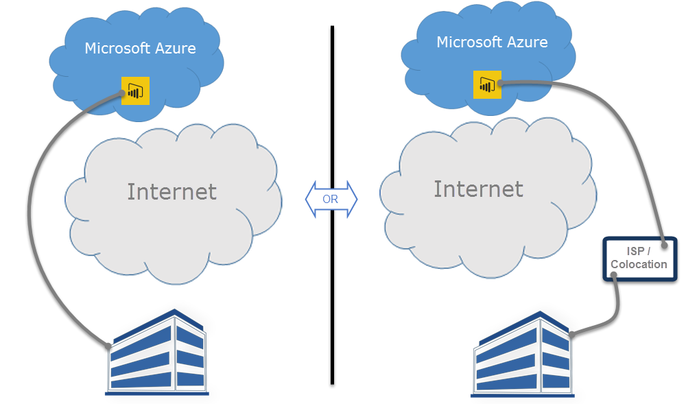

# Power BI and ExpressRoute

**ExpressRoute** is an Azure service that lets you create private connections between Azure datacenters (where Power BI resides) and your on-premises infrastructure, or create private connections between Azure datacenters and your colocation environment.

With **Power BI** and **ExpressRoute**, you can create a private network connection from your organization to Power BI (or using an ISP’s colocation facility), bypassing the Internet to better secure your sensitive Power BI data and connections.

For more information, see [ExpressRoute overview](/azure/expressroute/expressroute-introduction). Power BI is compliant with ExpressRoute, with some exceptions, where Power BI gets or sends data over the public Internet. For a list of the URLs that Power BI uses, see [Power BI URLs](power-bi-whitelist-urls.md).

