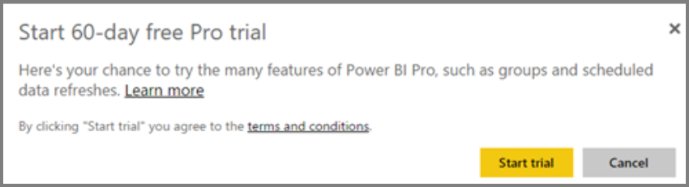
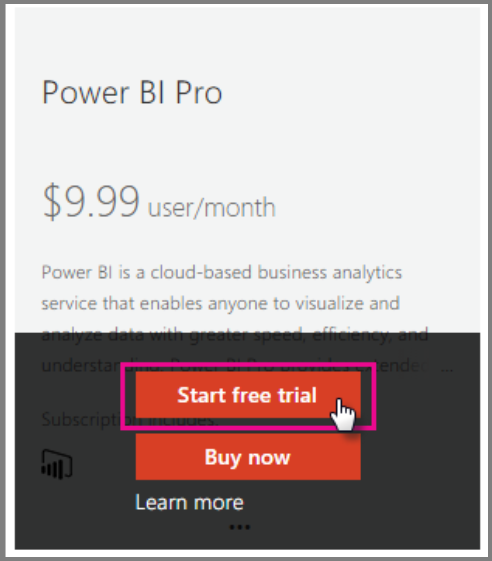

# Power BI Pro in your organization

Power BI Pro is a paid licenses that enables more features. Power BI Pro licenses are for a team that wants to share and collaborate with others to make data-driven decisions.  Each team member creating or viewing shared Power BI content needs a Pro license unless the content is associated with a dedicated capacity using Power BI Premium.

These features require a Power BI Pro license:

* **Analyze data in Excel or Power BI Desktop** - Use Excel or Power BI Desktop to view and interact with a dataset published in Power BI. For more information, see [Analyze in Excel](service-analyze-in-excel.md).

* **Share dashboards and collaborate with workspaces** - Power BI workspaces facilitate collaboration with colleagues on dashboards, reports, and datasets. For more information, see [Collaborate in your Power BI app workspace](service-collaborate-power-bi-workspace.md).

* **View shared content** - Pro users can view dashboards and reports that are shared with them, interact with dashbaords and reports that are shareed with them, and re-share dashboards and reports that are shaed with them (if allowed). However, a Pro user cannot edit these dashboards or reports. For more information, see [Share your Power BI dashboards and reports with coworkers and others](service-share-dashboards.md).

* **Integrate content with Microsoft Teams** - You can add a a Power BI tab in a Microsoft (MS) Teams channel. MS Teams automatically detects all the reports in the workspace. For more information, see [Power BI teams up with Microsoft Teams](https://powerbi.microsoft.com/en-us/blog/power-bi-teams-up-with-microsoft-teams/). 

## Power BI Pro 60-day trial for individuals

After you have signed up for your free account, you can optionally choose to try Pro free for 60 days. You will have access to all of the Pro features for the duration of the trial. Power BI Pro has all the features of the free version of Power BI, and additional sharing and collaboration features. For more information, see [Power BI Pricing](https://powerbi.microsoft.com/en-us/pricing/). To try a 60-day free trial of Power BI Pro, sign into Power BI, and try one of these Power BI Pro features.

* [Create a workspace](service-create-distribute-apps.md)
* [Share a dashboard](service-share-dashboards.md)

When you try any of these features, you will be prompted to start your free trial. You can also choose to make use of it by going to the gear icon and selecting Manage personal storage. Then select Try Pro for free on the right.

   
    
   

Then you can select Start trial.

   

> [!NOTE]
> Users taking advantage of this in-product Power BI Pro trial do not appear in the Office 365 admin portal as Power BI Pro Trial users (they appear as Power BI free users). They will, however, show up as Power BI Pro Trial users in the manage storage page in Power BI.
>

> [!NOTE]
> If you are an IT Administrator wishing to acquire and deploy Power BI trial licenses to multiple users in your organization without having individual users accept trial terms individually, you can sign up for a Power BI Pro subscription trial. You will need to be an Office 365 Global or Billing Admin or create a new tenant to sign up for an admin trial. For more information, see [Purchasing Power BI Pro](service-admin-purchasing-power-bi-pro.md).
>

When you are in the service, you can then verify that you have a Pro trial account by going to the gear icon and selecting Manage personal storage.

   

## Subscription trial in Office 365

You can get Power BI Pro as a trial for your organization. Once you have the subscription, you can assign Power BI Pro licenses to your users. For more information about how to assign licenses, see [Assign licenses to users in Office 365](https://support.office.com/en-us/article/assign-licenses-to-users-in-office-365-for-business-997596b5-4173-4627-b915-36abac6786dc?ui=en-US&rs=en-US&ad=US).

> [!NOTE]
> There is a limit of one organizational trial per tenant. This means that if someone has already applied the Power BI Pro Trial to your tenant, you cannot do it again. If you need assistance with this, you can contact [Office 365 Billing support](https://support.office.microsoft.com/en-us/article/contact-support-for-business-products-admin-help-32a17ca7-6fa0-4870-8a8d-e25ba4ccfd4b?CorrelationId=552bbf37-214f-4202-80cb-b94240dcd671&ui=en-US&rs=en-US&ad=US).
>

Follow these steps to get a trial subscription in Offiec 365:

1. Navigate to the [Office 365 admin center](https://portal.office.com/adminportal/home#/homepage).
2. On the left navigation pane, select Billing and then click on Subscriptions.

   

3. Select Add subscriptions on the right side.

   

4. Under Other Plans, hover over the ellipse (…) for Power BI Pro and select Start free trial.

    

5. Select Try now on the confirm your order screen.
6. Select Continue on the order receipt.

## Purchasing Power BI Pro

You can purchase Power BI Pro through Microsoft Office 365 or through a certified Microsoft partner. For more information about how to purchase Power BI Pro, see [Purchasing Power BI Pro](service-admin-purchasing-power-bi-pro.md).

## Next steps
[Self-service sign up for Power BI](service-admin-signing-up-for-power-bi-with-a-new-office-365-trial.md)
 
[Power BI (free) in your organization](service-admin-service-free-in-your-organization.md)
 
[Purchasing Power BI Pro](service-admin-purchasing-power-bi-pro.md)
 
[Extended Pro Trial activation](service-extended-pro-trial.md)
 
[Assigning Power BI Pro licenses](service-admin-assigning-power-bi-pro-licenses.md)
 
[Power BI Premium - what is it?](service-admin-premium-manage.md)
 
[How to purchase Power BI Premium](service-admin-premium-purchase.md)
 
[Power BI Premium whitepaper](https://aka.ms/pbipremiumwhitepaper)

More questions? [Try asking the Power BI Community](https://community.powerbi.com/)