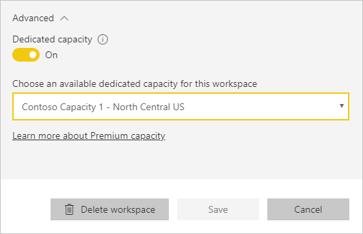

# Manage capacities within Power BI Premium and Power BI Embedded
Learn how you can manage Power BI Premium and Power BI Embedded capacities which provides dedicated resources for your content.

Capacity is the heard of the Power BI Premium and Power BI Embedded offerings.

## What is capacity?
Capacity is the set of resources reserved for the exclusive use by you. Having capacity allows you to publish dashboards, reports, and datasets to users throughout your organization without having to purchase licenses for them. It also guarantees dependable, consistent performance for the contents hosted in capacity.

Capacity is all transparent to your end users. They will continue to use Power BI or your application as usual. They don't have to be aware that some (or all) of the content is hosted in your dedicated capacity. For your users, everything works exactly as before.

[!INCLUDE [powerbi-premium-illustration](./includes/powerbi-premium-illustration.md)]

For more information, see [What is Power BI Premium?](service-premium.md).

## Purchase capacity
To take advantage of dedicated capacity, you will need to purchase a subscription for Power BI Premium within the Office 365 admin center or create a Power BI Embedded resource within the Microsoft Azure portal. For more information, see the following:

* **Power BI Premium:** [How to purchase Power BI Premium](service-admin-premium-purchase.md)
* **Power BI Embedded:** [Create Power BI Embedded capacity in the Azure portal](https://docs.microsoft.com/en-us/azure/power-bi-embedded/create-capacity)

When you purchase Power BI Premium SKUs, your tenant will receive the corresponding number of v-cores for use in running capacities. For example, purchasing a Power BI Premium P3 SKU provides the tenant with 32 v-cores.

> [!NOTE]
> You will have 30 days of full access after your subscription ends, but after that your content reverts to a shared capacity. Models that are > 1 GB will not be supported with a regular shared license.
>

## Capacity admins
> [!NOTE]
> Capacity admins, for Power BI Embedded capacity, are defined within the Microsoft Azure portal.
> 
> 

When you are assigned as a capacity admin to a capacity, you have full control over the capacity and its administrative features. From the Power BI admin portal, you can add more capacity admins (Power BI Premium only) or give users capacity assignment permissions. You can bulk assign workspaces to a capacity and view usage metrics on a capacity.

Each capacity has its own admins. Defining a capacity admin to one capacity does not give them access to all capacities within your organization. Capacity admins do not have access to all Power BI admin areas by default such as usage metrics, audit logs or tenant settings. Capacities admins also do not have permissions to set up new capacities or change the SKU of existing capacities. Only Global admins or Power BI service administrators have access to those items.

All Office 365 Global admins and Power BI admins are automatically capacity admins of both Power BI Premium capacity and Power BI Embedded capacity.

## Managing capacity
After you have purchased capacity nodes within Office 365, you will then need to set up a new capacity. This is done through the [Power BI admin portal](service-admin-portal.md). Within the admin portal, you will see a section called **Capacity settings**. This is where you will manage Power BI Premium capacities for your organization.

Selecting **Capacity settings** will take you to the capacity management screen defaulting to Power BI Premium.

### Setting up a new capacity (Power BI Premium)
The number of v-cores will reflect the amount used and the amount available to create capacities with. The amount of v-cores available to your organization is based on the Premium SKUs that you have purchased. For example, purchasing a P3 and a P2 would result in 48 available cores – 32 from the P3 and 16 from the P2.

If you have available v-cores, setup your new capacity by doing the following.

1. Select **Set up new capacity**.
2. Give your capacity a **name**.
3. Define who the capacity admin is for this capacity.
   
    Capacity admins do not have to be a Power BI admin or an Office 365 Global admin. For more information, see [Power BI Premium capacity admins](#capacity-admins)
4. Select your capacity size. Available options are dependent on how many available v-cores you have. You can't select an option that is larger than what you have available.
   
    
5. Select **Set up**.

Capacity admins, as well as Power BI admins and Office 365 Global Admins, will then see the capacity listed within the admin portal.

### Capacity settings
Within the Premium capacity management screen, you can select the **gear icon (settings)** under actions. This will allow you to rename or delete a capacity. It will also indicate who the service admins are, the SKU/size of the capacity and what region the capacity is in.

> [!NOTE]
> Power BI Embedded capacity settings are managed within the Microsoft Azure portal.
> 
> 

### Change capacity size (Power BI Premium)
Power BI admins and Office 365 Global admins change Power BI Premium capacity size by selecting **Change capacity size**. Capacity admins who are not a Power BI admin or Office 365 Global admin will not have this option.

The **Change capacity size** screen lets you upgrade or downgrade your capacity size if you have the available resources. Administrators are free to create, resize and delete nodes, so long as they have the requisite number of v-cores. 

P SKUs cannot be down graded to EM SKUs. You can hover over disabled options which provide an explanation.

### Capacity assignment
You can manage a capacity by selecting the name of the capacity. This will take you to the capacity management screen.

If no workspaces have been assigned to the capacity, you will see a message allowing you to **Assign workspaces**.

#### User permissions
You can assign additional **Capacity admins** for Power BI Premium capacities. As well as assign users that will have **capacity assignment permissions**. Users that have assignment permissions can assign an app workspace to the capacity if they are an admin of that workspace. They can also assign their personal *My Workspace* to the capacity. Users with assignment permissions will not have access to the admin portal.

> [!NOTE]
> For Power BI Embedded capacity, capacity admins are assigned within the Microsoft Azure portal.
> 
> 

## Usage measurements (Power BI Premium)
For each capacity, you will be able to use usage measurements for CPU, Memory Usage, Memory Thrashing and Direct Query. We suggest monitoring these metrics to ensure that your users see good performance while using premium content.

**Power BI Embedded capacity usage is monitored within the Azure portal.**

| Metric | Description |
| --- | --- |
| CPU |CPU usage of your cores. |
| Memory Usage |Total Available Memory being used in your capacity, represented as gigabytes (GB) |
| Memory Thrashing |Represents the memory pressure of your backend cores. Specifically, this is a metric of how often models are evicted from memory due to memory pressure from usage of multiple models. |
| DQ/s |* We limit the total number of DirectQuery and live connection queries per second. * The limits are 30/s for P1, 60/s for P2 and 120/s for P3. * DirectQuery and live connection queries count equally to the above throttle. For example, if you have 15 DirectQueries and 15 live connections in a second, you hit your throttle. * This applies equally to on-premises and cloud connections. |

Metrics reflect utilization over the past week.  If you'd like to see a more detailed view of the metrics, you can do so by clicking any of the summary tiles.  This will take you to detailed charts for each of the metrics for your premium capacity.  These charts are summarized on an hourly basis for the past week, and can help isolate when you may have had specific performance-related events in your premium capacity.  You may also export the underlying data for any of the metrics to a csv file.  This export will give you detailed information in five minute intervals for each day of the past week.

## Assign a workspace to a capacity
There are a few ways that a workspace could be assigned to a capacity.

### Capacity management in admin portal
Capacity admins, along with Power BI admins and Office 365 global admins, can bulk assign workspaces within the premium capacity management section of the admin portal. When you manage a capacity, you will see a **Workspaces** section that allows you to assign workspaces.

1. Select **Assign workspaces**. This is listed in multiple places and will all perform the same task.
2. Select either **The entire organization's workspaces** or **Specific workspaces by user**.
   
   | Selection | Description |
   | --- | --- |
   | **The entire organization's workspaces** |Assigning the entire organization's workspaces to Premium capacity will assign all App Workspaces and My Workspaces, in your organization, to this Premium capacity. In addition, all current and future users will have the permission to reassign individual workspaces to this capacity. |
   | **Specific workspaces by user** |When you assign workspaces by user, or group, all the workspaces owned by those users are assigned to Premium capacity, including the user's personal workspace. Said users automatically get workspace assignment permissions. This includes workspaces already assigned to a different capacity. |
3. Select **Apply**.

This option does not allow you to assign specific workspaces to a capacity.

### App workspace settings
You can also assign an app workspace to a Premium capacity from the settings of that workspace. To assign an app workspace to a premium capacity, do the following.

To move a workspace into capacity, you must have admin permissions to that workspace, and also capacity assignment permissions to that capacity. Notice that workspace admins can always remove a workspace from Premium capacity.

1. Edit an app workspace by selecting the **ellipsis (...)** and selecting **Edit workspace**.
   
    
2. Within **Edit workspace**, expand **Advanced**.
3. If you have been given capacity assignment permissions to any capacity, you will have the option to turn **Premium** on for this workspace.
4. Select the capacity that you want to assign this App workspace to.
   
    
5. Select **Save**.

Once saved, the workspace, and all its contents, will be moved into Premium capacity without any experience interruption for end users.

## What Premium looks like for users
For the most part, users will not even need to know they are in a Premium capacity. Their dashboards and reports will just work. As a visual hint, you will see a diamond icon next to workspaces that are in a Premium capacity. 

## Power BI Report Server product key)
Within the **Capacity settings** tab of the Power BI admin portal, you will have access to your Power BI Report Server product key. This will only be available for Global Admins or users assigned the Power BI service administrator role and if you have purchase a Power BI Premium SKU.

Selecting **Power BI Report Server key** will display a dialog contain your product key. You can copy it and use it with the installation.

For more information, see [Install Power BI Report Server](report-server/install-report-server.md).

## Next steps
Share published apps with Free users when you assign the workspace to a Premium capacity. For more information, see [Create and distribute an app in Power BI](service-create-distribute-apps.md).

More questions? [Try asking the Power BI Community](http://community.powerbi.com/)

