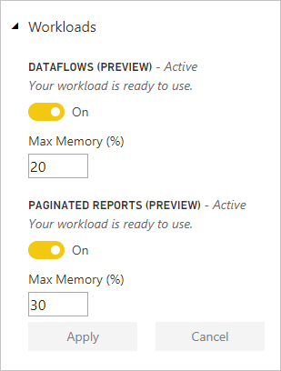

# Manage capacities within Power BI Premium and Power BI Embedded

Learn how to manage Power BI Premium and Power BI Embedded capacities, which provide dedicated resources for your content.

## What is capacity?

*Capacity* is at the heart of the Power BI Premium and Power BI Embedded offerings. It is the set of resources reserved for exclusive use by your organization. Having dedicated capacity enables you to publish dashboards, reports, and datasets to users throughout your organization without having to purchase per-user licenses for them. It also offers dependable, consistent performance for the content hosted in capacity. For more information, see [What is Power BI Premium?](service-premium.md).

### Capacity admins

When you are assigned to a capacity as a *capacity admin*, you have full control over the capacity and its administrative features. From the Power BI admin portal, you can add more capacity admins or give users capacity assignment permissions. You can bulk assign workspaces to a capacity and view usage metrics on a capacity.

> [!NOTE]
> For Power BI Embedded, capacity admins are defined in the Microsoft Azure portal.

Each capacity has its own admins. Assigning a capacity admin to one capacity does not give them access to all capacities within your organization. Capacity admins do not have access to all Power BI admin areas by default, such as usage metrics, audit logs or tenant settings. Capacity admins also do not have permissions to set up new capacities or change the SKU of existing capacities. Only Office 365 Global Administrators or Power BI service administrators have access to those items.

All Office 365 Global Administrators and Power BI service administrators are automatically capacity admins of both Power BI Premium capacity and Power BI Embedded capacity.

## Purchase capacity

To take advantage of dedicated capacity, you must purchase Power BI Premium in the Office 365 admin center or create a Power BI Embedded resource in the Microsoft Azure portal. For more information, see the following articles:

* **Power BI Premium:** [How to purchase Power BI Premium](service-admin-premium-purchase.md)

* **Power BI Embedded:** [Create Power BI Embedded capacity in the Azure portal](https://docs.microsoft.com/azure/power-bi-embedded/create-capacity)

When you purchase Power BI Premium or Embedded SKUs, your tenant receives the corresponding number of v-cores for use in running capacities. For example, purchasing a Power BI Premium P3 SKU provides the tenant with 32 v-cores. For more information on SKUs, see [Premium capacity nodes](service-premium.md#premium-capacity-nodes).

## What Premium looks like for users

For the most part, users don't need to know they are in a Premium capacity. Their dashboards and reports just work. As a visual hint, there is a diamond icon next to workspaces that are in a Premium capacity.

## Configure workloads

Think of a workload in Power BI as one of the many services you can expose to users. By default, capacities for **Power BI Premium** and **Power BI Embedded** support only the workload associated with running Power BI queries in the cloud.

We now offer preview support for two additional workloads: **Paginated reports** and **Dataflows**. You enable these workloads in the Power BI admin portal or through the Power BI REST API. You also set the maximum memory each workload can consume, so that you can control how the different workloads affect each other.

### Enable workloads in the Power BI admin portal

To enable workloads, follow these steps.

1. Under **Capacity settings**, select a capacity.

1. Under **MORE OPTIONS**, expand **Workloads**.

1. Enable one or more workloads, and set a value for **Max Memory**.

    

1. Select **Apply**.

### Default memory settings

The following table shows the default and minimum memory values, based on the different [capacity nodes](service-premium.md#premium-capacity-nodes) available. Memory is dynamically allocated to dataflows, but it is statically allocated to paginated reports. For more information, see the next section, [Considerations for paginated reports](#considerations-for-paginated-reports).

|                     | EM3                      | P1                       | P2                      | P3                       |
|---------------------|--------------------------|--------------------------|-------------------------|--------------------------|
| Paginated reports | N/A | 20% default; 10% minimum | 20% default; 5% minimum | 20% default; 2.5% minimum |
| Dataflows | 15% default; 8% minimum  | 15% default; 4% minimum  | 15% default; 2% minimum | 15% default; 1% minimum  |
| | | | | |

### Considerations for paginated reports

If you use the paginated reports workload, keep the following points in mind.

* **Memory allocation in paginated reports**: Paginated reports allow you to run your own code when rendering a report (such as dynamically changing text color based on content). Given this fact, we secure Power BI Premium capacity by running paginated reports in a contained space within the capacity. We assign the maximum memory you specify to this space, whether or not the workload is active. If you use Power BI reports or dataflows in the same capacity, make sure you set memory low enough for paginated reports that it doesn't negatively affect the other workloads.

* **Paginated reports are unavailable**: In rare circumstances, the paginated reports workload can become unavailable. In this case, the workload shows an error state in the admin portal, and users see timeouts for report rendering. To mitigate this issue, disable the workload then enable it again.

## Monitor capacity usage

Power BI provides an app for monitoring capacity usage. For more information, see [Monitor Power BI Premium capacities in your organization](service-admin-premium-monitor-capacity.md).

## Manage capacity

After you have purchased capacity nodes in Office 365, you set up the capacity in the Power BI admin portal. You manage Power BI Premium capacities in the **Capacity settings** section of the portal.

You manage a capacity by selecting the name of the capacity. This takes you to the capacity management screen.

If no workspaces have been assigned to the capacity, you will see a message about [assigning a workspace to the capacity](#assign-a-workspace-to-a-capacity).

### Setting up a new capacity (Power BI Premium)

The admin portal shows the number of *virtual cores* (v-cores) that you have used and that you still have available. The total number of v-cores is based on the Premium SKUs that you have purchased. For example, purchasing a P3 and a P2 results in 48 available cores – 32 from the P3 and 16 from the P2.

If you have available v-cores, set up your new capacity by following these steps.

1. Select **Set up new capacity**.

1. Give your capacity a name.

1. Define who the admin is for this capacity.

1. Select your capacity size. Available options are dependent on how many available v-cores you have. You can't select an option that is larger than what you have available.

    

1. Select **Set up**.

    

Capacity admins, as well as Power BI admins and Office 365 Global Administrators, then see the capacity listed in the admin portal.

### Capacity settings

1. In the Premium capacity management screen, under **Actions**, select the **gear icon** to review and update settings. 

    

1. You can see who the service admins are, the SKU/size of the capacity, and what region the capacity is in.

    

1. You can also rename or delete a capacity.

    

> [!NOTE]
> Power BI Embedded capacity settings are managed in the Microsoft Azure portal.

### Change capacity size

Power BI admins and Office 365 Global Administrators can change Power BI Premium capacity. Capacity admins who are not a Power BI admin or Office 365 Global Administrator don't have this option.

1. Select **Change capacity size**.

    

1. On the **Change capacity size** screen upgrade or downgrade your capacity as appropriate.

    

    Administrators are free to create, resize and delete nodes, so long as they have the requisite number of v-cores.

    P SKUs cannot be downgraded to EM SKUs. You can hover over any disabled options to see an explanation.

### Manage user permissions

You can assign additional capacity admins, and assign users that have *capacity assignment* permissions. Users that have assignment permissions can assign an app workspace to a capacity if they are an admin of that workspace. They can also assign their personal *My Workspace* to the capacity. Users with assignment permissions do not have access to the admin portal.

> [!NOTE]
> For Power BI Embedded, capacity admins are defined in the Microsoft Azure portal.

Under **User permissions**, expand **Users with assignment permissions**, then add users or groups as appropriate.

## Assign a workspace to a capacity

There are two ways to assign a workspace to a capacity: in the admin portal; and from an app workspace.

### Assign from the admin portal

Capacity admins, along with Power BI admins and Office 365 Global Administrators, can bulk assign workspaces in the premium capacity management section of the admin portal. When you manage a capacity, you see a **Workspaces** section that allows you to assign workspaces.

1. Select **Assign workspaces**. This option is available in multiple places.

1. Select an option for **Apply to**.

    

   | Selection | Description |
   | --- | --- |
   | **Workspaces by users** | When you assign workspaces by user, or group, all the workspaces owned by those users are assigned to Premium capacity, including the user's personal workspace. Said users automatically get workspace assignment permissions. This includes workspaces already assigned to a different capacity. |
   | **Specific workspaces** | Enter the name of a specific workspace to assign to the selected capacity. |
   | **The entire organization's workspaces** | Assigning the entire organization's workspaces to Premium capacity assigns all app workspaces and My Workspaces, in your organization, to this Premium capacity. In addition, all current and future users will have the permission to reassign individual workspaces to this capacity. |
   | | |

1. Select **Apply**.

### Assign from app workspace settings

You can also assign an app workspace to a Premium capacity from the settings of that workspace. To move a workspace into a capacity, you must have admin permissions to that workspace, and also capacity assignment permissions to that capacity. Note that workspace admins can always remove a workspace from Premium capacity.

1. Edit an app workspace by selecting the ellipsis **(. . .)** then selecting **Edit workspace**.

    

1. Under **Edit workspace**, expand **Advanced**.

1. Select the capacity that you want to assign this app workspace to.

    

1. Select **Save**.

Once saved, the workspace and all its contents are moved into Premium capacity without any experience interruption for end users.

## Power BI Report Server product key

On the **Capacity settings** tab of the Power BI admin portal, you will have access to your Power BI Report Server product key. This will only be available for Global Admins or users assigned the Power BI service administrator role and if you have purchase a Power BI Premium SKU.

Selecting **Power BI Report Server key** will display a dialog contain your product key. You can copy it and use it with the installation.

For more information, see [Install Power BI Report Server](report-server/install-report-server.md).

## Next steps

Share published apps with users. For more information, see [Create and distribute an app in Power BI](service-create-distribute-apps.md).

More questions? [Try asking the Power BI Community](http://community.powerbi.com/)
