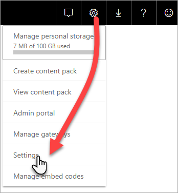
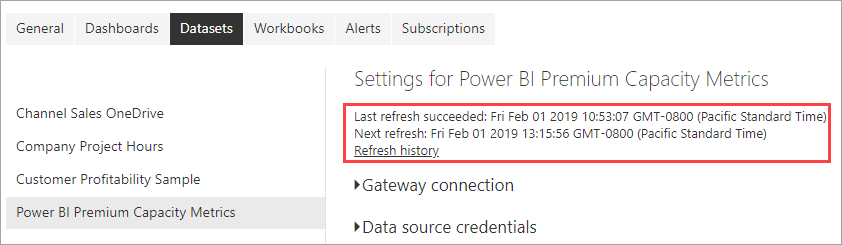

# Monitor Premium capacities with the app

Monitoring your capacities is essential to making informed decisions on how best to utilize your Premium capacity resources. You can monitor capacities in the Admin portal or with the **Power BI Premium Capacity Metrics** app. This article describes using the Premium Capacity Metrics app. The app provides the most in-depth information into how your capacities are performing. For a higher level overview of average use metrics over the last seven days, you can use the Admin portal. To learn more about monitoring in the portal, see [Monitor Premium capacities in the Admin portal](service-admin-premium-monitor-portal.md).

The app is updated regularly with new features and functionality. Make sure you are running the latest version.
**The latest version of the app is 1.10.1.1 (released February 4th, 2019)**.   
If you have a previous version of the app already installed, it’s best to delete it from your apps and then press CTRL+F5 to refresh. 

## Install the app

You can go straight to [Premium Capacity Metrics app](https://app.powerbi.com/groups/me/getapps/services/capacitymetrics), or install it like you do other apps in Power BI.

1. In Power BI, click **Apps**.   
    

2. On the right side, click **Get apps**.
3. In the **Apps** category, search for **Power BI Premium Capacity Metrics app**.
4. Subscribe to install the app.

Be patient. It takes a few minutes to install and refresh metrics. If the app shows blank metrics, press F5 to refresh your browser.

## Get app refresh history

To check the last time your Premium Capacity Metrics app refreshed, click **Settings** > **Datasets** > **Power BI Premium Capacity Metrics** > **Refresh History**. 

The last refresh is shown, or click **Refresh history** to see scheduled and on demand refreshes.

## Monitor a capacity with the app

Now that you've installed the app, you can see metrics for the capacities in your organization. Let's take a look at some of the key metrics that are available.

### Metrics dashboard

When you open the app, it first shows a dashboard with a summary of all the capacities for which you have admin rights.

The dashboard includes the following metrics:

| **Report section** | **Metrics** |
| --- | --- |
| **System Summary** | * Version of the application  * Number of capacities for which you are admin  * Number of workspaces in your capacities that are reporting metrics  * Average memory consumption in GB over the past seven days  * Maximum memory consumption in GB in the past seven days  * Local time that maximum memory consumption occurred  * Number of times CPU exceeded 80% of the thresholds in the past seven days, split into three minute buckets  * Most times the CPU exceeded 80% in the past seven days, split into one hour buckets  * Local time that CPU exceeded 80% the most times in an hour |
| **Dataset Summary** | * Total number of datasets across all workspaces in your capacities  * Number of times Direct query/Live connections exceeded 80% of the thresholds in the past seven days, split into three minute buckets  * Most times the Direct query/Live connections exceeded 80% in the past seven days, split into one hour buckets  * Local time that Direct query/Live connections exceeded 80% the most times in an hour  * Total number of refreshes in the past seven days  * Average refresh wait time - the average lag between the scheduled time and start of the refresh, in minutes  * Average refresh duration - the time taken to complete the refresh, in minutes  * Total number of queries run in the past seven days  * Average query wait time - the time a query waited on system resources before starting execution, in milliseconds  * Average query duration - the time taken to complete the query, in milliseconds  * Total number of models evicted due to memory pressure  * Average size of datasets   * Average count of datasets loaded into memory |
| **Dataflow Summary** | * Total number of dataflows across all workspaces in your capacities  * Total number of refreshes in the past seven days  * Average refresh wait time - the average lag between the scheduled time and start of the refresh, in minutes  * Average refresh duration - the time taken to complete the refresh, in minutes |
| **Paginated Report Summary** | * Total number of paginated reports across all workspaces in your capacities  * Total number of times that all reports have been viewed by users  * Total number of rows of data in all reports  * Total time it takes for all phases (data retrieval, processing, and rendering) of all reports, in milliseconds |
|  |  |

### Metrics report

Click the dashboard to go to the underlying report. At the bottom of the report, there are five tabs:

* [**Datasets**](#datasets-tab) - Detailed metrics on the health of the Power BI datasets in your capacities.

* [**Paginated Reports**](#paginated-reports-tab) - Detailed metrics on the health of the paginated reports in your capacities.

* [**Dataflows**](#dataflows-tab) - Detailed refresh metrics for dataflows in your capacities.

* [**Resource Consumption**](#resource-consumption-tab) - Overall capacity metrics including memory and CPU high utilization.

* [**IDs and Info**](#ids-and-info-tab) - Names, IDs, and owners for capacities, workspaces, and workloads.

On each tab, you can filter metrics by capacity and date range. If no filters are selected, the report defaults to show the past week’s metrics for all capacities that are reporting metrics. 

#### Datasets

Use the buttons at the top of the **Datasets** tab to navigate to different areas: **Refreshes**, **Query Durations**, **Query Waits**, and **Datasets**.

##### Refreshes area

The **Refreshes** area contains the following metrics.

| **Report section** | **Metrics** |
| --- | --- |
| **Refresh reliability** | * Total Count: Total refreshes for each dataset  * Reliability: the percentage of refreshes that completed for each dataset  * Avg Wait Time: The average lag between the scheduled time and start of a refresh for the dataset, in minutes  * Max Wait Time: The maximum wait time for the dataset, in minutes   * Avg Duration: The average duration of refresh for the dataset, in minutes  * Max Duration: The duration of the longest-running refresh for the dataset, in minutes |
| **Top 5 Datasets by Average Refresh Duration** | * The five datasets with the longest average refresh duration, in minutes |
| **Top 5 Datasets by Average Wait Time** | * The five datasets with the longest average refresh wait time,  in minutes |
| **Hourly Average Refresh Wait Times** | * The average refresh wait time, split into one hour buckets, reported in local time. Multiple spikes with high refresh wait times are indicative of the capacity running hot. |
| **Hourly Refresh Count and Memory Consumption** | * Successes, failures, and memory consumption, split into one hour buckets, reported in local time |
|  |  |

##### Query Durations area

The **Query Durations** area contains the following metrics.

| **Report section** | **Metrics** |
| --- | --- |
| **Query Durations** | * Data in this section is sliced by datasets, workspace, and hourly buckets in the past seven days  * Total: The total number of queries run for the dataset  * Average: The average query duration for the dataset, in milliseconds  * Max: The duration of the longest-running query in the dataset, in milliseconds|
| **Query Duration Distribution** | * The query duration histogram is bucketed by query durations (in milliseconds) into the following categories: <= 30ms, 30-100ms, 100-300ms, 300ms-1sec, 1sec-3sec, 3sec-10sec, 10sec-30sec, and > 30 seconds intervals. Long query durations and long wait times are indicative of the capacity running hot. It may also mean that a single dataset is causing problems and further investigation is needed. |
| **Top 5 Datasets by Average Duration** | * The five datasets with the longest average query duration, in milliseconds |
| **Direct Query / Live Connections (> 80% Utilization)** | * The times that a direct query or live connection exceeded 80% CPU utilization, split into one hour buckets, reported in local time |
| **Hourly Query Duration Distributions** | * Query counts and average duration (in milliseconds) vs. memory consumption in GB, split into one hour buckets, reported in local time |
|  |  |

##### Query Waits area

The **Query Waits** area contains the following metrics.

| **Report section** | **Metrics** |
| --- | --- |
| **Query Wait Times** | * Data in this section is sliced by datasets, workspace, and hourly buckets in the past seven days  * Total: The total number of queries run for the dataset  * Wait count: The number of queries in the dataset that waited on system resources before starting execution   * Average: The average query wait time for the dataset, in milliseconds  * Max: The duration of the longest-waiting query in the dataset, in milliseconds|
| **Wait Time Distribution** | * The query duration histogram is bucketed by query durations (in milliseconds) into the following categories: <= 50ms , 50-100ms , 100-200ms , 200-400ms 400ms-1sec , 1 sec-5 sec and > 5 seconds intervals |
| **Top 5 Datasets by Average Wait Time** | * The five datasets with the longest average wait time to start executing a query,  in milliseconds |
| **Hourly Query Wait Counts and Times** | * Query wait counts and average wait time (in milliseconds) vs. memory consumption in GB, split into one hour buckets reported in local time |
|  |  |

##### Datasets area

The **Datasets** area contains the following metrics.

| **Report section** | **Metrics** |
| --- | --- |
| **Dataset Eviction Counts** | * Total: The total number of dataset *evictions* for each capacity. When a capacity faces memory pressure, the node evicts one or more datasets from memory. Datasets that are inactive (with no query/refresh operation currently executing) are evicted first. Then the eviction order is based on a measure of 'least recently used' (LRU).|
| **Hourly Dataset Evictions and Memory Consumption** | * Dataset evictions vs. memory consumption in GB, split into one hour buckets, reported in local time |
| **Hourly Loaded Dataset Counts** | * Number of datasets loaded into memory vs. memory consumption in GB, split into one hour buckets, reported in local time |
| **Data Sizes**  | * Max size: The maximum size of the dataset in MB for the period shown |
|  |  |

#### Paginated reports

The **Paginated reports** tab shows detailed metrics on the health of the paginated reports in your capacities.

| **Report section** | **Metrics** |
| --- | --- |
| **Overall usage** | * Total Views: The number of times that the report has been viewed by users  * Row Count: The number of rows of data in the report  * Retrieval (avg): The average amount of time it takes to retrieve data for the report, in milliseconds. Long durations can indicate slow queries or other data source issues.   * Processing (avg): The average amount of time it takes to process the data for a report, in milliseconds * Rendering (avg): The average amount of time it takes to render a report in the browser, in milliseconds  * Total time: The time it takes for all phases of the report, in milliseconds|
| **Top 5 Reports by Average Data Retrieval Time** | * The five reports with the longest average data retrieval time, in milliseconds |
| **Top 5 Reports by Average Report Processing Time** | * The five reports with the longest average report processing time, in milliseconds |
| **Hourly Durations** | * Data retrieval vs. processing and rendering time, split into one hour buckets, reported in local time |
| **Hourly Results** | * Successes, failures, and memory consumption, split into one hour buckets, reported in local time |
|  |  |

#### Dataflows

The **Dataflows** tab shows detailed refresh metrics for dataflows in your capacities.

| **Report section** | **Metrics** |
| --- | --- |
| **Refresh** | * Total: Total refreshes for each dataflow  * Reliability: the percentage of refreshes that completed for each dataflow  * Avg Wait Time: The average lag between the scheduled time and start of a refresh for the dataflow, in minutes  * Max Wait Time: The maximum wait time for the dataflow, in minutes   * Avg Duration: The average duration of refresh for the dataflow, in minutes  * Max Duration: The duration of the longest-running refresh for the dataflow, in minutes |
| **Top 5 dataflows by Average Refresh Duration** | * The five dataflows with the longest average refresh duration, in minutes |
| **Top 5 dataflows by Average Wait Time** | * The five dataflows with the longest average refresh wait time,  in minutes |
| **Hourly Average Refresh Wait Times** | * The average refresh wait time, split into one hour buckets, reported in local time. Multiple spikes with high refresh wait times are indicative of the capacity running hot. |
| **Hourly Refresh Count and Memory Consumption** | * Successes, failures, and memory consumption, split into one hour buckets, reported in local time |
|  |  |

#### Resource Consumption

The **Resource Consumption** tab shows CPU and memory consumption across all capacities and workloads.

| **Report section** | **Metrics** |
| --- | --- |
| **CPU consumption** | * The number of times CPU exceeded 80% of the thresholds in the past seven days, split into three minute buckets |
| **Memory consumption** | * Memory consumption in the past seven days, split into three minute buckets |
|  |  |

#### IDs and Info

The **IDs and Info** tab contains the names, IDs, and owners for capacities, workspaces, and workloads.

## Monitor Power BI Embedded capacity

You can use the Power BI Premium Capacity Metrics app to monitor *A SKU* capacities in Power BI Embedded. Those capacities will show up in the report as long as you are an admin of the capacity. However, refresh of the report fails unless you grant certain permissions to Power BI on your A SKUs:

1. Open your capacity in the Azure portal.

1. Click **Access control (IAM)**, and add the “Power BI Premium” app to the reader role. If you are unable to find the app by name, you can also add it by its client Id: cb4dc29f-0bf4-402a-8b30-7511498ed654.

    

> [!NOTE]
> You can monitor Power BI Embedded capacity usage in the app or the Azure portal, but not in the Power BI admin portal.

## Next steps

> [!div class="nextstepaction"]
> [Power BI Premium capacity resource management and optimization](service-premium-understand-how-it-works.md)
