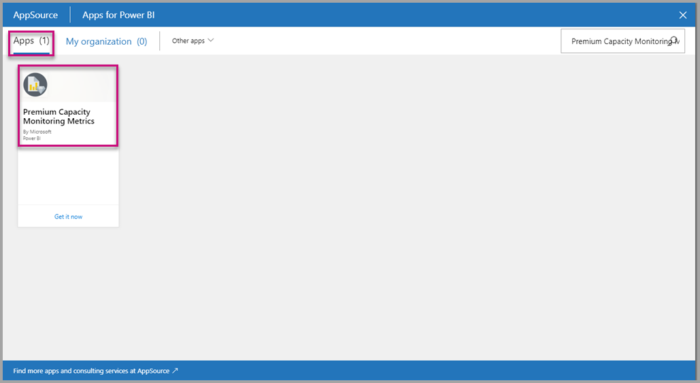
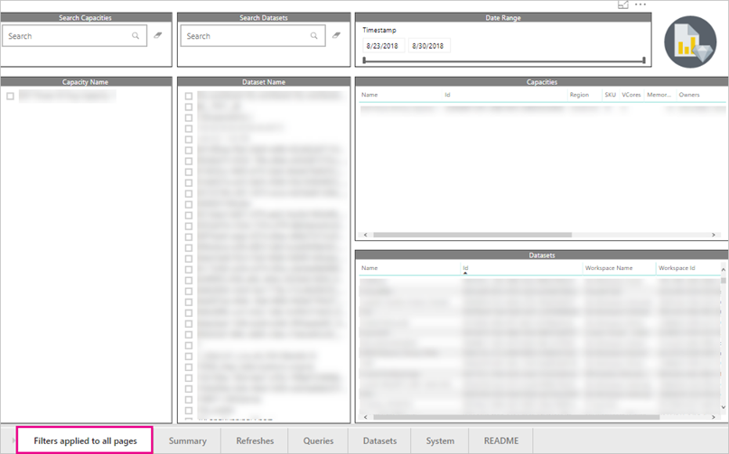
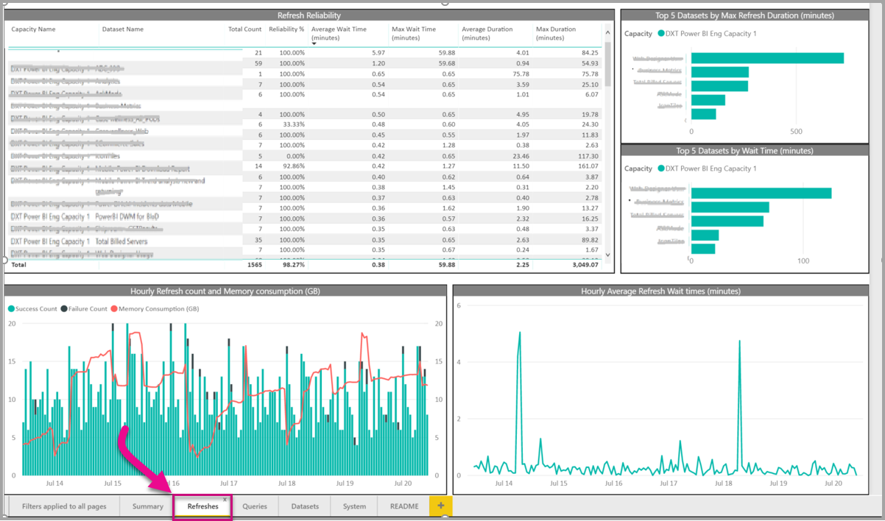
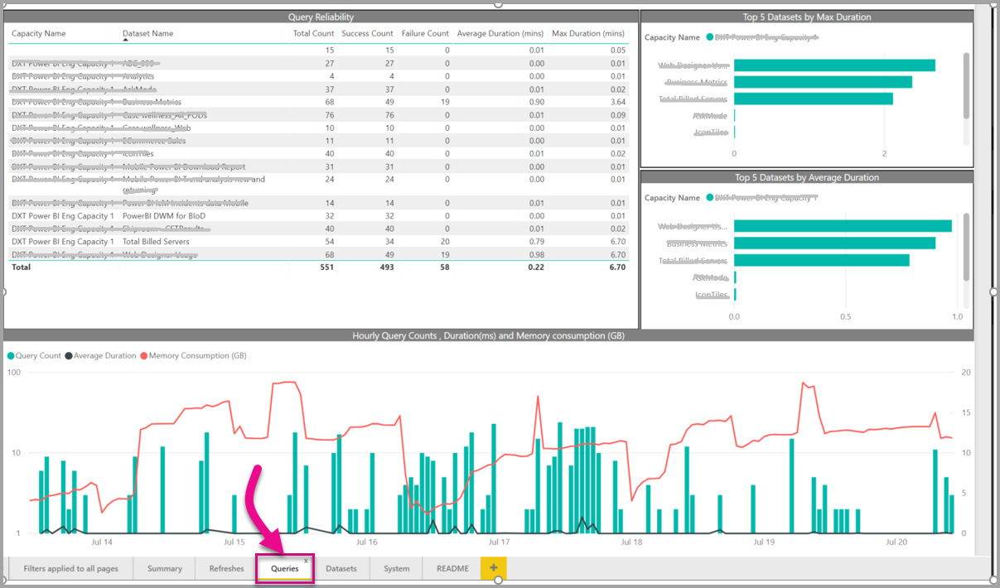
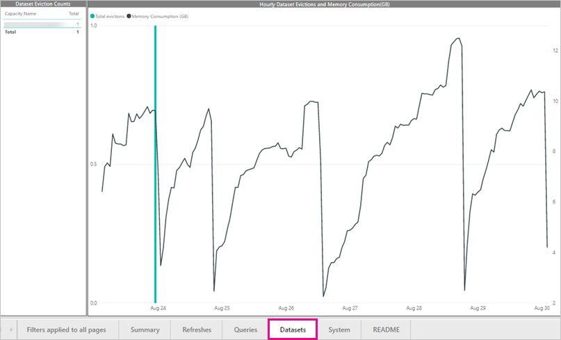
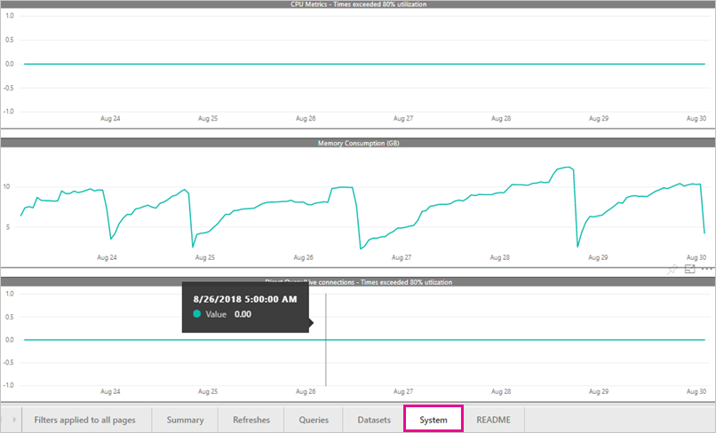

# Monitor Power BI Premium capacities in your organization

This article gives an overview of monitoring your Power BI Premium capacities. The admin portal provides basic metrics, and the Power BI Premium Capacity Monitoring app provides more detailed metrics. These metrics enable you to take an informed approach to scaling a capacity up or down.

> [!NOTE]
> Power BI Embedded capacity usage is monitored within the Azure portal.

## Basic monitoring in the admin portal

The **Capacity settings** area of the admin portal provides four gauges that indicate the loads placed and the resources utilized by your capacity for the past seven days. These four tiles work on an hourly time window that indicates how many hours in the past seven days the corresponding metric was above 80%. This metric indicates a potential degradation for the end-user experience. This new report is intended to complement the existing tiles in a more granular way, focusing on better, and more informative metrics that measure real end-user issues.

| **Metric** | **Description** |
| --- | --- |
| CPU |Number of times CPU exceeded 80% utilization. |
| Memory Thrashing |Represents the memory pressure on your backend cores. Specifically, this is a metric of how many times datasets are evicted from memory due to memory pressure from the usage of multiple datasets. |
| Memory Usage |Average memory usage, represented in gigabytes (GB). |
| DQ/s | Number of times Direct Query and Live Connections count exceeded 80% of the limit.   * We limit the total number of DirectQuery and live connection queries per second.* The limits are 30/s for P1, 60/s for P2 and 120/s for P3. * Direct Query and live connection queries count add to the above throttle. For example, if you have 15 DirectQueries and 15 live connections in a second, you hit your throttle. * This applies equally to on-premises and cloud connections. |
| --- | --- |

Metrics reflect utilization over the past week.  If you'd like to see a more detailed view of the metrics, you can do so by clicking any of the summary tiles.  This will take you to detailed charts for each of the metrics for your premium capacity. The following chart shows details for the CPU metric.

These charts are summarized on an hourly basis for the past week, and can help isolate when you may have had specific performance-related events in your premium capacity.

You may also export the underlying data for any of the metrics to a csv file.  This export will give you detailed information in three minute intervals for each day of the past week.

## Installing the Premium Capacity Monitoring app

To install the Premium Capacity Monitoring App, follow these steps:

1. Go to the **Apps** menu in the Power BI site

    

2. Click get apps.

3. Click on **Get apps**, and in the **Apps** category, search for **Power BI Premium Capacity Monitoring**.

    

4. Subscribe to install the app.

Now that you've installed the app, you can see metrics about the capacities in your organization. Let's take a look at some of the key metrics that are available.

## App dashboard and filtering

After you install the app, click to open it. The app shows a dashboard with a summary of all the capacities for which you have admin rights.

The **filters applied to all pages** allow you to select a capacity, a dataset, and/or a date range within the past seven days. These filters apply the selection to all the relevant pages and tiles in this report. If nothing is selected, the report defaults to show the past week’s metrics on every capacity you own.

## Summary page

The **Summary page** shows a view of the capacity based on entities, system, and datasets.

| **Area** | **Metrics** |
| --- | --- |
| **Entities** | * The number of capacities you own  * The distinct number of datasets in your capacity  * The distinct number of workspaces in your capacity |
| **System** | * The average memory usage in GB over the past seven days  * Highest memory consumption in GB in the past seven days and the local time it occurred.  * The number of times CPU exceeded 80% of the thresholds in the past seven days split into 3-minute buckets  * Most times the CPU exceeded 80% in the past seven days split by hour buckets and the local time it occurred.  * The number of times Direct query/Live connections exceeded 80% of the thresholds in the past seven days split into 3-minute buckets  * Most times the Direct query/Live connections exceeded 80% in the past seven days split by hour buckets and the local time it occurred. |
| **Dataset workloads** | * Total number of refreshes in the past seven days  * Total number of successful refreshes in the past seven days  * Total number of failed refreshes in the past seven days  * Total number of failed refreshes due to out of memory  * Average refresh duration is measured in minutes, the time taken to complete the operation  * Average refresh wait-time is measured in minutes, the average lag between the scheduled time and start of the operation.  * Total number of queries run in the past seven days  * Total number of successful queries in the past seven days  * Total number of failed queries in the past seven days  * Average queries duration is measured in minutes, the time taken to complete the operation  * Total number of models evicted due to memory pressure |
| --- | --- |

## Refreshes page

The **Refreshes page** table lists out the complete refreshes, success measures, average/max refresh wait-time and average/max refresh duration sliced by datasets in the past seven days. The bottom two charts show the refreshes vs. memory consumption in GB and average wait-times split by one-hour buckets reported in local time. The top bar charts list the top five datasets by the total of the max time it took to complete the dataset to refresh (refresh duration), and max refresh waits time. Multiple high refresh wait-time spikes are indicative of the capacity running hot.

## Queries page

The **Queries page** table lists out the total query count, success, and failure count and average/max query duration sliced by datasets in the past seven days. The bottom chart shows the queries vs. memory consumption in GB split by one-hour buckets reported in local time. The top bar charts list the top five datasets by an average of the max and the average time it took to complete the query. Multiple high refresh wait-time spikes are indicative of the capacity running hot.

## Datasets page

The **Datasets page** shows complete datasets evicted due to memory pressure by the hour.

## System page

The **System page** shows the CPU High utilization (number of times exceeded 80% utilization), Direct Query/Live connections high utilization, and Memory Consumption.

## Next Steps

Now that you have gone through the report to monitor Power BI Premium capacities, you can learn more about optimizing capacities.

> [!div class="nextstepaction"]
> [Power BI Premium capacity resource management and optimization](service-premium-understand-how-it-works.md)