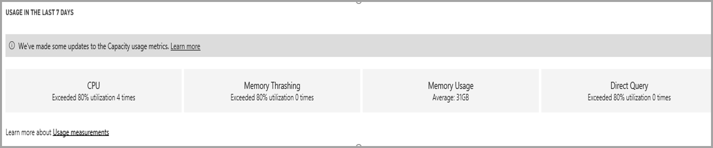
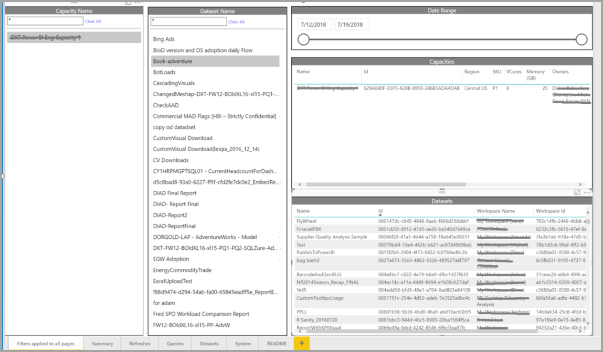
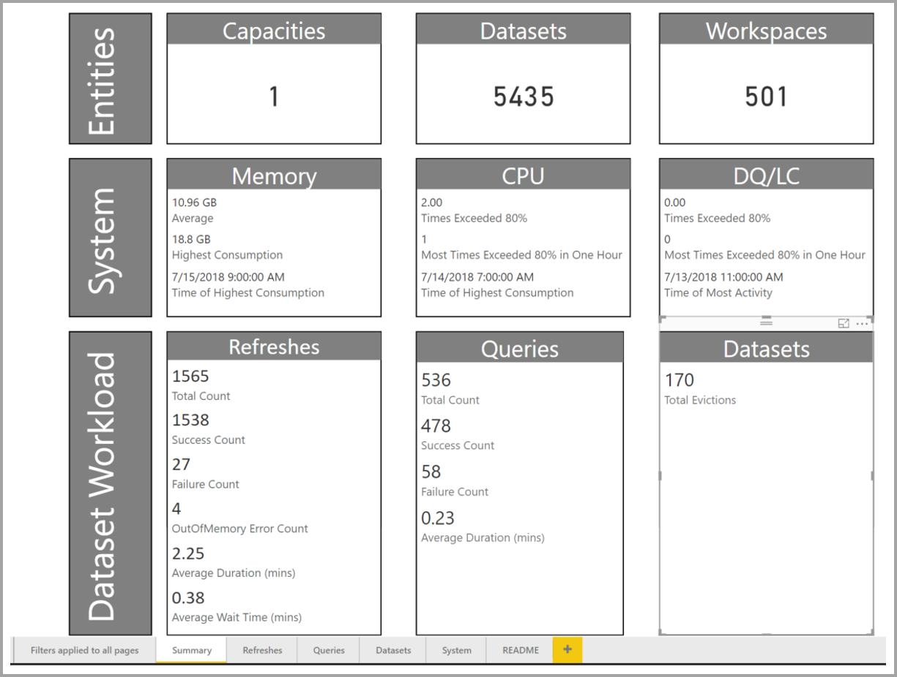
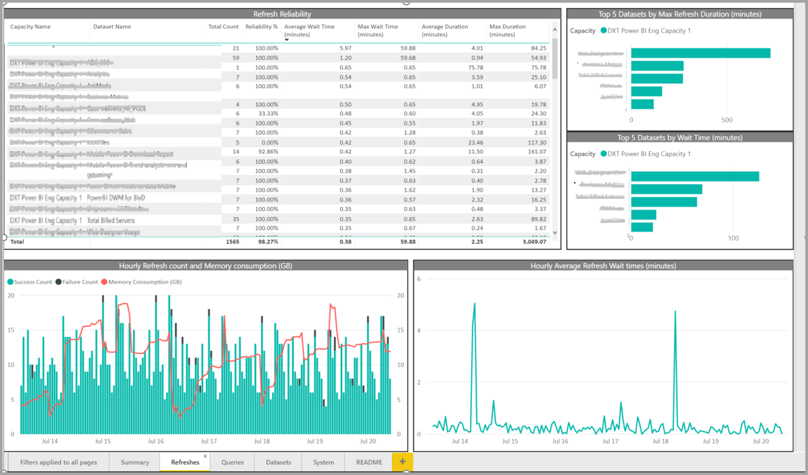
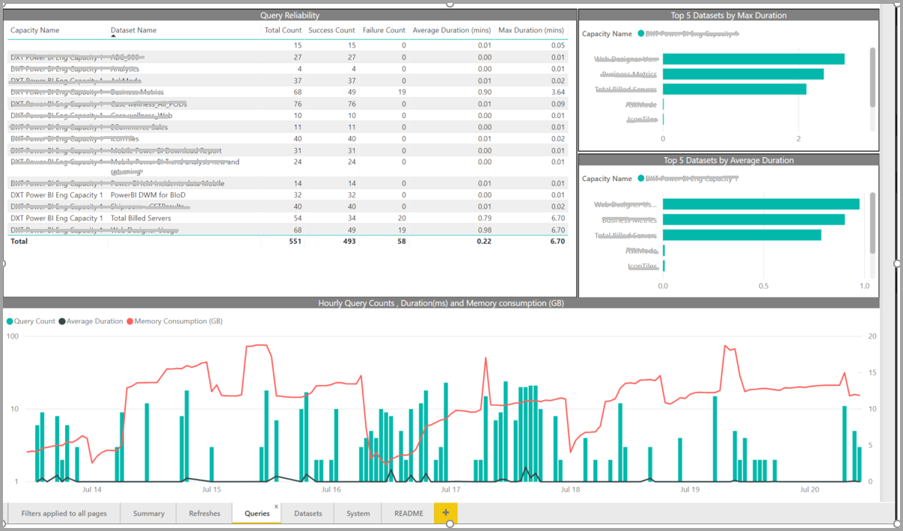
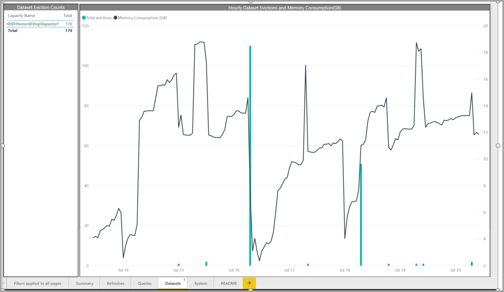
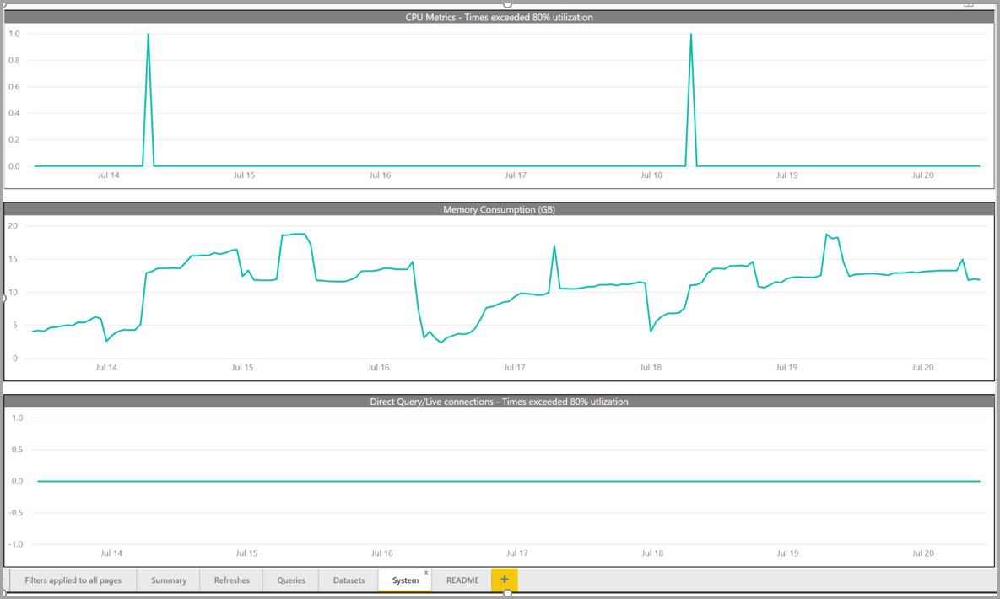

# Using the report to monitor Power BI Premium in your organization

This article aims to give an in-depth overview of the Power BI report built using Power BI diagnostic APIs to support admins in monitoring the health of their capacity and taking appropriate steps to scale up or down as needed based on the metrics provided.

Today, the Premium Capacity admin portal provides four gauges that indicate the load placed and resource utilized by your capacity in past week. These four tiles work on an hourly time window and indicate how many hours in the past week the corresponding metric was above 80% utilization indicating potentially a degraded end-user experience. The new report is intended to complement the existing tiles in a more granular way focusing on better and informative metrics measures indicative of real issues.

## Installing the app

Installing the Premium Capacity Monitoring App:

1. Go the "Apps" menu in the Power BI website

2. Click get apps.

3. Click on "Get apps" and in the “Apps” category, search for “Power BI Premium Capacity Monitoring”.

4. Subscribe to install the app.

Now you have the app installed and can see metrics about the capacities in your organization. Let's take a look at some of the key new metrics now available.

## Overview of the report

The **filters applied to all pages** allow you to select a capacity, dataset and/or date range within the past week to apply the selection to all the relevant pages and tiles in this report. If nothing is selected, the report defaults to show the past week’s metrics on every capacity you own.

## Summary

The **Summary page** shows the higher view of the capacity using entities, system, and datasets.

This page summarizes:

* Entities
    * The number of capacities you own
    * The distinct number of datasets in your capacity
    * The distinct number of workspaces in your capacity

* System:
    * The average memory usage in GB over the past seven days
    * Highest memory consumption in GB in the past seven days and the local time it occurred.
    * The number of times CPU exceeded 80% of the thresholds in the past seven days split into 3-minute buckets
    * Most times the CPU exceeded 80% in the past seven days split by hour buckets and the local time it occurred.
    * The number of times Direct query/Live connections exceeded 80% of the thresholds in the past seven days split into 3-minute buckets
    * Most times the Direct query/Live connections exceeded 80% in the past seven days split by hour buckets and the local time it occurred.

* Dataset Workloads:
    * Total number of refreshes in the past seven days
    * Total number of successful refreshes in the past seven days
    * Total number of failed refreshes in the past seven days
    * Total number of failed refreshes due to out of memory
    * Average refresh duration is measured in minutes, the time taken to complete the operation
    * Average refresh wait-time is measured in minutes, the average lag between the scheduled time and start of the operation.
    * Total number of queries run in the past seven days
    * Total number of successful queries in the past seven days
    * Total number of failed queries in the past seven days
    * Average queries duration is measured in minutes, the time taken to complete the operation
    * Total number of models evicted due to memory pressure

## Refreshes

The **Refreshes page** table lists out the complete refreshes, success measures, average/max refresh wait-time and average/max refresh duration sliced by datasets in the past seven days. The bottom two charts show the refreshes vs. memory consumption in GB and average wait-times split by one-hour buckets reported in local time. The top bar charts list the top five datasets by the total of the max time it took to complete the dataset to refresh (refresh duration), and max refresh waits time. Multiple high refresh wait-time spikes are indicative of the capacity running hot.

## Queries

The **Queries page** table lists out the total query count, success, and failure count and average/max query duration sliced by datasets in the past seven days. The bottom chart shows the queries vs. memory consumption in GB split by one-hour buckets reported in local time. The top bar charts list the top five datasets by an average of the max and the average time it took to complete the query. Multiple high refresh wait-time spikes are indicative of the capacity running hot.

## Datasets

The **Datasets page** shows complete datasets evicted due to memory pressure by the hour.

## System

The **System page** shows the CPU High utilization (number of times exceeded 80% utilization), Direct Query/Live connections high utilization, and Memory Consumption.

## Next Steps

Now that you have gone through the report to monitor Power BI Premium capacities, you can learn more about monitoring capacity usage for Power BI Premium capacities.

> [!div class="nextstepaction"]
> [Monitor capacity usage](service-admin-premium-manage.md#monitor-capacity-usage)