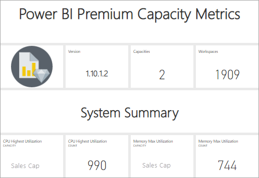
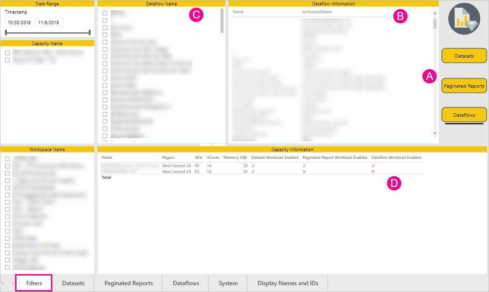
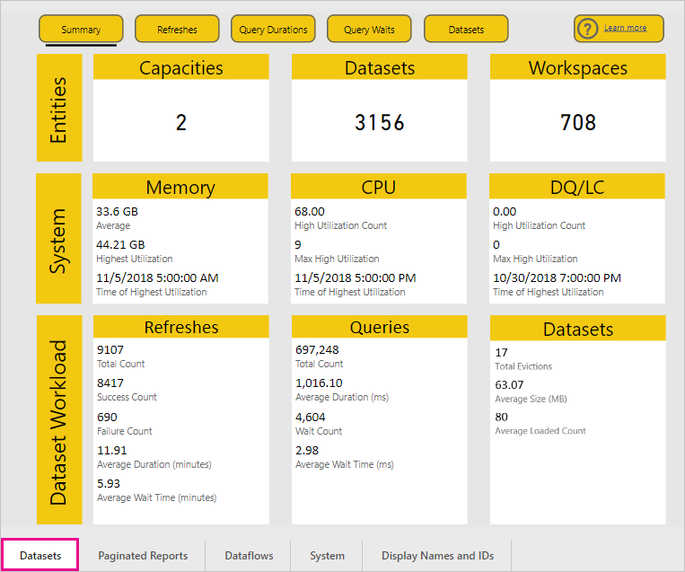
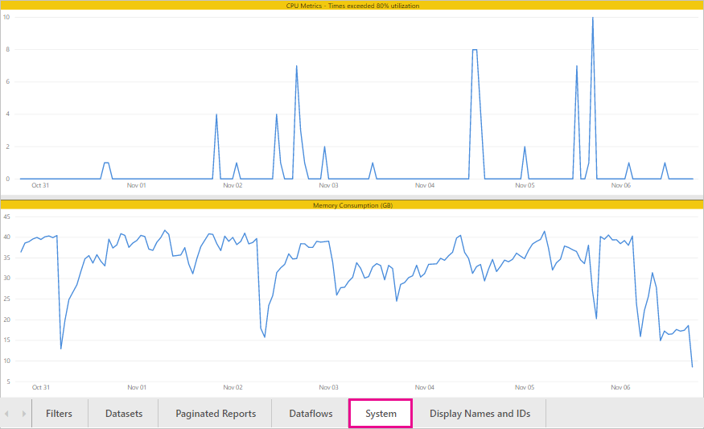

# Monitor Power BI Premium and Power BI Embedded capacities

This article provides an overview of monitoring the metrics for your Power BI Premium capacities. Monitoring capacity usage enables you to take an informed approach to managing your capacities.

You can monitor capacity with the Power BI Premium Capacity Metrics app or in the admin portal. We recommend the app, because it provides much more detail, but this article covers both options. **The current version of the app is 1.8 (released November 7, 2018).**

<iframe width="560" height="315" src="https://www.youtube.com/embed/UgsjMbhi_Bk?rel=0&amp;showinfo=0" frameborder="0" allowfullscreen></iframe>

## Install the Premium Capacity Metrics app

You can go straight to the [Premium Capacity Metrics app](https://app.powerbi.com/groups/me/getapps/services/capacitymetrics) or install it like you do other apps in Power BI.

1. In Power BI, click **Apps**.

    

1. On the right side, click **Get apps**.

1. In the **Apps** category, search for **Power BI Premium Capacity Metrics app**.

1. Subscribe to install the app.

Now that you've installed the app, you can see metrics about the capacities in your organization. Let's take a look at some of the key metrics that are available.

## Use the metrics app

When you open the app, it first shows a dashboard with a summary of all the capacities for which you have admin rights.

Click the dashboard to go to the underlying report. The report has six tabs, which we describe in more detail in the following sections.

* **Filters**: enables you to filter the other pages in the report to a specific capacity.

* **Datasets**: detailed metrics on the health of the Power BI datasets in your capacities.

* **Paginated reports**: detailed metrics on the health of the paginated reports in your capacities.

* **Dataflows**: detailed refresh metrics for dataflows in your capacities.

* **System**: overall capacity metrics including memory and CPU high utilization.

* **Display Names and IDs**: names, IDs, and owners for capacities, workspaces, and workloads.

### Filters tab

The **Filters** tab enables you to select a capacity, a date range, and other options. Filters are then applied to all the relevant pages and tiles in the report. If no filters are selected, the report defaults to show the past week’s metrics on every capacity you own.

* **(A)** Select **Datasets**, **Paginated Reports**, or **Dataflows** to set filters for each workload.

* **(B)** Name and **(C)** information are updated based on what you select in **(A)**, allowing you to filter on a workload by name. For example, in the image above, **Dataflows** is selected, showing **Dataflows Name** and **Dataflows Information**.

* **(D)** Capacity information, which indicates if datasets, paginated reports, or dataflows are enabled for a capacity.

### Datasets tab

Use the buttons at the top of the **Datasets** tab to navigate to different areas: **Summary**, **Refreshes**, **Query Durations**, **Query Waits**, and **Datasets**.

#### Summary area

The **Summary** area shows a view of your capacities based on entities, system resources, and dataset workloads. It shows the following metrics.

| **Report section** | **Metrics** |
| --- | --- |
| **Entities** | * The number of capacities you own  * The distinct number of datasets in your capacity  * The distinct number of workspaces in your capacity |
| **System** | * The average memory usage in GB over the past seven days  * Highest memory consumption in GB in the past seven days and the local time it occurred  * The number of times CPU exceeded 80% of the thresholds in the past seven days, split into three minute buckets  * Most times the CPU exceeded 80% in the past seven days, split into one hour buckets, and the local time it occurred  * The number of times Direct query/Live connections exceeded 80% of the thresholds in the past seven days, split into three minute buckets  * Most times the Direct query/Live connections exceeded 80% in the past seven days, split into one hour buckets, and the local time it occurred |
| **Dataset Workloads** | * Total number of refreshes in the past seven days  * Total number of successful refreshes in the past seven days  * Total number of failed refreshes in the past seven days  * Total number of failed refreshes due to out of memory  * Average refresh duration is the time taken to complete the operation, in minutes  * Average refresh wait time is the average lag between the scheduled time and start of the operation, in minutes  * Total number of queries run in the past seven days  * Total number of successful queries in the past seven days  * Total number of failed queries in the past seven days  * Average query duration is the time taken to complete the operation, in minutes  * Total number of models evicted due to memory pressure |
|  |  |

#### Refreshes area

The **Refreshes** area contains the following metrics.

| **Report section** | **Metrics** |
| --- | --- |
| **Refresh reliability** | * Total Count: Total refreshes for each dataset  * Reliability: the percentage of refreshes that completed for each dataset  * Avg Wait Time: The average lag between the scheduled time and start of a refresh for the dataset, in minutes  * Max Wait Time: The maximum wait time for the dataset, in minutes   * Avg Duration: The average duration of refresh for the dataset, in minutes  * Max Duration: The duration of the longest-running refresh for the dataset, in minutes |
| **Top 5 Datasets by Average Refresh Duration** | * The five datasets with the longest average refresh duration, in minutes |
| **Top 5 Datasets by Average Wait Time** | * The five datasets with the longest average refresh wait time,  in minutes |
| **Hourly Average Refresh Wait Times** | * The average refresh wait time, split into one hour buckets, reported in local time. Multiple spikes with high refresh wait times are indicative of the capacity running hot. |
| **Hourly Refresh Count and Memory Consumption** | * Successes, failures, and memory consumption, split into one hour buckets, reported in local time |
|  |  |

#### Query Durations area

The **Query Durations** area contains the following metrics.

| **Report section** | **Metrics** |
| --- | --- |
| **Query Durations** | * Data in this section is sliced by datasets, workspace, and hourly buckets in the past seven days  * Total: The total number of queries run for the dataset  * Average: The average query duration for the dataset, in milliseconds  * Max: The duration of the longest-running query in the dataset, in milliseconds|
| **Query Duration Distribution** | * The query duration histogram is bucketed by query durations (in milliseconds) into the following categories: <= 30ms, 30-100ms, 100-300ms, 300ms-1sec, 1sec-3sec, 3sec-10sec, 10sec-30sec, and > 30 seconds intervals. Long query durations and long wait times are indicative of the capacity running hot. It may also mean that a single dataset is causing problems and further investigation is needed. |
| **Top 5 Datasets by Average Duration** | * The five datasets with the longest average query duration, in milliseconds |
| **Direct Query / Live Connections (> 80% Utilization)** | * The times that a direct query or live connection exceeded 80% CPU utilization, split into one hour buckets, reported in local time |
| **Hourly Query Duration Distributions** | * Query counts and average duration (in milliseconds) vs. memory consumption in GB, split into one hour buckets, reported in local time |
|  |  |

#### Query Waits area

The **Query Waits** area contains the following metrics.

| **Report section** | **Metrics** |
| --- | --- |
| **Query Wait Times** | * Data in this section is sliced by datasets, workspace, and hourly buckets in the past seven days  * Total: The total number of queries run for the dataset  * Wait count: The number of queries in the dataset that waited on system resources before starting execution   * Average: The average query wait time for the dataset, in milliseconds  * Max: The duration of the longest-waiting query in the dataset, in milliseconds|
| **Wait Time Distribution** | * The query duration histogram is bucketed by query durations (in milliseconds) into the following categories: <= 50ms , 50-100ms , 100-200ms , 200-400ms 400ms-1sec , 1 sec-5 sec and > 5 seconds intervals |
| **Top 5 Datasets by Average Wait Time** | * The five datasets with the longest average wait time to start executing a query,  in milliseconds |
| **Hourly Query Wait Counts and Times** | * Query wait counts and average wait time (in milliseconds) vs. memory consumption in GB, split into one hour buckets reported in local time |
|  |  |

#### Datasets area

The **Datasets** area contains the following metrics.

| **Report section** | **Metrics** |
| --- | --- |
| **Dataset Eviction Counts** | * Total: The total number of dataset *evictions* for each capacity. When a capacity faces memory pressure, the node evicts one or more datasets from memory. Datasets that are inactive (with no query/refresh operation currently executing) are evicted first. Then the eviction order is based on a measure of 'least recently used' (LRU).|
| **Hourly Dataset Evictions and Memory Consumption** | * Dataset evictions vs. memory consumption in GB, split into one hour buckets, reported in local time |
|  |  |

### Paginated reports tab

The **Paginated reports** tab shows detailed metrics on the health of the paginated reports in your capacities.

The **Paginated reports** tab contains the following metrics.

| **Report section** | **Metrics** |
| --- | --- |
| **Overall usage** | * Total Views: The number of times that the report has been viewed by a user  * Row Count: The number of rows of data in the report  * Retrieval (avg): The average amount of time it takes to retrieve data for the report, in milliseconds. Long durations can indicate slow queries or other data source issues.   * Processing (avg): The average amount of time it takes to process the data for a report, in milliseconds * Rendering (avg): The average amount of time it takes to render a report in the browser, in milliseconds  * Total time: The time it takes for all phases of the report, in milliseconds|
| **Top 5 Reports by Average Data Retrieval Time** | * The five reports with the longest average data retrieval time, in milliseconds |
| **Top 5 Reports by Average Report Processing Time** | * The five reports with the longest average report processing time, in milliseconds |
| **Hourly Durations** | * Data retrieval vs. processing and rendering time, split into one hour buckets, reported in local time |
| **Hourly Results** | * Successes, failures, and memory consumption, split into one hour buckets, reported in local time |
|  |  |

### Dataflows tab

The **Dataflows** tab shows detailed refresh metrics for dataflows in your capacities.

The **Dataflows** tab contains the following metrics.

| **Report section** | **Metrics** |
| --- | --- |
| **Refresh** | * Total: Total refreshes for each dataflow  * Reliability: the percentage of refreshes that completed for each dataflow  * Avg Wait Time: The average lag between the scheduled time and start of a refresh for the dataflow, in minutes  * Max Wait Time: The maximum wait time for the dataflow, in minutes   * Avg Duration: The average duration of refresh for the dataflow, in minutes  * Max Duration: The duration of the longest-running refresh for the dataflow, in minutes |
| **Top 5 dataflows by Average Refresh Duration** | * The five dataflows with the longest average refresh duration, in minutes |
| **Top 5 dataflows by Average Wait Time** | * The five dataflows with the longest average refresh wait time,  in minutes |
| **Hourly Average Refresh Wait Times** | * The average refresh wait time, split into one hour buckets, reported in local time. Multiple spikes with high refresh wait times are indicative of the capacity running hot. |
| **Hourly Refresh Count and Memory Consumption** | * Successes, failures, and memory consumption, split into one hour buckets, reported in local time |
|  |  |

### System tab

The **System** tab shows CPU and memory consumption across all capacities and workloads.

The **System** tab contains the following metrics.

| **Report section** | **Metrics** |
| --- | --- |
| **CPU Metrics (> 80% Utilization)** | * The number of times CPU exceeded 80% of the thresholds in the past seven days, split into three minute buckets |
| **Memory consumption** | * Memory consumption in the past seven days, split into three minute buckets |
|  |  |

### Display Names and IDs tab

The **Display Names and IDs** tab contains the names, IDs, and owners for capacities, workspaces, and workloads.

## Monitor Power BI Embedded capacity

You can also use the Power BI Premium Capacity Metrics app to monitor *A SKU* capacities in Power BI Embedded. Those capacities will show up in the report as long as you are an admin of the capacity. However, refresh of the report fails unless you grant certain permissions to Power BI on your A SKUs:

1. Open your capacity in the Azure portal.

1. Click **Access control (IAM)**, and add the “Power BI Premium” app to the reader role. If you are unable to find the app by name, you can also add it by its client Id: cb4dc29f-0bf4-402a-8b30-7511498ed654.

    

> [!NOTE]
> You can monitor Power BI Embedded capacity usage in the app or the Azure portal, but not in the Power BI admin portal.

## Basic monitoring in the admin portal

The **Capacity settings** area of the admin portal provides four gauges that indicate the loads placed and the resources utilized by your capacity for the past seven days. These four tiles work on an hourly time window that indicates how many hours in the past seven days the corresponding metric was above 80%. This metric indicates a potential degradation for the end-user experience.

| **Metric** | **Description** |
| --- | --- |
| CPU |Number of times CPU exceeded 80% utilization. |
| Memory Thrashing |Represents the memory pressure on your backend cores. Specifically, this is a metric of how many times datasets are evicted from memory due to memory pressure from the usage of multiple datasets. |
| Memory Usage |Average memory usage, represented in gigabytes (GB). |
| DQ/s | Number of times Direct Query and Live Connections count exceeded 80% of the limit.   * We limit the total number of DirectQuery and live connection queries per second.* The limits are 30/s for P1, 60/s for P2 and 120/s for P3. * Direct Query and live connection queries count add to the above throttle. For example, if you have 15 DirectQueries and 15 live connections in a second, you hit your throttle * This applies equally to on-premises and cloud connections. |
|  |  |

Metrics reflect utilization over the past week.  If you'd like to see a more detailed view of the metrics, you can do so by clicking any of the summary tiles.  This will take you to detailed charts for each of the metrics for your premium capacity. The following chart shows details for the CPU metric.

These charts are summarized on an hourly basis for the past week, and can help isolate when you may have had specific performance-related events in your premium capacity.

You may also export the underlying data for any of the metrics to a csv file.  This export will give you detailed information in three minute intervals for each day of the past week.

## Next steps

Now that you understand how to monitor Power BI Premium capacities, learn more about optimizing capacities.

> [!div class="nextstepaction"]
> [Power BI Premium capacity resource management and optimization](service-premium-understand-how-it-works.md)
