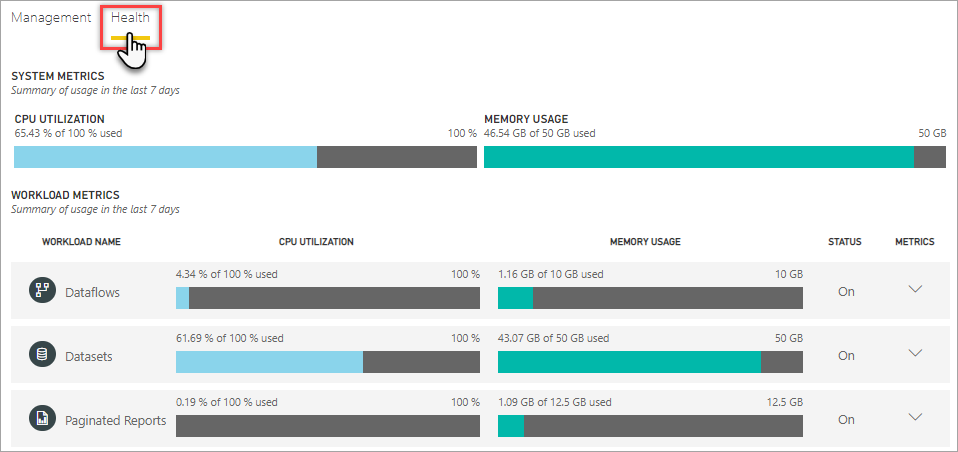
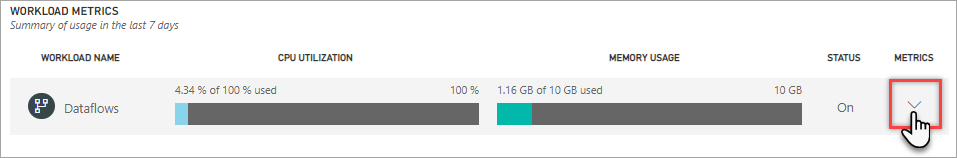

# Monitor capacities by using the Admin portal

The Health tab in the Admin portal provides high-level metrics your Premium capacity workloads. To view capacity metrics in the Admin portal, click **Capacity settings** > **Health**.

## System metrics

System metrics provide a cumulative summary of workload metrics. If CPU utilization regularly exceeds 80%, use detailed workload metrics to determine operations that are causing excessive utilization.

| **Metric** | **Description** |
| --- | --- |
| CPU Utilization | Utilization as a percentage of your total CPU capacity. |
| Memory Usage |Average memory usage, represented in gigabytes (GB). |

## Workload metrics

To view detailed metrics for a workload, click the down arrow.  

### Dataflows metrics

|**Metric**  |**Description**  |
|---------|---------|
|Total count      |   Total refreshes for each dataflow.       |
|Success count      |    Total successful refreshes for each dataflow.      |
|Average Duration      |    The average duration of refresh for the dataflow, in milliseconds.     |
|Max Duration      |   The duration of the longest-running refresh for the dataflow, in milliseconds.      |
|Average Wait Time      |    The average lag between the scheduled time and start of a refresh for the dataflow, in seconds.     |
|Max Wait Time      |    The maximum wait time for the dataflow, in seconds.     |

### Datasets metrics

#### Refresh metrics

|**Metric**  |**Description**  |
|---------|---------|
|Total Count      |   Total refreshes for each dataset.       |
|Success Count     |     Total successful refreshes for each dataset.     |
|Failure Count      |     Total failed refreshes for each dataset.     |
|Success Rate      |     Number of successful refreshes divided by the total refreshes to measure. reliability.      |
|Avg Duration     |    The average duration of refresh for the dataset, in minutes.      |
|Max Duration      |    The duration of the longest-running refresh for the dataset, in minutes.      |
|Avg Wait Time      |     The average lag between the scheduled time and start of a refresh for the dataset, in minutes.     |
|Max Wait Time      |     The maximum wait time for the dataset, in minutes.    |

#### Query metrics

|**Metric**  |**Description**  |
|---------|---------|
|Total Count      |    The total number of queries run for the dataset.      |
|Average Duration      |    The average query duration for the dataset, in milliseconds.      |
|Max Duration      |   The duration of the longest-running query in the dataset, in milliseconds.       |
|Average Wait Time     |    The average query wait time for the dataset, in milliseconds.     |
|Max Wait Time      |   The duration of the longest-waiting query in the dataset, in milliseconds.       |

#### Eviction metrics

|**Metric**  |**Description**  |
|---------|---------|
|   Average Idle Time Before Eviction    |    Average time the report was left idle.   |
|   Active Model Count  |   The number of reports being interacted on recently.   |
|   Inactive Model Count   |  The total number of dataset evictions for each capacity. When a capacity faces memory pressure, the node evicts one or more datasets from memory. Datasets that are inactive (with no query/refresh operation currently executing) are evicted first. Then the eviction order is based on a measure of 'least recently used' (LRU).   |

### Paginated Reports metrics

Metrics reflect utilization over the past week.  If you'd like to see a more detailed view of the metrics, you can do so by clicking any of the summary tiles.  This will take you to detailed charts for each of the metrics for your premium capacity. The following chart shows details for the CPU metric.

These charts are summarized on an hourly basis for the past week, and can help isolate when you may have had specific performance-related events in your premium capacity.

You may also export the underlying data for any of the metrics to a csv file.  This export will give you detailed information in three minute intervals for each day of the past week.

## Next steps

Now that you understand how to monitor Power BI Premium capacities, learn more about optimizing capacities.

> [!div class="nextstepaction"]
> [Power BI Premium capacity resource management and optimization](service-premium-understand-how-it-works.md)
