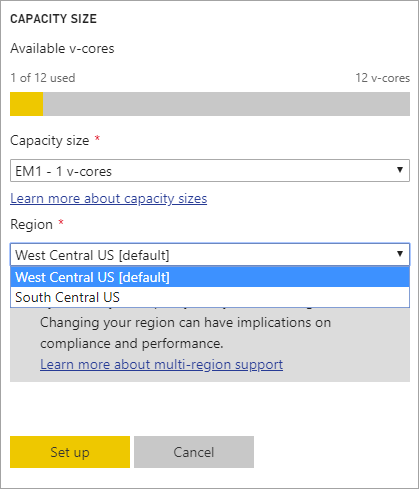
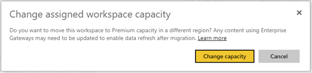
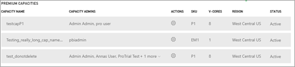

# Configure Multi-Geo support for Power BI Premium

Multi-Geo is a Power BI Premium feature that helps multinational customers address regional, industry-specific, or organizational data residency requirements. As a Power BI Premium customer, you can deploy content to datacenters in regions other than the home region of the Power BI tenant. A geo (geography) can contain more than one region. For example, the United States is a geo, and West Central US and South Central US are regions in the United States. You may choose to deploy content to any of the following geos:

- United States
- Canada
- United Kingdom
- Brazil
- Europe
- Japan
- India
- Asia Pacific
- Australia
- Africa

Multi-Geo isn't available for Power BI Germany, Power BI China operated by 21Vianet, or Power BI for the US government.

Multi-Geo is now also available in Power BI Embedded. Read more at [Multi-Geo support in Power BI Embedded](developer/embedded-multi-geo.md).

## Enable and configure

For new capacities, enable Multi-Geo by selecting a region other than the default region from the dropdown.  Each available capacity shows the region where it's currently located, such as **West Central US**.

After you've created capacity, it remains in that region, and any workspaces created will have their content stored in that region. You can migrate workspaces from one region to another through the dropdown on the workspace settings screen.

You see this message to confirm the change.

You don't need to reset the gateway credentials during a migration at this time.  After they're stored in the Premium capacity region, you will need to reset them upon migration.

During migration, certain operations may fail, such as publishing new datasets or scheduled data refresh.  

The following items are stored in the Premium region when Multi-Geo is enabled:

- Models (.ABF files) for import and Direct Query datasets
- Query cache
- R images

These items remain in the home region for the tenant:

- Push datasets
- Excel workbooks
- Dashboard/report metadata: e.g., tile names, tile queries
- Service buses for gateway queries or scheduled refresh jobs
- Permissions
- Dataset credentials

## View capacity regions

In the Admin Portal, you can view all the capacities for your Power BI tenant and the regions where they’re currently located.

 

## Change the region for existing content

If you need to change the region for existing content, you have two options.

- Create a second capacity and move workspaces. Free users won't experience any downtime as long as the tenant has spare v-cores.
- If creating a second capacity isn't an option, you can temporarily move the content back to shared capacity from Premium. You don't need extra v-cores, but free users will experience some downtime.

## Move content out of Multi-Geo  

You can take workspaces out of Multi-Geo capacity in one of two ways:

- Delete the current capacity where the workspace is located.  This moves the workspace back to shared capacity in the home region.
- Migrate individual workspaces back to Premium capacity located in the home tenant.

## Limitations and considerations

- Confirm that any movement you initiate between regions follows all corporate and government compliance requirements prior to initiating data transfer.
- A cached query stored in a remote region stays in that region at rest. However, other data in transit may go back and forth between multiple geographies.
- When moving data from one region to another in a Multi-Geo environment, the source data may remain in the region from which the data was moved for up to 30 days. During that time end users don't have access to it. It's removed from this region and destroyed during the 30-day period.
- Multi-Geo doesn't result in better performance in general. Loading reports and dashboards still involves requests to the home region for metadata.
- The [dataflows](service-dataflows-overview.md) feature is not supported on Multi-GEO at this time.

## Next steps

- [What is Power BI Premium?](service-premium-what-is.md)
- [Multi-Geo for Power BI Embedded capacities](developer/embedded-multi-geo.md)

More questions? [Try asking the Power BI Community](http://community.powerbi.com/)
