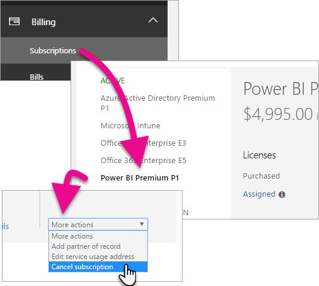
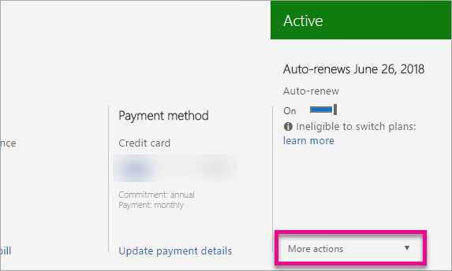

# How to purchase Power BI Premium
Learn how to purchase Power BI Premium capacity for your organization.

<iframe width="640" height="360" src="https://www.youtube.com/embed/NkvYs5Qp4iA?rel=0&amp;showinfo=0" frameborder="0" allowfullscreen></iframe>

You can purchase a Power BI Premium capacity node through the Office 365 Admin center. You can also have any combination of Premium capacity SKUs (P1 through P3) within your organization. They provide different resource capabilities.

For more information about what Power BI Premium is, see [Power BI Premium - what is it?](service-premium.md). To see the current pricing for Power BI, see the [Power BI pricing page](https://powerbi.microsoft.com/pricing/). You can also plan your costs for Power BI Premium by using the [Power BI Premium calculator](https://powerbi.microsoft.com/calculator/).

> [!IMPORTANT]
> Authors of content will still need a Power BI Pro license, even if you purchase Power BI Premium.
> 
> 

## Create a new tenant with Power BI Premium P1
If you don't have an existing tenant and want to create one, you can purchase Power BI Premium at the same time. The following link will walk you through the process of creating a new tenant for use with Office 365 and allow you to purchase Power BI Premium. You will need to purchase a Power BI Pro license for a user after the tenant is created. When you create your tenant, you will automatically be the Global Admin for that tenant.

To make this purchase, see [Power BI Premium P1 offer](https://signup.microsoft.com/Signup?OfferId=b3ec5615-cc11-48de-967d-8d79f7cb0af1).

## Purchase a Power BI Premium capacity for an existing organization
If you have an existing organization, you need to be either a Global admin or a Billing admin, to purchase subscriptions and licenses. For more information, see [About Office 365 admin roles](https://support.office.com/article/About-Office-365-admin-roles-da585eea-f576-4f55-a1e0-87090b6aaa9d).

To purchase a Premium capacity, you will need to do the following.

1. From within the Power BI service, select the **Office 365 app picker** > **Admin**. Alternatively, you can browse to the Office 365 Admin center. You can get there by going to https://portal.office.com and selecting **Admin**.
   
    
2. Select **Billing** > **Purchase services**.
3. Under **Other plans**, look for Power BI Premium offerings. This will list as P1 through P3, EM3 and P1 (month to month).
4. Hover over the **ellipsis (...)** and then select **Buy now**.
   
    
5. Follow the steps to complete the purchase.

You can also select the following links to take you directly to the purchase pages of those items. For more information about these SKUs, see [Power BI Premium - what is it?](service-premium.md#premiumskus).

In order to pucharse a Power BI Premium SKU, ***you must be a Global or Billing admin*** within your tenant. Selecting the links below will produce an error if you are not an admin.

| Direct purchase links |
| --- |
| [EM3 (month-to-month) SKU](https://portal.office.com/commerce/completeorder.aspx?OfferId=4004702D-749C-4F74-BF47-3048F1833780&adminportal=1) |
| [P1 SKU](https://portal.office.com/commerce/completeorder.aspx?OfferId=b3ec5615-cc11-48de-967d-8d79f7cb0af1&adminportal=1) |
| [P1 (month-to-month) SKU](https://portal.office.com/commerce/completeorder.aspx?OfferId=E4C8EDD3-74A1-4D42-A738-C647972FBE81&adminportal=1) |
| [P2 SKU](https://portal.office.com/commerce/completeorder.aspx?OfferId=062F2AA7-B4BC-4B0E-980F-2072102D8605&adminportal=1) |
| [P3 SKU](https://portal.office.com/commerce/completeorder.aspx?OfferId=40c7d673-375c-42a1-84ca-f993a524fed0&adminportal=1) |

After you have completed the purchase, the Purchase services screen will show that the item is purchased and active.

You can now manage this capacity within the Power BI admin center. For more information, see [Manage Power BI Premium](service-admin-premium-manage.md).

## Purchase more capacities
When you are in the **Premium settings** section of the Power BI Admin portal, if you are an admin, you will see a **Purchase more** button. This button will take you to the Office 365 portal. Once you are in the Office 365 Admin center, you can do the following.

1. Select **Billing** > **Purchase services**.
2. Find the Power BI Premium item you want to purchase more of under **Other plans**.
3. Hover over the **ellipsis (...)** and then select **Change license quantity**.
   
    
4. Change the number of instances that you want to have for this item. Then select **Submit** when finished.
   
   > [!IMPORTANT]
   > Selecting **Submit** will cause charges to be made to the credit card on file.
   > 
   > 

The **Purchase services** page will then indicate the number of instances you have. Within the Power BI admin portal, under **Capacity settings**, the available v-cores reflects the new capacity purchased.

You can now manage this capacity within the Power BI admin center. For more information, see [Manage Power BI Premium](service-admin-premium-manage.md).

## Cancel your subscription
You can cancel your subscription from within the Office 365 admin center. To cancel your Premium subscription, do the following.

1. Browse to the Office 365 admin center.
2. Select **Billing** > **Subscriptions**.
3. Select your Power BI Premium subscription from the list.
4. In the **More actions** dropdown, select **Cancel subscription**.
   
    
5. The **Cancel subscription** page will indicate whether or not you are responsible for an [early termination fee](https://support.office.com/article/early-termination-fees-6487d4de-401a-466f-8bc3-c0beb5cc40d3). This page will also let you know when the data will be deleted for the subscription.
6. Read through the information, and if you want to proceed, select **Cancel subscription**.

## Next steps
[Power BI pricing page](https://powerbi.microsoft.com/pricing/)  
[Power BI Premium calculator](https://powerbi.microsoft.com/calculator/)  
[Power BI Premium - what is it?](service-premium.md)  
[Manage Power BI Premium](service-admin-premium-manage.md)  
[Power BI Premium FAQ](service-premium-faq.md)  
[Power BI Premium release notes](service-premium-release-notes.md)  
[Microsoft Power BI Premium whitepaper](https://aka.ms/pbipremiumwhitepaper)  
[Planning a Power BI Enterprise Deployment whitepaper](https://aka.ms/pbienterprisedeploy)  
[Power BI admin portal](service-admin-portal.md)  
[Administering Power BI in your Organization](service-admin-administering-power-bi-in-your-organization.md)  

More questions? [Try asking the Power BI Community](http://community.powerbi.com/)

