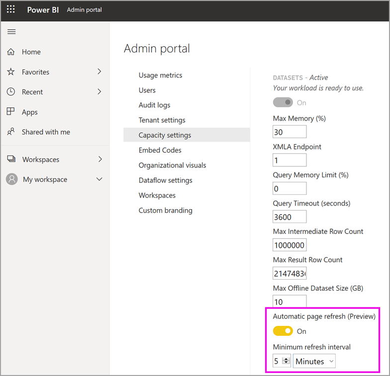

# Configure workloads in a Premium capacity

This article describes enabling and configuring workloads for Power BI Premium capacities. By default, capacities support only the workload associated with running Power BI queries. You can also enable and configure additional workloads for **[AI (Cognitive Services)](service-cognitive-services.md)**, **[Dataflows](service-dataflows-overview.md#dataflow-capabilities-on-power-bi-premium)**, and **[Paginated reports](paginated-reports-save-to-power-bi-service.md)**.

## Default memory settings

Query workloads are optimized for and limited by resources determined by your Premium capacity SKU. Premium capacities also support additional workloads that can use your capacity's resources. Default memory values for these workloads are based on the capacity nodes available for your SKU. Max memory settings are not cumulative. Memory up to the max value specified is dynamically allocated for AI and dataflows, but is statically allocated for paginated reports.

### Microsoft Office SKUs for software as a service (SaaS) scenarios

|                     | EM2                      | EM3                       | P1                      | P2                       | P3                       |
|---------------------|--------------------------|--------------------------|-------------------------|--------------------------|--------------------------|
| AI | N/A | N/A | 20% default; 20% minimum | 20% default; 10% minimum | 20% default; 5% minimum |
| Dataflows | N/A |20% default; 12% minimum  | 20% default; 5% minimum  | 20% default; 3% minimum | 20% default; 2% minimum  |
| Paginated reports | N/A |N/A | 20% default; 10% minimum | 20% default; 5% minimum | 20% default; 2.5% minimum |
| | | | | | |

### Microsoft Azure SKUs for platform as a service (PaaS) scenarios

|                  | A1                       | A2                       | A3                      | A4                       | A5                      | A6                        |
|-------------------|--------------------------|--------------------------|-------------------------|--------------------------|-------------------------|---------------------------|
| AI | N/A                      | 20% default; 100% minimum                     | 20% default; 50% minimum                     | 20% default; 20% minimum | 20% default; 10% minimum | 20% default; 5% minimum |
| Dataflows         | 40% default; 40% minimum | 24% default; 24% minimum | 20% default; 12% minimum | 20% default; 5% minimum  | 20% default; 3% minimum | 20% default; 2% minimum   |
| Paginated reports | N/A                      | N/A                      | N/A                     | 20% default; 10% minimum | 20% default; 5% minimum | 20% default; 2.5% minimum |
| | | | | | |

## Workload settings

### AI (Preview)

The AI workload lets you use cognitive services and Automated Machine Learning in Power BI. Use the following settings to control workload behavior.

| Setting Name | Description |
|---------------------------------|----------------------------------------|
| **Max Memory (%)** | The maximum percentage of available memory that AI processes can use in a capacity. |
| **Allow usage from Power BI Desktop** | This setting is reserved for future use and does not appear in all tenants. |
| **Allow building machine learning models** | Specifies whether business analysts can train, validate, and invoke machine learning models directly in Power BI. For more information, see [Automated Machine Learning in Power BI (Preview)](service-machine-learning-automated.md). |
| **Enable parallelism for AI requests** | Specifies whether AI requests can run in parallel. |
|  |  |

### Datasets

The datasets workload is enabled by default and cannot be disabled. Use the following settings to control workload behavior. There is additional usage information below the table for some of the settings.

| Setting Name | Description |
|---------------------------------|----------------------------------------|
| **Max Memory (%)** | The maximum percentage of available memory that datasets can use in a capacity. |
| **XMLA Endpoint** | Specifies that connections from client applications honor the security group membership set at the workspace and app levels. For more information, see [Connect to datasets with client applications and tools](service-premium-connect-tools.md). |
| **Max Intermediate Row Set Count** | The maximum number of intermediate rows returned by DirectQuery. The default value is 1000000, and the allowable range is between 100000 and 2147483647. |
| **Max Offline Dataset Size (GB)** | The maximum size of the offline dataset in memory. This is the compressed size on disk. The default value is set by SKU, and the allowable range is between 0.1 and 10 GB. |
| **Max Result Row Set Count** | The maximum number of rows returned in a DAX query. The default value is -1 (no limit), and the allowable range is between 100000 and 2147483647. |
| **Query Memory Limit (%)** | The maximum percentage of available memory in the workload that can be used for temporary results in a query or DAX measure. |
| **Query Timeout (seconds)** | The maximum amount of time before a query times out. The default is 3600 seconds (1 hour). A value of 0 specifies that queries won't timeout. |
| **Automatic page refresh (preview)** | On/Off toggle to allow premium workspaces to have reports with automatic page refresh. |
| **Minimum refresh interval** | If automatic page refresh is on, the minimum interval allowed for page refresh interval. The default value is five minutes, and the minimum allowed is one second. |
|  |  |  |

#### Max Intermediate Row Set Count

Use this setting to control the impact of resource-intensive or poorly designed reports. When a query to a DirectQuery dataset results in a very large result from the source database, it can cause a spike in memory usage and processing overhead. This situation can lead to other users and reports running low on resources. This setting allows the capacity administrator to adjust how many rows an individual query can fetch from the data source.

Alternatively, if the capacity can support more than the one million row default, and you have a large dataset, increase this setting to fetch more rows.

Note that this setting affects only DirectQuery queries, whereas [Max Result Row Set Count](#max-result-row-set-count) affects DAX queries.

#### Max Offline Dataset Size

Use this setting to prevent report creators from publishing a large dataset that could negatively impact the capacity. Note that Power BI can't determine actual in-memory size until the dataset is loaded into memory. It's possible that a dataset with a smaller offline size can have a larger memory footprint than a dataset with a larger offline size.

If you have an existing dataset that is larger than the size you specify for this setting, the dataset will fail to load when a user tries to access it.

#### Max Result Row Set Count

Use this setting to control the impact of resource-intensive or poorly designed reports. If this limit is reached in a DAX query, a report user sees the following error. They should copy the error details and contact an administrator.

Note that this setting affects only DAX queries, whereas [Max Intermediate Row Set Count](#max-intermediate-row-set-count) affects DirectQuery queries.

#### Query Memory Limit

Use this setting to control the impact of resource-intensive or poorly designed reports. Some queries and calculations can result in intermediate results that use a lot of memory on the capacity. This situation can cause other queries to execute very slowly, cause eviction of other datasets from the capacity, and lead to out of memory errors for other users of the capacity.

This setting applies to (a) report rendering and (b) the query refresh portion of data refresh. Data refresh performs the refresh of data from the data source followed by an optional query refresh. If query refresh is enabled, then this memory limit also applies to those queries in the query refresh. Any query failure during query refresh will cause the scheduled refresh state to be reported as a failure, even though the refresh of data from the data source was successful.

#### Query Timeout

Use this setting to maintain better control of long-running queries, which can cause reports to load slowly for users. This setting applies to (a) report rendering and (b) the query refresh portion of data refresh. Data refresh performs the refresh of data from the data source followed by an optional query refresh. If query refresh is enabled, then this timeout limit also applies to those queries in the query refresh.

This setting applies to a single query and not the length of time it takes to run all of the queries associated with updating a dataset or report. Consider the following example:

- The **Query Timeout** setting is 1200 (20 minutes).
- There are five queries to execute, and each runs 15 minutes.

The combined time for all queries is 75 minutes, but the setting limit isn't reached because all of the individual queries run for less than 20 minutes.

Note that Power BI reports override this default with a much smaller timeout for each query to the capacity. The timeout for each query is typically about three minutes.

#### Automatic page refresh (preview)

When enabled, automatic page refresh allows users in your Premium capacity to refresh pages in their report at a defined interval, for DirectQuery sources. As a capacity admin, you can do the following:

1.	Turn automatic page refresh on and off
2.	Define a minimum refresh interval

The following image shows the location of the automatic refresh interval setting:

Queries created by automatic page refresh go directly to the data source, so it's important to consider reliability and load on those sources when allowing automatic page refresh in your organization. 

### Dataflows

The dataflows workload lets you use dataflows self-service data prep, to ingest, transform, integrate, and enrich data. Use the following settings to control workload behavior.

| Setting Name | Description |
|---------------------------------|----------------------------------------|
| **Max Memory (%)** | The maximum percentage of available memory that dataflows can use in a capacity. |
| **Enhanced Dataflows Compute Engine (Preview)** | Enable this option for up to 20x faster calculation of computed entities when working with large scale data volumes. **You must restart the capacity to activate the new engine.** For more information, see [Enhanced dataflows compute engine](#enhanced-dataflows-compute-engine). |
| **Container Size** | The maximum size of the container that dataflows use for each entity in the dataflow. The default value is 700 MB. For more information, see [Container size](#container-size). |
|  |  |

#### Enhanced dataflows compute engine

To benefit from the new compute engine, split ingestion of data into separate dataflows and put transformation logic into computed entities in different dataflows. This approach is recommended because the compute engine works on dataflows that reference an existing dataflow. It doesn't work on ingestion dataflows. Following this guidance ensures that the new compute engine handles transformation steps, such as joins and merges, for optimal performance.

#### Container size

When refreshing a dataflow, the dataflow workload spawns a container for each entity in the dataflow. Each container can take memory up to the volume specified in the **Container Size setting. The default for all SKUs is 700 MB. You might want to change this setting if:

- Dataflows take too long to refresh, or dataflow refresh fails on a timeout.
- Dataflow entities include computation steps, for example, a join.  

It's recommend you use the [Power BI Premium Capacity Metrics](service-admin-premium-monitor-capacity.md) app to analyze Dataflow workload performance.

In some cases, increasing container size may not improve performance. For example, if the dataflow is getting data only from a source without performing significant calculations, changing container size probably won’t help. Increasing container size might help if it will enable the Dataflow workload to allocate more memory for entity refresh operations. By having more memory allocated, it can reduce the time it takes to refresh heavily computed entities.

The Container Size value can’t exceed the maximum memory for the Dataflows workload. For example, a P1 capacity has 25GB of memory. If the Dataflow workload Max Memory (%) is set to 20%, Container Size (MB) cannot exceed 5000. In all cases, the Container Size cannot exceed the Max Memory, even if you set a higher value.

### Paginated reports

The paginated reports workload lets you run paginated reports, based on the standard SQL Server Reporting Services format, in the Power BI service. Use the following setting to control workload behavior.

| Setting Name | Description |
|---------------------------------|----------------------------------------|
| **Max Memory (%)** | The maximum percentage of available memory that paginated reports can use in a capacity. |
|  |  |

Paginated reports allow custom code to be run when rendering a report. For example, dynamically changing text color based on content, which can take additional memory. Power BI Premium runs paginated reports in a contained space within the capacity. 

In some cases, the paginated reports workload can become unavailable. In this case, the workload shows an error state in the Admin portal, and users see timeouts for report rendering. To mitigate this issue, disable the workload and then enable it again.

## Configure workloads

Maximize your capacity's available resources by enabling workloads only if they will be used. Change memory and other settings only when you have determined default settings are not meeting your capacity resource requirements.

### To configure workloads in the Power BI admin portal

1. In **Capacity settings** > **PREMIUM CAPACITIES**, select a capacity.

1. Under **MORE OPTIONS**, expand **Workloads**.

1. Enable one or more workloads, and set a value for **Max Memory** and other settings.

1. Select **Apply**.

### REST API

Workloads can be enabled and assigned to a capacity by using the [Capacities](https://docs.microsoft.com/rest/api/power-bi/capacities) REST APIs.

## Monitoring workloads

The [Power BI Premium Capacity Metrics app](service-admin-premium-monitor-capacity.md) provides dataset, dataflows, and paginated reports metrics to monitor workloads enabled for your capacities. 

## Next steps

[Optimizing Power BI Premium capacities](service-premium-capacity-optimize.md)     
[Self-service data prep in Power BI with Dataflows](service-dataflows-overview.md)   
[What are paginated reports in Power BI Premium?](paginated-reports-report-builder-power-bi.md)   
[Automatic page refresh in Power BI Desktop (preview)](desktop-automatic-page-refresh.md)

More questions? [Ask the Power BI Community](https://community.powerbi.com/)
