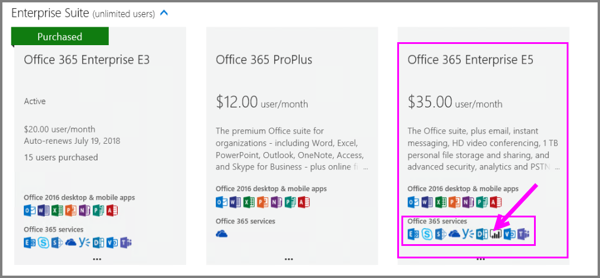
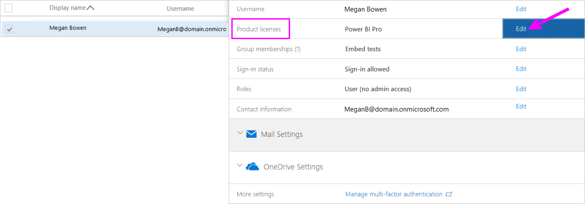
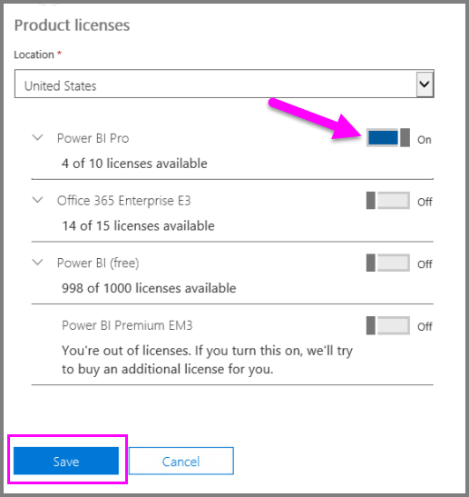
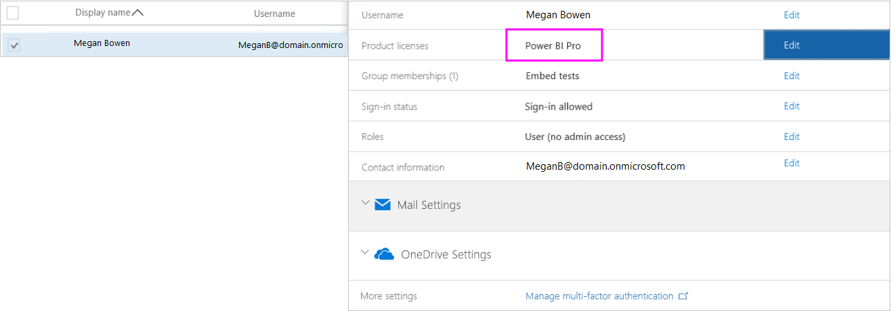
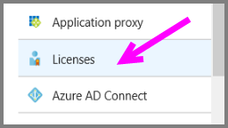
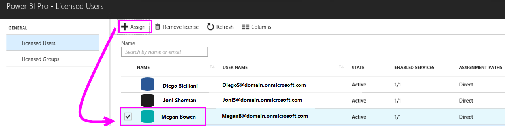

# Purchase and assign Power BI Pro licenses

Power BI Pro is an individual license that allows access to all content and capabilities in the Power BI service, including the ability to share content and collaborate with other Pro users. Only Pro users can publish to and consume content from app workspaces, share dashboards, and subscribe to dashboards and reports. For more information, see [Power BI features by license type](service-features-license-type.md).

This article first explains how to purchase Power BI Pro licenses in Office 365. The article then explains the two options you have for assigning those licenses to individual users: Office 365 and Azure (choose one option).

## Prerequisites

You must be a member of the [**Global administrator** or **Billing administrator**](https://support.office.com/article/about-office-365-admin-roles-da585eea-f576-4f55-a1e0-87090b6aaa9d) role in Office 365.

To assign licenses in Azure, you must be an owner of the Azure subscription that Power BI uses for Active Directory lookups.

## Purchase licenses in Office 365

Follow these steps to purchase Power BI Pro licenses:

1. Open the [Microsoft 365 admin center](https://portal.office.com/adminportal/home#/homepage).

2. On the left navigation pane, select **Billing** > **Subscriptions**.

    

3. In the upper right corner of the **Subscriptions** page, select **Add subscriptions**.

    

4. Locate the desired subscription offering:

    Under **Enterprise Suite**, select **Office 365 Enterprise E5**.

    

    Under **Other Plans**, select **Power BI Pro**.

    

5. Hover over the ellipsis (**. . .**) for the desired subscription, and select **Buy now**.

    

6. Choose **Pay monthly** or **Pay for a full year**, according to your billing preference.

7. Under **How many users do you want?** enter the desired number of licenses, and then select **Check out now** to complete the transaction.

8. Verify that the acquired subscription is now listed on the **Subscriptions** page.

   

9. To add more licenses after the initial purchase, select **Power BI Pro** from the **Subscriptions** page, and then select **Add/Remove licenses**.

## Assign licenses in Office 365

Follow these steps to assign Power BI Pro licenses to individual user accounts:

1. Open the [Microsoft 365 admin center](https://portal.office.com/adminportal/home#/homepage).

2. On the left navigation pane, expand **Users**, and then select **Active users**.

    

3. Select a user, then under **Product licenses** select **Edit**.

    

4. Under **Power BI Pro**, toggle the setting to **On**, then select **Save**.

    

5. Under **Status** for the selected account, verify that the Power BI Pro license has been assigned successfully.

    

## Assign licenses in Azure

Follow these steps to assign Power BI Pro licenses to individual user accounts:

1. Open the [Azure portal](https://ms.portal.azure.com/#@microsoft.onmicrosoft.com/dashboard/private/39bc3cf7-31a4-43f6-954c-f2d69ca2f0).

2. In the left navigation bar, select **Azure Active Directory**.

    

3. Under **Azure Active Directory**, select **Licenses**.

    

4. Under **Licenses**, select **All products** then select **Power BI Pro** to display the list of licensed users.

    

5. Select **Assign** to add a Power BI Pro license to an additional user account.

    

## Next steps

Now that you've assigned licenses, learn more about Power BI Pro.

[Power BI licensing in your organization](service-admin-licensing-organization.md)

[Find Power BI users who have signed in](service-admin-access-usage.md)

More questions? [Try asking the Power BI Community](https://community.powerbi.com/)
