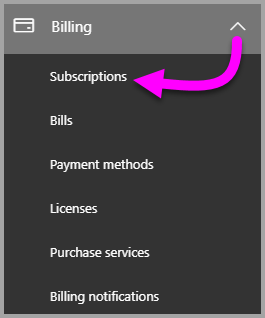
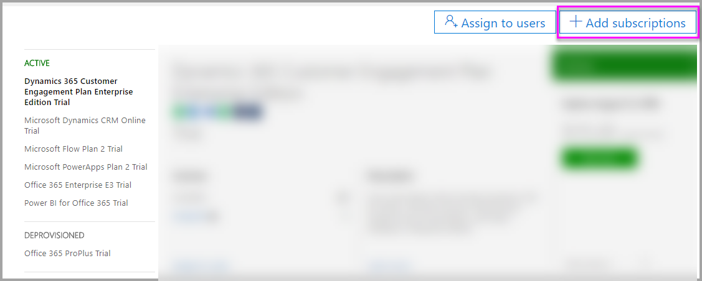
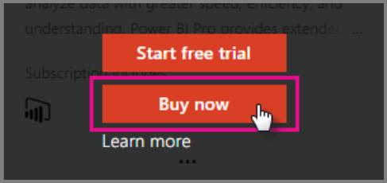
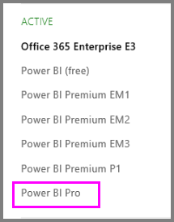

# Purchasing Power BI Pro

With Power BI Pro you can publish reports, share dashboards, collaborate with colleagues in workspaces and engage in other related activities. For more information about how Power BI Pro can benefit your organization, see [Power BI Pro in your organization](service-admin-power-bi-pro-in-your-organization.md).

## Purchasing Power BI Pro through Office 365 Admin Center

Office IT Admins can purchase Power BI Pro either as part of an Office 365 Enterprise E5 subscription or as a separate Power BI Pro subscription. Then you can assign Power BI Pro licenses to the appropiate users. For more information about how to assign licenses, see [Assign licenses to users in Office 365](https://support.office.com/en-us/article/assign-licenses-to-users-in-office-365-for-business-997596b5-4173-4627-b915-36abac6786dc?ui=en-US&rs=en-US&ad=US).

Follow these steps to purchase Power BI Pro if you are an Office IT Admin:

1. Navigate to the [Office 365 admin center](https://portal.office.com/adminportal/home#/homepage).
2. On the left navigation pane, select Billing and then click on Subscriptions.

    

3. Click on Add subscriptions in the upper right corner of the Subscriptions page.

    

4. Locate the desired subscription offering:

    Under Enterprise Suite select Office 365 Enterprise E5

    

    Under Other Plans select Power BI Pro

    

5. Hover over the ellipses (…) for the desired subscription and select Buy now.

    

6. Choose Pay monthly or Pay for a full year according to your billing preference.
7. Under How many users do you want? enter the desired number of licenses, and then click on Check out now or Add to cart and complete the transaction.
8. Verify that the acquired subscription is now listed on the Subscriptions page.

   

> [!NOTE]
> You can add more licenses after the initial purchase. Select the Power BI Pro subscription from the Subscriptions page, and then click on Add/Remove licenses.
>

## Pricing

For latest pricing information, see [Power BI Pricing](https://powerbi.microsoft.com/en-us/pricing/).

> [!NOTE]
> Users with Pro licenses assigned will have 30 days of full access after the subscription ends, but after that the content moves back to free. When this happens you will see your subscription show as "expired" in teh admin portal.
>

## Next steps
[Self-service sign up for Power BI](service-admin-signing-up-for-power-bi-with-a-new-office-365-trial.md)
 
[Power BI (free) in your organization](service-admin-service-free-in-your-organization.md)
 
[Power BI Pro in your organization](service-admin-power-bi-pro-in-your-organization.md)
 
[Extended Pro Trial activation](service-extended-pro-trial.md)
 
[Assigning Power BI Pro licenses](service-admin-assigning-power-bi-pro-licenses.md)
 
[Power BI Premium - what is it?](service-admin-premium-manage.md)
 
[How to purchase Power BI Premium](service-admin-premium-purchase.md)
 
[Power BI Premium whitepaper](https://aka.ms/pbipremiumwhitepaper)

More questions? [Try asking the Power BI Community](https://community.powerbi.com/)