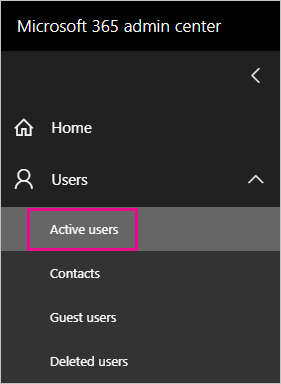
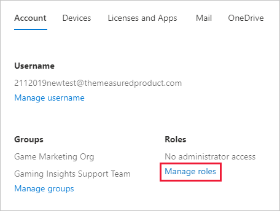
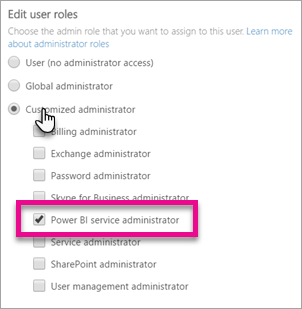

# Understanding Power BI service administrator roles

To administer a Power BI tenant, you must be in one of the following roles: Power BI admin, Power Platform admin, or Microsoft 365 global admin. Microsoft 365 user management administrators assign users to the Power BI admin or Power Platform admin roles in the Microsoft 365 admin center, or by using a PowerShell script.

Users in Power BI admin and Power Platform admin roles have full control over a Power BI tenant and its administrative features, except for licensing. Once a user is assigned, they can access the [Power BI admin portal](service-admin-portal.md). There, they have access to tenant-wide usage metrics, and can control tenant-wide usage of Power BI features. These admin roles are ideal for users who need access to the Power BI admin portal without also granting those users complete Microsoft 365 administrative access.

> [!NOTE]
> In Power BI documentation, "Power BI admin" refers to users in either the Power BI admin or Power Platform admin roles. The documentation makes it clear when the Microsoft 365 global admin role is required for a task.

## Limitations and considerations

The Power BI service admin and Power Platform admin roles don't provide the following capabilities:

* Ability to modify users and licenses within the Microsoft 365 admin center.

* Access to the audit logs. For more information, see [Track user activities in Power BI](service-admin-auditing.md).

These capabilities require the Microsoft 365 global admin role.

## Assign users to an admin role in the Microsoft 365 admin center

To assign users to an admin role in the Microsoft 365 admin center, follow these steps.

1. In the [Microsoft 365 admin center](https://portal.office.com/adminportal/home#/homepage), select **Users** > **Active Users**.

    

1. Select the user that you want to assign the role to.

1. Under **Roles**, select **Manage Roles**.

    

1. Expand **Show all by category**, then select **Power BI admin** or **Power Platform admin**.

    

1. Select **Save changes**.

## Assign users to the admin role with PowerShell

You can also assign users to roles by using PowerShell. Users are managed in Azure Active Directory (Azure AD). If you don't already have the Azure AD PowerShell module, [download and install the latest version](https://www.powershellgallery.com/packages/AzureAD/).

1. First, connect to Azure AD:
   ```
   PS C:\Windows\system32> Connect-AzureAD
   ```

1. Second, get the **ObjectId** for the **Power BI Service Administrator** role. You can run [Get-AzureADDirectoryRole](/powershell/module/azuread/get-azureaddirectoryrole) to get the **ObjectId**

    ```
    PS C:\Windows\system32> Get-AzureADDirectoryRole

    ObjectId                             DisplayName                        Description
    --------                             -----------                        -----------
    00f79122-c45d-436d-8d4a-2c0c6ca246bf Power BI Service Administrator     Full access in the Power BI Service.
    250d1222-4bc0-4b4b-8466-5d5765d14af9 Helpdesk Administrator             Helpdesk Administrator has access to perform..
    3ddec257-efdc-423d-9d24-b7cf29e0c86b Directory Synchronization Accounts Directory Synchronization Accounts
    50daa576-896c-4bf3-a84e-1d9d1875c7a7 Company Administrator              Company Administrator role has full access t..
    6a452384-6eb9-4793-8782-f4e7313b4dfd Device Administrators              Device Administrators
    9900b7db-35d9-4e56-a8e3-c5026cac3a11 AdHoc License Administrator        Allows access manage AdHoc license.
    a3631cce-16ce-47a3-bbe1-79b9774a0570 Directory Readers                  Allows access to various read only tasks in ..
    f727e2f3-0829-41a7-8c5c-5af83c37f57b Email Verified User Creator        Allows creation of new email verified users.
    ```

    In this case, the role's **ObjectId** is 00f79122-c45d-436d-8d4a-2c0c6ca246bf.

1. Next, get the user's **ObjectId**. You can find that by running [Get-AzureADUser](/powershell/module/azuread/get-azureaduser).

    ```
    PS C:\Windows\system32> Get-AzureADUser -ObjectId 'tim@contoso.com'

    ObjectId                             DisplayName UserPrincipalName      UserType
    --------                             ----------- -----------------      --------
    6a2bfca2-98ba-413a-be61-6e4bbb8b8a4c Tim         tim@contoso.com        Member
    ```

1. To add the member to the role, run [Add-AzureADDirectoryRoleMember](/powershell/module/azuread/add-azureaddirectoryrolemember).

    | Parameter | Description |
    | --- | --- |
    | ObjectId |The Role ObjectId. |
    | RefObjectId |The members ObjectId. |

    ```powershell
    Add-AzureADDirectoryRoleMember -ObjectId 00f79122-c45d-436d-8d4a-2c0c6ca246bf -RefObjectId 6a2bfca2-98ba-413a-be61-6e4bbb8b8a4c
    ```

## Next steps

[Administering Power BI in your Organization](service-admin-administering-power-bi-in-your-organization.md)  
[Power BI admin portal](service-admin-portal.md)  

More questions? [Try asking the Power BI Community](https://community.powerbi.com/)