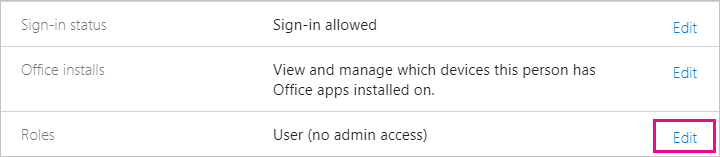

# Understanding the Power BI admin role
Learn how you can use the Power BI admin role within your organization.

<iframe width="640" height="360" src="https://www.youtube.com/embed/PQRbdJgEm3k?showinfo=0" frameborder="0" allowfullscreen></iframe>

The Power BI Service Administrator role can be assigned to users who should have access to the Power BI Admin Portal without also granting them other Office 365 administrative access. For example, the Global Admin role. It is meant for those tasked with administering Power BI for their organization.

Office 365 user admins can assign users to be Power BI admins within the Office 365 Admin center, or via PowerShell script. Once a user is assigned, they'll be able to access the [Power BI admin portal](service-admin-portal.md). There, they will have access to tenant-wide usage metrics, and can control tenant-wide usage of Power BI features.


## Using the Office 365 Admin Center to assign a role
To assign users to the Power BI Administrator role within the Office 365 Admin Center, you can do the following.

1. Browse to the Office 365 Admin Center and select **Users** > **Active Users**.
   
    
2. Select the user that you want to assign the role to.
3. Select **Edit** for roles.
   
    
4. Select **Customized administrator** > **Power BI service administrator**
   
    
5. Select **Save**.

You should see **Power BI service administrator** listed for the role of that user. They will now have access to the [Power BI admin portal](service-admin-portal.md).


## Using PowerShell to assign a role
To run the PowerShell command, you must have the Azure Active Directory PowerShell Module installed.

### Download Azure AD PowerShell module
[Download Azure Active Directory PowerShell Version 2](https://github.com/Azure/azure-docs-powershell-azuread/blob/master/Azure%20AD%20Cmdlets/AzureAD/index.md)

[Download Azure Active Directory PowerShell Version 1.1.166.0 GA](http://connect.microsoft.com/site1164/Downloads/DownloadDetails.aspx?DownloadID=59185)

### Command to add role to member
**Azure AD PowerShell v2 Command**

You will need to get the **ObjectId** for the **Power BI Service Administrator** role. You can run [Get-AzureADDirectoryRole](https://docs.microsoft.com/powershell/azuread/v2/get-azureaddirectoryrole) to get the **ObjectId**

```
PS C:\Windows\system32> Get-AzureADDirectoryRole

ObjectId                             DisplayName                        Description
--------                             -----------                        -----------
00f79122-c45d-436d-8d4a-2c0c6ca246bf Power BI Service Administrator     Full access in the Power BI Service.
250d1222-4bc0-4b4b-8466-5d5765d14af9 Helpdesk Administrator             Helpdesk Administrator has access to perform..
3ddec257-efdc-423d-9d24-b7cf29e0c86b Directory Synchronization Accounts Directory Synchronization Accounts
50daa576-896c-4bf3-a84e-1d9d1875c7a7 Company Administrator              Company Administrator role has full access t..
6a452384-6eb9-4793-8782-f4e7313b4dfd Device Administrators              Device Administrators
9900b7db-35d9-4e56-a8e3-c5026cac3a11 AdHoc License Administrator        Allows access manage AdHoc license.
a3631cce-16ce-47a3-bbe1-79b9774a0570 Directory Readers                  Allows access to various read only tasks in ..
f727e2f3-0829-41a7-8c5c-5af83c37f57b Email Verified User Creator        Allows creation of new email verified users.
```

In this case, the role objectid is 00f79122-c45d-436d-8d4a-2c0c6ca246bf.

You will also need to know the users **ObjectID**. You can find that by running [Get-AzureADUser](https://docs.microsoft.com/powershell/azuread/v2/get-azureaduser).

```
PS C:\Windows\system32> Get-AzureADUser -SearchString 'tim@contoso.com'

ObjectId                             DisplayName UserPrincipalName      UserType
--------                             ----------- -----------------      --------
6a2bfca2-98ba-413a-be61-6e4bbb8b8a4c Tim         tim@contoso.com        Member
```

To add the member to the role, run [Add-AzureADDirectoryRoleMember](https://docs.microsoft.com/powershell/azuread/v2/add-azureaddirectoryrolemember).

| Parameter | Description |
| --- | --- |
| ObjectId |The Role ObjectId. |
| RefObjectId |The members ObjectId. |

```
Add-AzureADDirectoryRoleMember -ObjectId 00f79122-c45d-436d-8d4a-2c0c6ca246bf -RefObjectId 6a2bfca2-98ba-413a-be61-6e4bbb8b8a4c
```

**Azure AD PowerShell v1 Command**

To add a member to a role using the Azure AD v1 cmdlets, you will want to run the [Add-MsolRoleMember](https://docs.microsoft.com/powershell/msonline/v1/add-msolrolemember) command.

```
Add-MsolRoleMember -RoleMemberEmailAddress "tim@contoso.com" -RoleName "Power BI Service Administrator"
```

## Limitations and considerations
The Power BI service administrator role does not provide access to the following.

* Ability to modify users and licenses within the Office 365 Admin Center
* Access to the audit logs. For more information, see [Using auditing within your organization](service-admin-auditing.md).

## Next steps
[Power BI admin portal](service-admin-portal.md)  
[Add-AzureADDirectoryRoleMember](https://docs.microsoft.com/powershell/azuread/v2/add-azureaddirectoryrolemember)  
[Add-MsolRoleMember](https://docs.microsoft.com/powershell/msonline/v1/add-msolrolemember)  
[Auditing Power BI in your organization](service-admin-auditing.md)  
[Administering Power BI in your Organization](service-admin-administering-power-bi-in-your-organization.md)  

More questions? [Try asking the Power BI Community](http://community.powerbi.com/)

