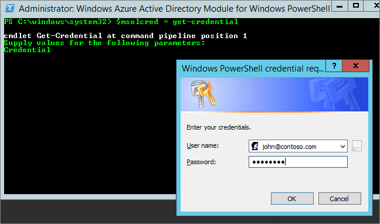

# Power BI (free) in your organization
This will look at how the Power BI (free) offering can be used within your organization. An organization means that you have a tenant and can manage users and services within that tenant. As an administrator, you can control license assignment, or you can allow users to sign up as an individual. We will look at the Power BI (free) license and how you can control individual sign up.

## Individual sign up versus license assignment
Users within your organization can gain access to Power BI in two different ways. They can individually sign up for Power BI, or you can assign a Power BI license to them within the Office 365 admin portal.

Allowing individual sign up reduces the burden, from the organization administrators, by allowing the users that are interested in Power BI to sign up for free.

For more control, you can block individual sign up and assign Power BI licenses yourself within the Office 365 admin center. This allows you to be specific of who can access what services within your organization. This is also a great option if you have to deal with auditing and need to know exactly who can use what.

## How to get the unlimited license block
Within the Office 365 admin center, under **Billing** > **Licenses**, you may or may not see Power BI (free) with unlimited licenses.

This block of licenses will show up after the first time someone signs up for Power BI as an individual. During that process, this license block gets attached to your organization and a license is assigned to the user that is signing up.

If you are blocking individual user sign up, and no one has signed up, you will not see this license block. You can either allow individual user sign ups and have one user sign up, or you can get free licenses through the add subscription Office 365 flow which will be talked about next.

Once the Power BI (free) license block is available, you can assign those licenses to your users. For more information about how to assign licenses, see [Assign licenses to users in Office 365 ](https://support.office.com/article/Assign-or-unassign-licenses-for-Office-365-for-business-997596b5-4173-4627-b915-36abac6786dc).

## Getting free licenses via add subscription within Office 365
1. Navigate to the [Office 365 admin center](https://portal.office.com/admin/default.aspx).
2. On the left navigation pane, select **Billing** > **Subscriptions**.
3. Select **Add subscriptions +** on the right side.
4. Under Other Plans, hover over the **ellipse (…)** for Power BI (free) and select **Buy now**.
   
    
5. Enter the number of licenses you would like to add and select **Check out now** or **Add to cart**.
   
   > [!NOTE]
   > You can add more at a later date if needed.
   > 
   > 
6. Enter the needed information in the check out flow.

There is no purchase when using this approach, although you will need to either enter your credit card information for billing, or choose to be invoiced.

If you decide later that you want to add more licenses, you can go back to **Add subscriptions**, and select **Change license quantity** for Power BI (free).

You can now assign those licenses to your users. For more information about how to assign licenses, see [Assign licenses to users in Office 365 ](https://support.office.com/article/Assign-or-unassign-licenses-for-Office-365-for-business-997596b5-4173-4627-b915-36abac6786dc).

## Enable, or disable, individual user sign up in Azure Active Directory
As an administrator, you can choose to enable, or disable, individual user sign ups as part of Azure Active Directory (AAD). If you know how to leverage the AAD PowerShell commands, you can enable, or disable, ad-hoc subscriptions yourself. [Learn more](https://technet.microsoft.com/library/jj151815.aspx)

The AAD setting that controls this is **AllowAdHocSubscriptions**. Most tenants will have this setting set to true, which means it is enabled. If you acquired Power BI through a partner, this may be set to false by default, which means it is disabled.

1. You need to first sign into Azure Active Directory using your Office 365 credential. The first line will prompt you for your credentials. The second line connects to Azure Active Directory.
   
     $msolcred = get-credential
     connect-msolservice -credential $msolcred
   
   
2. Once you are signed in, you can issue the following command to see what your tenant is currently configured for.
   
     Get-MsolCompanyInformation | fl AllowAdHocSubscriptions
3. You can this command to enable ($true) or disable ($false) AllowAdHocSubscriptions.
   
     Set-MsolCompanySettings -AllowAdHocSubscriptions $true

> [!NOTE]
> This blocking prevents new users in your organization from signing up for Power BI. Users that sign up for Power BI prior to disabling new signups for your organization will still retain their licenses.
> 
> 

## Next steps
[Self-service sign up for Power BI](service-self-service-signup-for-power-bi.md)  
[Purchasing Power BI Pro](service-admin-purchasing-power-bi-pro.md)  
[Sign up for Power BI (free) with a custom Azure Active Directory tenant](developer/create-an-azure-active-directory-tenant.md)  
[Power BI Premium - what is it?](service-premium.md)  
[Power BI Premium whitepaper](https://aka.ms/pbipremiumwhitepaper)  

More questions? [Try asking the Power BI Community](http://community.powerbi.com/)

