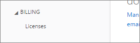

# Unable to add Power BI to Office 365 partner subscription
Office 365 allows companies to resell Office 365 bundled and integrated with their own solutions, providing end-customers with a single point of contact for purchasing, billing, and support.

If you are interested in acquiring Power BI, alongside your Office 365 subscription, we recommend you contact your partner to do so. If your partner does not offer Power BI, you have different options you can consider.

1. You are able to buy the service from another channel, either directly from Microsoft or another partner. This option is not available to all customers depending on their relationship with the partner. You can verify this by going to the **Office 365 Admin Portal** > **Billing** > **Subscriptions**. If you do see **Subscriptions**, you can acquire the service from Microsoft directly, or you can also contact a partner that is offering Power BI.
   
    
2. If you do not see **Subscriptions** listed under **Billing**, you cannot buy from Microsoft directly or another partner. 
   
   

If you are not able to purchase Power BI directly, and depending on what type of Power BI subscription you are interested in, you still have some options.

[Power BI (free)](#power-bi-free)

[Power BI Pro and Premium](#power-bi-pro)

## Power BI (free)
If you are happy with the free offering for Power BI, you can sign up for the free service. By default, individual sign-ups, also known as ad-hoc subscriptions, are disabled. When you try to sign up for Power BI, you will see a message indicating that your IT department has turned off sign up for Microsoft Power BI.

    Your IT department has turned off signup for Microsoft Power BI.

To enable ad-hoc subscriptions, you can contact your partner and request that they turn it on. If you are an Administrator of your tenant, and know how to leverage Azure Active Directory PowerShell commands, you can enable ad-hoc subscriptions yourself. [Learn more](https://technet.microsoft.com/library/jj151815.aspx)

1. You need to first sign into Azure Active Directory using your Office 365 credential. The first line will prompt you for your credentials. The second line connects to Azure Active Directory.
   
        $msolcred = get-credential
        connect-msolservice -credential $msolcred
   
    
2. Once you are signed in, you can issue the following command to enable free sign ups.
   
        Set-MsolCompanySettings -AllowAdHocSubscriptions $true

## Power BI Pro and Premium
If you want to buy a subscription to Power BI Pro or Power BI Premium, you will have to work with your partner to consider what options you have.

* Your partner agrees to add Power BI to their portfolio so that you can purchase from them.
* Your partner is able to transition you to a model where you can buy Power BI directly from Microsoft or another partner who offers Power BI.

This video looks at Office 365 syndication and purchasing Power BI:

<iframe width="560" height="315" src="https://www.youtube.com/embed/C357phT94A8" frameborder="0" allowfullscreen></iframe>

## Next steps
[Manage Azure AD using Windows PowerShell](https://technet.microsoft.com/library/jj151815.aspx)  
[Power BI Premium - what is it?](service-premium.md)

More questions? [Try asking the Power BI Community](http://community.powerbi.com/)

