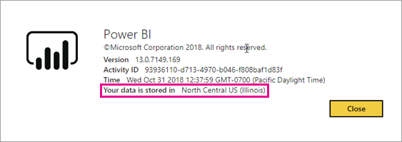

# Where is my Power BI tenant located?
<iframe width="560" height="315" src="https://www.youtube.com/embed/0fOxaHJPvdM?showinfo=0" frameborder="0" allowfullscreen></iframe>

Learn where your Power BI tenant is located and how that location is selected. This is important to understand as it can impact interactions you have with the service.

## How to determine where your Power BI tenant is located
The find the region your tenant is in, you can do the following.

1. Select the **?** within the Power BI service.
2. Select **About Power BI**.
3. Look for the value next to **Your data is stored in**. This is the region you are located in.

## How the data region is selected
The data region is based on the country that was selected when the tenant was first created. This applies to sign up for Office 365 in addition to Powe rBI as this information is shared. If this is a new tenant, when you sign up, you will see a country drop down.

This selection is what drives the location of where your data will be stored. Power BI will pick a data region closest to this selection.

> [!WARNING]
> This selection cannot be changed!
> 
> 

More questions? [Try the Power BI Community](http://community.powerbi.com/)

