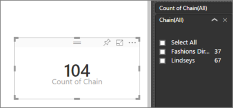

# Aggregates in Power BI
## What is an aggregate?
Sometimes you want to mathematically combine the values of rows in a column. The mathematical operation could be sum, average, maximum, count, etc. Combining the value of data in rows in a column is called aggregating. The result of that mathematical operation is an *aggregate*. 

A numeric field is a value that will be aggregated (summed or averaged, for example) over some categorical field.  For example, "sales amount by product" and "number of defects by region". Numeric fields are often referred to as **measures**. In the Fields list, measures are shown with the ∑ symbol. For more information see [The report editor... take a tour](service-the-report-editor-take-a-tour.md).

Sometimes a *measure* is actually a *calculated measure*. Calculated measures in Power BI are imported with the data (defined in the data model your report is based on). Each calculated measure has its own hard-coded formula. You can’t change the aggregation being used, for example, if it’s a sum, it can only be a sum. In the Fields list, *calculated measures* are shown with the calculator symbol. For more information on how calculated measures are created, see [Measures in Power BI Desktop](powerbi-desktop-measures.md).

Categorical fields aren't numeric but they can still be aggregated.  When categorical fields are placed in a *numeric only* bucket like **Values** or **Tooltips**, Power BI can count the occurrences of each category or count the distinct occurrences of each category.  For strings and dates, Power BI has a few more aggregate options: earliest, latest, first, and last.  

## Why don't aggregates work the way I want them to?
Working with aggregates in Power BI service can be confusing; maybe you have a numeric field and Power BI won't let you change the aggregation. Or maybe you have a field, like a year, and you don't want to aggregate it, you just want to count the number of occurrences.

Most often, the source of the problem is how the field was categorized in the Power BI dataset. Maybe the field is categorized as text and that explains why it can't be summed or averaged. Unfortunately, [only the dataset owner can change the way a field is categorized](powerbi-desktop-measures.md).  

To help you navigate the confusion we have a special section at the end of this article called **Tips and troubleshooting**.  If you don't find your answer there, post your question on the [Power BI Community forum](http://community.powerbi.com) for a quick response directly from the Power BI team.

## Change how a numeric field is aggregated
Say you have a chart that sums the sales data for different regions, but you'd rather have the average. 

1. In report Editing view, add the measure to a visualization.
2. Find that field in the Visualizations pane, right-click, and select the aggregate type you need. If you don't see the aggregation you need, contact the dataset owner. It could be an issue with how the field was categorized by the owner.  
   
   
   
   > [!NOTE]
   > The options available in the dropdown will vary depending on 1) the field selected and 2) the way that field was categorized by the dataset owner.
   > 
   > 

Some of the options that may be available for aggregating a field:

* **Do Not Summarize**. With this option chosen, each value in that field is treated separately and not summarized. This is often used if you have a numeric ID column that shouldn't be summed.
* **Sum**. This adds all the values in that field up.
* **Average**. Takes an arithmetic mean of the values.
* **Minimum**. Shows the smallest value.
* **Maximum**. Shows the largest value.
* **Count (Not Blanks).** This counts the number of values in that field that are not blank.
* **Count (Distinct).** This counts the number of different values in that field.
* **Standard deviation.**
* **Variance**.
* **Median**.  Shows the median (middle) value. This is the value that has the same number of items above and below.  If there are 2 medians, Power BI averages them.

For example, this data:

| Country | Amount |
|:--- |:--- |
| USA |100 |
| UK |150 |
| Canada |100 |
| Germany |125 |
| France | |
| Japan |125 |
| Australia |150 |

Would give the following results:

* **Do Not Summarize**: Each value is shown separately
* **Sum**: 750
* **Average**: 125
* **Maximum**:  150
* **Minimum**: 100
* **Count (Not Blanks):** 6
* **Count (Distinct):** 4
* **Standard deviation:** 20.4124145...
* **Variance:** 416.666...
* **Median:** 125

## Use a non-aggregated field as a numeric field
You can also use a non-aggregated field as a numeric field. For example, if you have a Product Name field, you can add it as a value and then set it to **Count** or **Distinct count**. 

1. For example, if you select **Store > Chain**.
   
   
2. And if you change the aggregation from the default **Do not summarize** to **Count (Distinct)**, Power BI counts the number of different chains. In this case, there are 2: Fashions Direct and Lindseys.
   
   
3. And if you change the aggregation to **Count**, Power BI counts the total number. In this case, there are 104 entries for **Chain**. By adding **Chain** as a filter, you can see that there are 37 rows for Fashions Direct and 67 rows for Lindseys.  
   
   

## Tips and Troubleshooting
Q:  Why don't I have a **Do not summarize** option?

A:  The field you've selected is likely a calculated measure. Remember, each calculated measure has its own hard-coded formula. You can’t change the calculation.

Q:  My field **is** numeric, why are my only choices **Count** and **Distinct count**?

A:  The likely explanation is that the dataset owner has, accidentally or intentionally, *not* classified the field as a number. For example, if a dataset has a **year** field, the dataset owner may categorize that as text because it is more likely that the **year** field will be counted (i.e., number of people born in 1974) and not that it will be summed or averaged. If you are the owner, you can open the dataset in Power BI Desktop and use the **Modeling** tab to change the data type.  

A:  Another possibility is that you've dropped the field into a *bucket* that only allows categorical values.  In that case, your only options will be count and distinct count.

A:  And a third possibility is that you're using the field for an axis. On a bar chart axis, for example, Power BI shows one bar for each distinct value -- it doesn't aggregate the field values at all. NOTE: The exception to this rule is scatter charts, which *require* aggregated values for the X and Y axes.

Q:  I have a scatter diagram and I want my field to *not* aggregate.  How do I do this?

A:  Add the field to the **Details** bucket and not to the X or Y axes buckets.

Q:  When I add a numeric field to a visualization, most of them default to sum but some default to average or count or some other aggregation.  Why isn't the default aggregation always the same?

A:  Dataset owners have the option to set the default summarization for each field. If you are a dataset owner, change the default summarization in the **Modeling** tab of Power BI Desktop.

Q:  My field **is** numeric, why don't I have any aggregate options in the dropdown?

A:  If the field has a calculator icon, that means it's a *calculated measure* and each calculated measure has its own hard-coded formula that can't be changed in Power BI service. The calculation being used may be a simple aggregation like an average or sum, but it could also be something more complicated like a "percent of contribution to parent category" or "running total since start of the year". Power BI isn't going to sum or average the results but will instead just re-calculate (using the hard-coded formula) for each data point.

Q:  I'm a dataset owner and I want to ensure that a field is never aggregated.

A:  In Power BI Desktop, in the **Modeling** tab, set **Data type** to **Text**.

Q:  I do not see **Do not summarize** as an option in my dropdown.

A:  Try removing the field and adding it back in.

More questions? [Try the Power BI Community](http://community.powerbi.com/)

