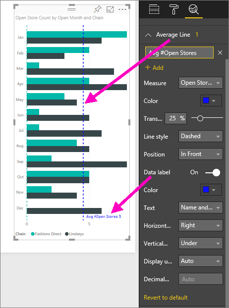

# Create dynamic reference lines for visuals in the Power BI service

With the **Analytics** pane in **Power BI service**, you can add dynamic *reference
lines* to visualizations, and provide focus for important trends or insights.

> [!NOTE]
> The **Analytics** pane only appears when you select a visual on the report canvas.
> 
> 

## Use the Analytics pane
With the **Analytics** pane, you can create the following types of dynamic reference lines (not all lines are available for all visual types):

* X-Axis constant line
* Y-Axis constant line
* Min line
* Max line
* Average line
* Median line
* Percentile line

To view the available dynamic reference lines for a visual, follow these steps:

1. Select or create a visual, then select the **Analytics** icon
   from the **Visualizations** pane.

2. Select the down arrow for the type of line you want to create to expand its options. In this case, we'll select **Average Line**.
   
   

3. To create a new line, select **+ Add** and decide the measure that will be used to create the line.  The **Measure** dropdown is automatically populated with available data from the selected visualization. Let's use **Open store count**.

5. You have all sorts of options for your line, such as color, transparency, style, and position (relative to the visual's data elements). If you want to label the line, give it a title and then move the **Data label** slider to **On**.  In this case, we'll title the line *Avg # Open Stores*, and customize a few of the other options as shown below.
   
   

1. Notice the number that appears next to the **Average line** item in the **Analytics** pane. That tells you how many dynamic lines you currently have on your visual, and of which type. If we add a **Constant line** as a store count goal of 9, you can see that the **Analytics** pane shows that we now also have a **Constant line** reference line applied to this visual.
   
   
   

There are all sorts of interesting insights you can highlight by creating dynamic reference lines with the **Analytics** pane.

## Considerations and troubleshooting

If the visual you've selected can't have dynamic reference lines applied to it (in this case, a **Map** visual), you'll see the following when you select the **Analytics** pane.
   

The ability to use dynamic reference lines is based on the type of visual being used. The following list shows which dynamic lines are currently available for which visuals:

Full use of dynamic lines are available on the following visuals:

* Area chart
* Line chart
* Scatter chart
* Clustered Column chart
* Clustered Bar chart

The following visuals can use only a *constant line* from the **Analytics** pane:

* Stacked Area
* Stacked Bar
* Stacked Column
* 100% Stacked Bar
* 100% Stacked Column

For the following visuals, a *trend line* is currently the only option:

* Non-stacked Line
* Clustered Column chart

Lastly, non-Cartesian visuals cannot currently apply dynamic lines from the **Analytics** pane, such as:

* Matrix
* Pie chart
* Donut
* Table

## Next steps
[Analytics pane in Power BI Desktop](desktop-analytics-pane.md)

More questions? [Try the Power BI Community](http://community.powerbi.com/)

