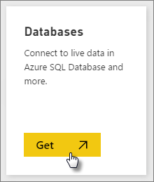

# Azure SQL Data Warehouse with DirectQuery

Azure SQL Data Warehouse with DirectQuery allows you to create dynamic reports based on data and metrics you already have in Azure SQL Data Warehouse. With DirectQuery, queries are sent back to your Azure SQL Data Warehouse in real time as you explore the data. Real-time queries, combined with the scale of SQL Data Warehouse enables users to create dynamic reports in minutes against terabytes of data. In addition, the introduction of the **Open in Power BI** button allows users to directly connect Power BI to their SQL Data Warehouse without having to manually specify the information.

When using the SQL Data Warehouse connector:

* Specify the fully qualified server name when connecting (see below for details)
* Ensure firewall rules for the server are configured to "Allow access to Azure services"
* Every action such as selecting a column or adding a filter will directly query the data warehouse
* Tiles are set to refresh approximately every 15 minutes and refresh does not need to be scheduled.  Refresh can be adjusted in the Advanced settings when you connect.
* Q&A isn't available for DirectQuery datasets
* schema changes aren't picked up automatically

These restrictions and notes may change as we continue to improve the experiences. The steps to connect are detailed below.

## Using the 'Open in Power BI' button

> [!Important]
> We have been improving our connectivity to Azure SQL Data Warehouse.  For the best experience to connect to your Azure SQL Data Warehouse data source, use Power BI Desktop.  Once you've built your model and report, you can publish it to the Power BI service.  The direct connector for Azure SQL Data Warehouse in the Power BI service is now deprecated.

The easiest way to move between your SQL Data Warehouse and Power BI is with the **Open in Power BI** button within the Azure portal. This button allows you to seamlessly begin creating new dashboards in Power BI.

1. To get started, navigate to your SQL Data Warehouse instance in the Azure portal. Note that SQL Data Warehouse only have a presence in the Azure Preview portal at this time.

2. Click the **Open in Power BI** button

    

3. If we aren't able to sign you in directly or if you do not have a Power BI account, you'll need to sign in.

4. You'll be directed to the SQL Data Warehouse connection page, with the information from your SQL Data Warehouse pre-populated. Enter your credentials and hit connect to create a connection.

## Connecting through Power BI

SQL Data Warehouse is also listed on the Power BI Get Data page. 

1. Select **Get Data** at the bottom of the left navigation pane.  

    

2. Within **Databases**, select **Get**.

    

3. Select **SQL Data Warehouse** \> **Connect**.

    

4. Enter the necessary information to connect. The **Finding Parameters** section below shows where this data can be located in your Azure Portal.

    

    

    

   > [!NOTE]
   > The username will be a user that is defined in your Azure SQL Data Warehouse instance.

5. Drill into the dataset by selecting the new tile or the newly created dataset, indicated by the asterisk. This dataset will have the same name as your database.

    

6. You can explore all of the tables and columns. Selecting a column will send a query back to the source, dynamically creating your visual. Filters will also be translated into queries back to your data warehouse. These visuals can be saved in a new report and pinned back to your dashboard.

    

## Finding Parameter Values

Your fully qualified server name and database name can be found in the Azure portal. Note that SQL Data Warehouse only have a presence in the Azure Preview portal at this time.

> [!NOTE]
> If your Power BI tenant is in the same region as the Azure SQL Data Warehouse there will be no egress charges. You can find where your Power BI tenant is located using [these instructions](https://docs.microsoft.com/power-bi/service-admin-where-is-my-tenant-located).

## Next steps

* [What is Power BI?](power-bi-overview.md)  
* [Get Data for Power BI](service-get-data.md)  
* [Azure SQL Data Warehouse](/azure/sql-data-warehouse/sql-data-warehouse-overview-what-is/)

More questions? [Try the Power BI Community](http://community.powerbi.com/)