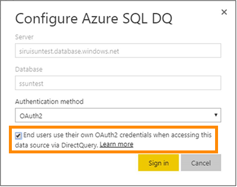
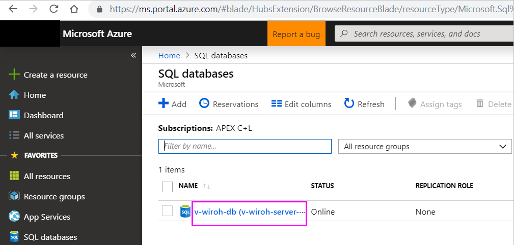
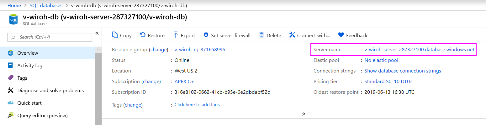

# Azure SQL Database with DirectQuery

Learn how you can connect directly to Azure SQL Database and create reports that use live data. You can keep your data at the source and not in Power BI.

With DirectQuery, queries are sent back to your Azure SQL Database as you explore the data in the report view. This experience is suggested for users who are familiar with the databases and entities they connect to.

**Notes:**

* Specify the fully qualified server name when connecting (see below for more details)
* Ensure firewall rules for the database are configured to "[Allow access to Azure services](https://msdn.microsoft.com/library/azure/ee621782.aspx)"
* Every action such as selecting a column or adding a filter will send a query back to the database
* Tiles are refreshed every hour (refresh does not need to be scheduled). This can be adjusted in the Advanced settings when you connect.
* Q&A is not available for DirectQuery datasets
* Schema changes are not picked up automatically

These restrictions and notes may change as we continue to improve the experiences. The steps to connect are detailed below.

> [!Important]
> We have been improving our connectivity to Azure SQL Database.  For the best experience to connect to your Azure SQL Database data source, use Power BI Desktop.  Once you've built your model and report, you can publish it to the Power BI service.  The direct connector for Azure SQL Database in the Power BI service is now deprecated.

## Power BI Desktop and DirectQuery

In order to connect to Azure SQL Database using DirectQuery, you will need to use Power BI Desktop. This approach provides additional flexibility and capabilities. Reports created using Power BI Desktop can then be published to the Power BI service. You can learn more about how to connect to [Azure SQL Database using DirectQuery](desktop-use-directquery.md) within Power BI Desktop.

## Single sign-on

After you publish an Azure SQL DirectQuery dataset to the service, you can enable single sign-on (SSO) via Azure Active Directory (Azure AD) OAuth2 for your end users.

To enable SSO, go to settings for the dataset, open the **Data Sources** tab, and check the SSO box.

When the SSO option is enabled and your users access reports built atop the data source, Power BI sends their authenticated Azure AD credentials in the queries to the Azure SQL database. This enables Power BI to respect the security settings that are configured at the data source level.

The SSO option takes affect across all datasets that use this data source. It does not affect the authentication method used for import scenarios.

> [!Note]
> Azure Multi-Factor Authentication (MFA) is not supported. Users who want to use SSO with Azure SQL DirectQuery must be exempted from MFA.

## Finding Parameter Values

Your fully qualified server name and database name can be found in the Azure Portal.

## Next steps

* [Use DirectQuery in Power BI Desktop](desktop-use-directquery.md)  
* [What is Power BI?](power-bi-overview.md)  
* [Get Data for Power BI](service-get-data.md)  

More questions? [Try the Power BI Community](http://community.powerbi.com/)
