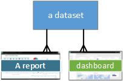
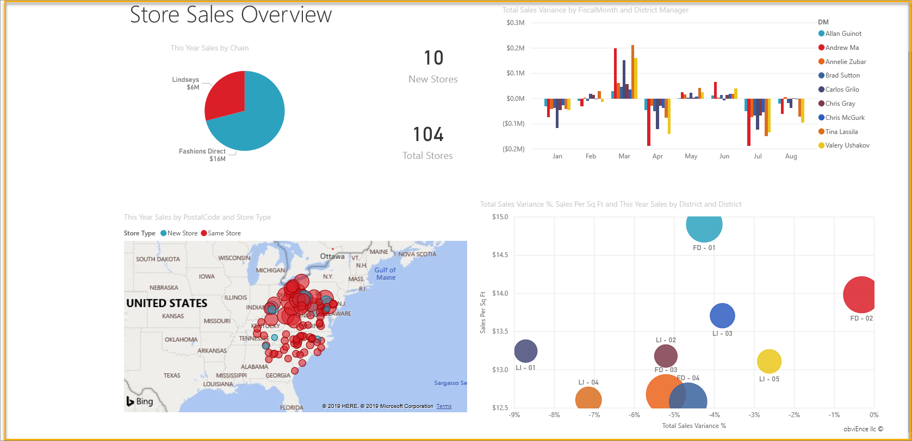

# Power BI - basic concepts for Power BI service
<!-- Shared newnav Include -->
[!INCLUDE [newnavbydefault](./includes/newnavbydefault.md)]

This article assumes that you've already [signed up for Power BI](service-self-service-signup-for-power-bi.md) and [added some data](service-get-data.md).

When you open the Power BI service, you'll see a ***dashboard*** displayed. Dashboards are something that differentiates Power BI service from Power BI Desktop.

The main features of your Power BI service UI are the following:

1. navigation bar
2. dashboard with tiles
3. Q&A question box
4. help and feedback buttons
5. dashboard title
6. Office 365 app launcher
7. Power BI home buttons
8. Additional dashboard actions

We'll dig into these later, but first let's review some Power BI concepts.

Or, you might want to watch this video first before reading the rest of this article.  In the video, Will reviews the basic concepts and gives a tour of Power BI service.

<iframe width="560" height="315" src="https://www.youtube.com/embed/B2vd4MQrz4M" frameborder="0" allowfullscreen></iframe>

## Power BI concepts
The 3 major building blocks of Power BI are: ***dashboards***, ***reports***, and ***datasets***. You can't have dashboards or reports without data (well, you can have empty dashboards and empty reports, but they're not very useful until they have data), so let's start with **datasets**.

## Datasets
A *dataset* is a collection of data that you *import* or *connect* to. Power BI lets you connect to and import all sorts of datasets and bring all of it together in one place.  

In the navigation bar, the datasets you've connected to or imported are listed under the **Datasets** heading. Each listed dataset represents a single source of data, for example, an Excel workbook on OneDrive, or an on-premises SSAS tabular dataset, or a Salesforce dataset. There are many different data sources supported, and we’re adding new ones all the time. [See the list of dataset types that can be used with Power BI](service-get-data.md).

**ONE** dataset...

* can be used over and over.
* can be used in many different reports.
* Visualizations from that one dataset can display on many different dashboards.
  
  

To [connect to or import a dataset](service-get-data.md), select **Get Data** (at the bottom of the navigation bar) or select the plus icon next to the **Datasets** heading. Follow the instructions to connect to or import the specific source and add the dataset to your workspace. New datasets are listed in the left navigation bar and marked with a yellow asterisk. The work you do in Power BI does not change the underlying dataset.

If you're [part of an ***app workspace***](service-collaborate-power-bi-workspace.md), datasets added by one workspace member are available to the other workspace members.

Datasets can be refreshed, renamed, explored, used to create reports, and removed. To explore a dataset, select it. What you're actually doing is opening the dataset in the report editor where you can really start digging into the data and creating visualizations. So, let's move on to the next topic -- reports.

### Dig deeper:
* [Power BI Premium - what is it?](service-premium.md)
* [Get data for Power BI](service-get-data.md)
* [Sample datasets and content packs for Power BI](sample-datasets.md)

## Reports
A Power BI report is one or more pages of visualizations (charts and graphs like line charts, pie charts, treemaps, and many many more). Visualizations are also called ***visuals***. All of the visualizations in a report come from a single dataset. Reports can be created from scratch within Power BI, can be imported with dashboards that colleagues share with you, or can be created when you connect to datasets from Excel, Power BI Desktop, databases, SaaS applications and [content packs](service-organizational-content-pack-introduction.md).  For example, when you connect to an Excel workbook that contains Power View sheets, Power BI creates a report based on those sheets. And when you connect to an SaaS application, Power BI imports a pre-built report.

There are 2 modes to view and interact with reports: [Reading View](service-report-open-in-reading-view.md) and [Editing View](service-interact-with-a-report-in-editing-view.md).  Only the person who created the report, co-owners, and those granted permission, have access to all of the exploring, designing, building, and sharing capabilities of ***Editing View*** for that report. And the people they share the report with can explore and interact with the report using ***Reading View***.   

In the navigation pane, your reports are listed under the **Reports** heading. Each listed report represents 1 or more pages of visualizations based on 1 of the underlying datasets. To open a report, simply select it. By default, the report opens in Reading View first.  Just select **Edit report** to open it in Editing View (if you have the necessary permissions).  If a shared dashboard has reports, you will NOT see the report listed in the navigation bar. Instead, open shared reports directly from the shared dashboard by selecting a dashboard tile (more on these later).

**ONE** report...

* can be associated with multiple dashboards (tiles pinned from that one report can appear on multiple dashboards).
* can be created using data from one dataset. (the slight exception to this is that Power BI Desktop can combine more than 1 dataset into a single report and that report can be imported into Power BI)
  
  

## Dashboards
A *dashboard* is something you create or something a colleague creates and shares with you. It is a single canvas that contains zero or more tiles and widgets. Each tile displays a single [visualization](power-bi-report-visualizations.md) that was created from a dataset and pinned to the dashboard. There are many ways to add tiles to your dashboard; too many to be covered in this overview topic. To learn more, see [Dashboard tiles in Power BI](service-dashboard-tiles.md). 

In the navigation bar, "your" dashboards are listed under the **Dashboards** heading. "Your" means that you have access to them, not necessarily that you created them. Each dashboard represents a customized view of some subset of the underlying datasets.  If you own the dashboard, you'll also have access to the underlying dataset(s) and they'll appear in the navbar under **Datasets**.  If the dashboard was shared with you, it has a sharing icon  next to it, and depending on how it was shared, you may or may not see the underlying datasets listed in your navbar.

> [!NOTE]
> Pinning and tiles are covered in more detail below under the heading "Dashboard with tiles."
> 
> 

**ONE** dashboard...

* can display visualizations from many different datasets
* can display visualizations from many different reports
* can display visualizations pinned from other tools (e.g., Excel)
  
  

### Dig deeper:
**A dashboard can be [created from scratch](service-dashboard-create.md)** -- create a new blank dashboard and then get some data. 

**You, or a colleague, can create a dashboard and [share it](service-share-dashboards.md)** -  when you accept the invitation, the shared dashboard (and any associated report and dataset) is added to your navigation bar. Power BI Pro is required for both sharing a dashboard and viewing a shared dashboard.

**Sometimes dashboards are imported with the dataset or are created as you connect to the dataset**. For example, the **Get Data** wizard for Salesforce asks you if you'd like a dashboard and/or report to be created from the dataset. 

**Why do people create dashboards?**  Here are just some of the reasons:

* to see, in one glance, all the information needed to make decisions
* to monitor the most-important information about their business
* to ensure all colleagues are on the same page, viewing and using the same information
* to monitor the health of a business or product or business unit or marketing campaign, etc.
* to create a personalized view of a larger dashboard -- all the metrics that matter to me

## My Workspace
We've circled back to your Power BI dashboard and workspace. Let's take a closer look at the pieces that make up the landing page for Power BI service.

### 1. **Navigation bar** (navbar)
Use the navbar to move between the Power BI building blocks: dashboards, reports, and datasets.  

  

* Select **Get Data** to [add datasets, reports, and dashboards to Power BI](service-get-data.md).
* Expand and collapse the navbar with this icon .
* Use **Search** to find specific items in the navbar.
* Select a plus icon  to create a new dashboard or get a new dataset.
* The listed **Dashboards, Reports,** and **Datasets** are available for you to use.  Shared dashboards are read-only and display the shared icon  .
* Dashboard, report, and dataset names usually match the name of the underlying dataset file -- but you can [rename them](service-rename.md).
* Right-click a dashboard, report or dataset to display the context-sensitive menu. 
  
  

Single-click

* a heading to collapse or expand it
* a dashboard to display it
* a report to open it in Reading View
* a dataset to explore it

### 2. **Dashboard with tiles**
Dashboards are composed of [tiles](service-dashboard-tiles.md).  Tiles are created in report Editing View, Q&A, other dashboards and can be pinned from Excel, SSRS, and more. A special type of tile called a [widget](service-dashboard-add-widget.md) is added directly onto the dashboard. The tiles that appear on a dashboard were specifically put there by a report creator/owner.  The act of adding a tile to a dashboard is called *pinning*.

For more information, see **Dashboards** (above).

### 3. **Q&A question box**
One way to explore your data is to ask a question and let Power BI Q&A give you an answer, in the form of a visualization. Q&A cannot be used to add content to a report -- only to add content, in the form of tiles, to dashboards.

Q&A looks for an answer in the dataset(s) connected to the dashboard.  A connected dataset is one that has at least one tile pinned to that dashboard.

As soon as you start to type your question, Q&A takes you to the Q&A page. As you type, Q&A helps you ask the right question and find the best answer with rephrasings, autofill, suggestions, and more. When you have a visualization (answer) you like, pin it to your dashboard. For more information, see [Q&A in Power BI](service-q-and-a.md).

### 4. **Full screen, Notifications, Settings, Downloads, Help, and feedback**
The icons in the top right corner are your resources for settings, notifications, downloads, getting help, and providing feedback to the Power BI team. Select the double arrow to open the dashboard in **Full screen** mode.  

### 5. **Dashboard title** (aka What dashboard is active?)
It's not always easy to figure out which dashboard is active.  The dashboard title appears on the dashboard view page, on the Q&A page, in report Editing View and report Reading View, and when you open a dataset.   

### 6. **Office 365 app launcher**
The app launcher is designed to help you get to your Office 365 apps.

### 7. **Power BI home**
Selecting this returns you to the dashboard that you viewed most recently.

   

### 8. **Options**
This area of the workspace contains icons for interacting with the dashboard.  Besides **Add tile**, **Favorite** and **Share** selecting the ellipses reveals options for duplicating, printing, and refreshing the dashboard and more.

   

## Next steps
[Get started with Power BI](service-get-started.md)  
[Power BI videos](powerbi-videos.md)  
[Power BI Premium - what is it?](service-premium.md)

More questions? [Try asking the Power BI Community](http://community.powerbi.com/)

