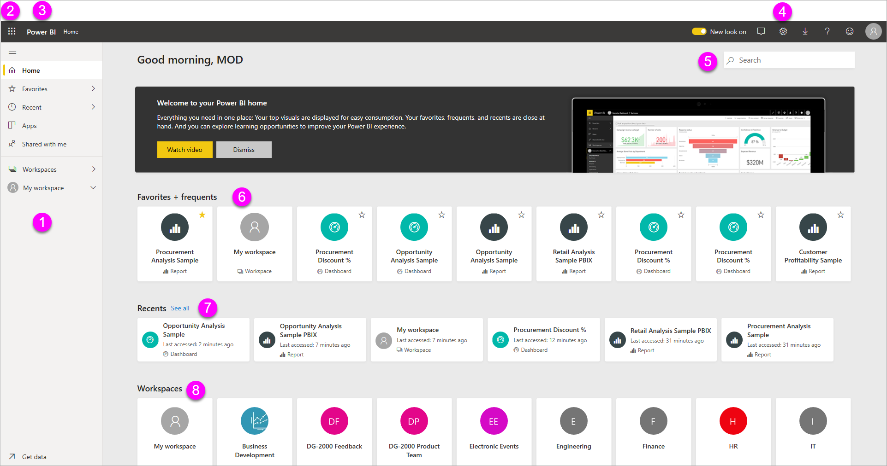
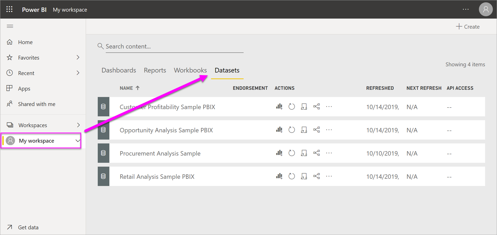
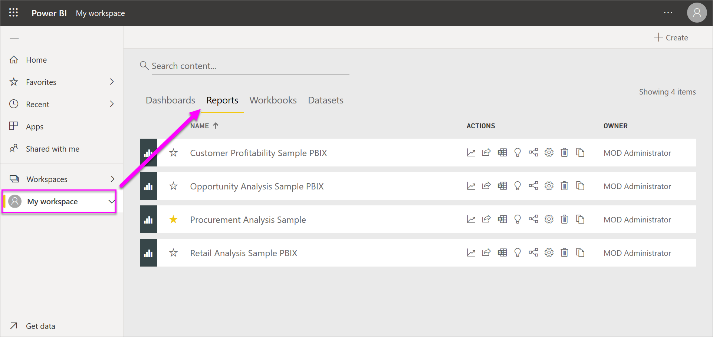
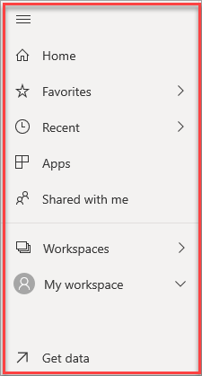
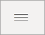
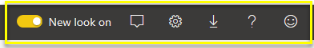

# Basic concepts for designers in the Power BI service

The aim of this article is to orient you to the Power BI service: what the different elements are, how they work together, and how you can work with them. You may get more out of it if you've already [signed up for the Power BI service](service-self-service-signup-for-power-bi.md) and [added some data](service-get-data.md). As a designer, your typical workflow is usually to start by creating reports in Power BI Desktop. Then you publish them to the Power BI service, where you can continue modifying them. You also create the dashboards based on your reports in the Power BI service. 

For this article, if you don't have your own reports yet try installing a [Power BI sample content pack](sample-datasets.md#the-power-bi-samples-as-content-packs).

When you open the Power BI service in a browser, you start at your Home screen. Here are the elements you may see:

1. Navigation pane (left nav)
2. Office 365 app launcher
3. Power BI home button
4. Icon buttons, including settings, help, and feedback
5. Search box
6. Tiles from a favorite dashboard
7. Favorite and frequent dashboards and reports

Your end users for your reports and dashboards have the same start experience in the Power BI service in a browser.

We'll dig into these features later, but first let's review some Power BI concepts. Or you might want to watch this video first.  In the video, Will reviews the basic concepts and gives a tour of the Power BI service.

<iframe width="560" height="315" src="https://www.youtube.com/embed/B2vd4MQrz4M" frameborder="0" allowfullscreen></iframe>

## Power BI concepts
The 4 major building blocks of Power BI are: **_dashboards_**, **_reports_**, **_workbooks_**, and **_datasets_**. And they're all organized into **_workspaces_**. It's important to understand workspaces before we dig into the four building blocks, so let's start there.

## Workspaces
Workspaces are containers for dashboards, reports, workbooks, and datasets in Power BI. There are two types of workspaces: *My workspace* and *app workspaces*. So what is an *app*? A Power BI *app* is a collection of dashboards and reports built to deliver key metrics to the Power BI end users for your organization. Apps are interactive but end users can't edit them.

- *My workspace* is the personal workspace for any Power BI customer to work with your own content. Only you have access to your My workspace. You can share dashboards and reports from your My Workspace. If you want to collaborate on dashboards and reports, or create an app, then you want to work in an app workspace.      
-  *App workspaces* are used to collaborate and share content with colleagues. They are also the places where you create, publish, and manage apps for your organization. Think of them as staging areas and containers for the content that will make up a Power BI app. You can add colleagues to your app workspaces and collaborate on dashboards, reports, workbooks, and datasets. All app workspace members need Power BI Pro licenses, but app consumers (the colleagues who have access to the apps) don't necessarily need Pro licenses.  

To learn more, start with [Ways to share dashboards your work](service-how-to-collaborate-distribute-dashboards-reports.md).

Now, on to the Power BI building blocks. You can't have dashboards or reports without data (well, you can have empty dashboards and empty reports, but they're not useful until they have data), so let's start with **datasets**.

## Datasets
A *dataset* is a collection of data that you *import* or *connect* to. Power BI lets you connect to and import all sorts of datasets and bring all of it together in one place.  

Datasets are associated with *workspaces* and a single dataset can be part of many workspaces. When you open a workspace, the associated datasets are listed under the **Datasets** tab. Each listed dataset represents a single source of data, for example, an Excel workbook on OneDrive, or an on-premises SSAS tabular dataset, or a Salesforce dataset. There are many different data sources supported, and we’re adding new ones all the time. [See the list of dataset types that can be used with Power BI](service-get-data.md).

In the example below, I've selected the "Sales and marketing" app workspace and clicked the tab for **Datasets**.

**ONE** dataset...

* can be used over and over in one or in many workspaces.
* can be used in many different reports.
* Visualizations from that one dataset can display on many different dashboards.

  

To [connect to or import a dataset](service-get-data.md), select **Get Data** at the bottom of the left navigation. Follow the instructions to connect to or import the specific source and add the dataset to the active workspace. New datasets are marked with a yellow asterisk. The work you do in Power BI doesn't change the underlying dataset.

If you're [part of an **_app workspace_**](service-collaborate-power-bi-workspace.md), datasets added by one workspace member are available to the other workspace members.

Datasets can be refreshed, renamed, explored, and removed. Use a dataset to create a report from scratch or by running [quick insights](service-insights.md).  To see which reports and dashboards are already using a dataset, select **View related**. To explore a dataset, select it. What you're actually doing is opening the dataset in the report editor where you can really start digging into the data and creating visualizations. So, let's move on to the next topic -- reports.

### Dig deeper
* [What is Power BI Premium?](service-premium-what-is.md)
* [Get data for Power BI](service-get-data.md)
* [Sample datasets for Power BI](sample-datasets.md)

## Reports
A Power BI report is one or more pages of visualizations such as line charts, maps, and treemaps. Visualizations are also called **_visuals_**. All of the visualizations in a report come from a single dataset. Reports can be created from scratch within Power BI, can be imported with dashboards that colleagues share with you, or can be created when you connect to datasets from Excel, Power BI Desktop, databases, SaaS applications, and [apps](service-get-data.md).  For example, when you connect to an Excel workbook that contains Power View sheets, Power BI creates a report based on those sheets. And when you connect to an SaaS application, Power BI imports a pre-built report.

There are two modes to view and interact with reports: [Reading view and Editing view](service-reading-view-and-editing-view.md).  Only the person who created the report, coowners, and those granted permissions, have access to all of the exploring, designing, building, and sharing capabilities of **_Editing View_** for that report. The people they share the report with can explore and interact with the report in **_Reading View_**.   

When you open a workspace, the associated reports are listed under the **Reports** tab. Each listed report represents one or more pages of visualizations based on only one of the underlying datasets. To open a report, select it.

When you open an app, you'll be presented with a dashboard.  To access an underlying report, select a dashboard tile (more on tiles later) that was pinned from a report. Keep in mind that not all tiles are pinned from reports, so you may have to click a few tiles to find a report.

By default, the report opens in Reading view.  Just select **Edit report** to open it in Editing view (if you have the necessary permissions).

In the example below, I've selected the "Sales and marketing" app workspace and clicked the tab for **Reports**.

**ONE** report...

* is contained in a single workspace.
* can be associated with multiple dashboards within that workspace (tiles pinned from that one report can appear on multiple dashboards).
* can be created using data from one dataset. (the slight exception to this is that Power BI Desktop can combine more than one dataset into a single report and that report can be imported into Power BI).

  

### Dig deeper
* [Reports in Power BI service and Power BI Desktop](service-reports.md)
* [Reports in Power BI mobile apps](mobile-reports-in-the-mobile-apps.md)

## Dashboards
A *dashboard* is something you create **in the Power BI service** or something a colleague creates **in the Power BI service** and shares with you. It is a single canvas that contains zero or more tiles and widgets. Each tile pinned from a report or from [Q&A](power-bi-q-and-a.md) displays a single [visualization](power-bi-report-visualizations.md) that was created from a dataset and pinned to the dashboard. Entire report pages can also be pinned to a dashboard as a single tile. There are many ways to add tiles to your dashboard; too many to be covered in this overview topic. To learn more, see [Dashboard tiles in Power BI](service-dashboard-tiles.md).

Why do people create dashboards?  Here are just some of the reasons:

* to see, in one glance, all the information needed to make decisions.
* to monitor the most-important information about your business.
* to ensure all colleagues are on the same page, viewing and using the same information.
* to monitor the health of a business or product or business unit or marketing campaign, etc.
* to create a personalized view of a larger dashboard -- all the metrics that matter to you.

When you open a workspace, the associated dashboards are listed under the **Dashboards** tab. To open a dashboard, select it. When you open an app, you'll be presented with a dashboard.  Each dashboard represents a customized view of some subset of the underlying dataset(s).  If you own the dashboard, you'll also have edit access to the underlying dataset(s) and reports.  If the dashboard was shared with you, you'll be able to interact with the dashboard and any underlying reports, but will not be able to save any changes.

There are many different ways that you, or a colleague, can [share a dashboard](service-share-dashboards.md). Power BI Pro is required for sharing a dashboard and may be required for viewing a shared dashboard.

**ONE** dashboard...

* is associated with a single workspace
* can display visualizations from many different datasets
* can display visualizations from many different reports
* can display visualizations pinned from other tools (for example, Excel)

  

### Dig deeper
* [Create a new blank dashboard and then get some data](service-dashboard-create.md) .
* [Duplicate a dashboard](service-dashboard-copy.md)
* [Create a phone view of a dashboard](service-create-dashboard-mobile-phone-view.md)

## Workbooks
Workbooks are a special type of dataset. If you've read the **Datasets** section above, you know almost all you need to know about workbooks. But you may be wondering why sometimes Power BI classifies an Excel workbook as a **Dataset** and other times as a **Workbook**.

When you use **Get data** with Excel files, you have the option to *Import* or *Connect* to the file. When you choose Connect, your workbook will appear in Power BI just like it would in Excel Online. But, unlike Excel Online, you’ll have some great features to help you pin elements from your worksheets right to your dashboards.

You can’t edit your workbook in Power BI. But if you need to make some changes, you can click Edit, and then choose to edit your workbook in Excel Online or open it in Excel on your computer. Any changes you make are saved to the workbook on OneDrive.

### Dig deeper
* [Get data from Excel workbook files](service-excel-workbook-files.md)
* [Publish to Power BI from Excel](service-publish-from-excel.md)

## A dashboard in My Workspace
We've covered workspaces and building blocks. Let's bring it together and review the pieces that make up the dashboard experience in the Power BI service.

### 1. **Navigation pane** (left nav)
Use the navigation pane to locate and move between your workspaces and the Power BI building blocks: dashboards, reports, workbooks, and datasets.  

  

* Select **Get Data** to [add datasets, reports, and dashboards to Power BI](service-get-data.md).
* Expand and collapse the navigation pane with this icon .
* Open or manage your favorite content by selecting **Favorites**.
* View and open your most-recently visited content by selecting **Recent**
* View, open, or delete an app by selecting **Apps**.
* Did a colleague share content with you? Select **Shared with me** to search and sort that content to find what you need.
* Display and open your workspaces by selecting **Workspaces**.

Single-click these elements:

* an icon or heading to open in content view
* a right arrow (>) to open a flyout menu for Favorites, Recent, and Workspaces.
* a chevron icon to display the **My Workspace** scrollable list of dashboards, reports, workbooks, and datasets.

### 2. **Canvas**
Because we've opened a dashboard, the canvas area displays visualization tiles. If for example, we had opened the report editor, the canvas area would display a report page.

Dashboards are composed of [tiles](service-dashboard-tiles.md).  Tiles are created in report Editing view, Q&A, other dashboards, and can be pinned from Excel, SSRS, and more. A special type of tile called a [widget](service-dashboard-add-widget.md) is added directly onto the dashboard. The tiles that appear on a dashboard were specifically put there by a report creator/owner.  The act of adding a tile to a dashboard is called *pinning*.

For more information, see [Dashboards](#dashboards) (above).

### 3. **Q&A question box**
One way to explore your data is to ask a question and let Power BI Q&A give you an answer, in the form of a visualization. Q&A can be used to add content to a dashboard or report.

Q&A looks for an answer in the dataset(s) connected to the dashboard.  A connected dataset is one that has at least one tile pinned to that dashboard.

As soon as you start to type your question, Q&A takes you to the Q&A page. As you type, Q&A helps you ask the right question and find the best answer with rephrasings, autofill, suggestions, and more. When you have a visualization (answer) you like, pin it to your dashboard. For more information, see [Q&A in Power BI](power-bi-q-and-a.md).

### 4. **Icon buttons**
The icons in the upper right corner are your resource for settings, notifications, downloads, getting help, and providing feedback to the Power BI team. Select the double arrow to open the dashboard in **Full screen** mode.  

### 5. **Dashboard title** (navigation path, or breadcrumbs)
It's not always easy to figure out which workspace and dashboard are active, so Power BI creates a navigation path for you.  In this example, we see the workspace (My workspace) and the dashboard title (Retail Analysis Sample).  If we opened a report, the name of the report would be appended to the end of the navigation path.  Each section of the path is an active hyperlink.  

Notice the "C" icon after the dashboard title. This dashboard has a [data classification tag](service-data-classification.md) of "confidential." The tag identifies the sensitivity and security level of the data. If your Admin has turned on data classification, every dashboard will have a default tag set. Dashboard owners should change the tag to match their dashboard's proper security level.

### 6. **Office 365 app launcher**
With the app launcher, all your Office 365 apps are easily available with one click. From here, you can quickly launch your email, documents, calendar, and more.

### 7. **Power BI home**
Selecting **Power BI** brings you back to your Power BI home.

   

### 8. **Labeled icon buttons**
This area of the screen contains additional options for interacting with the content (in this case, with the dashboard).  Besides the labeled icons you can see, selecting the ellipses reveals options for duplicating, printing, refreshing the dashboard and more.

   

## Next steps
- [What is Power BI?](power-bi-overview.md)  
- [Power BI videos](videos.md)  
- [Report editor - take a tour](service-the-report-editor-take-a-tour.md)

More questions? [Try asking the Power BI Community](http://community.powerbi.com/)
