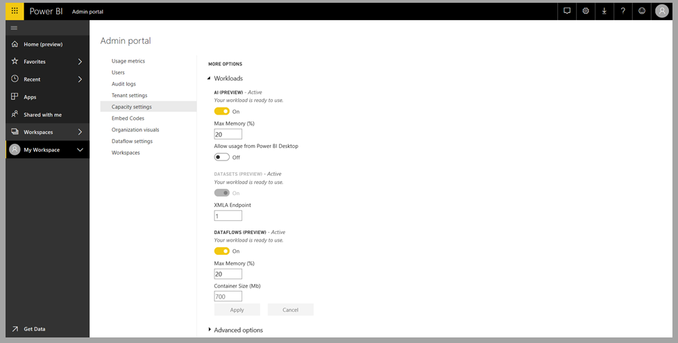
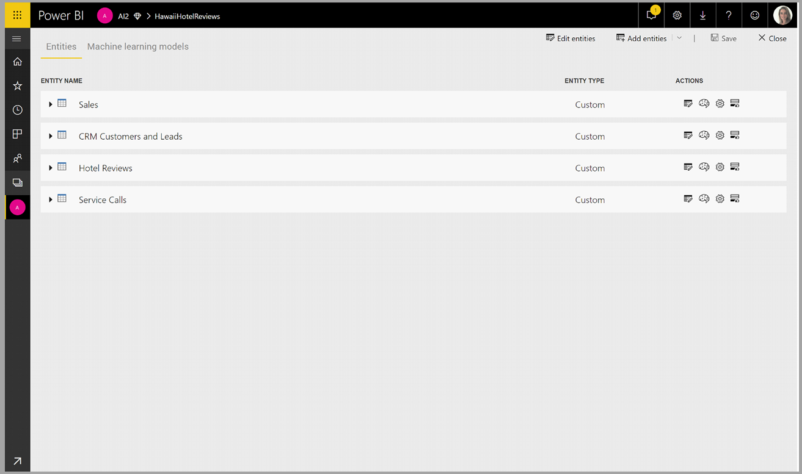
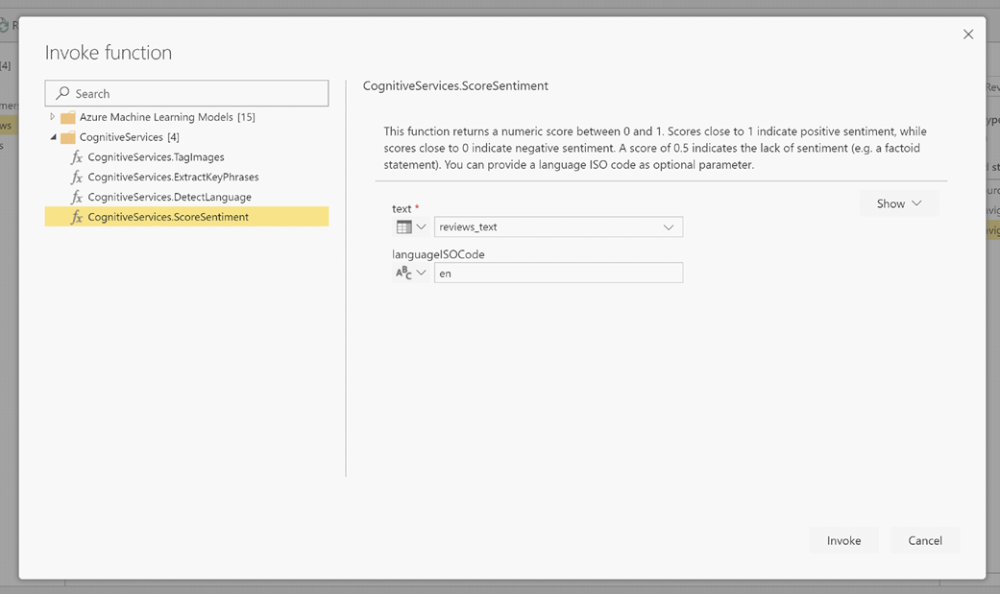
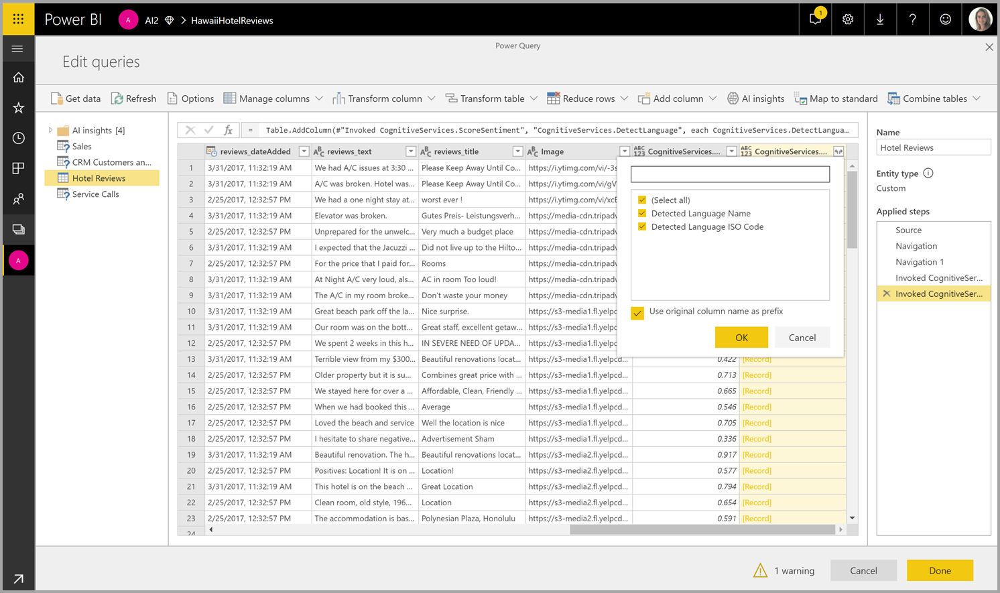

# Cognitive Services in Power BI (Preview)

With the Cognitive Services in Power BI, you can apply different algorithms from [Azure Cognitive Services](https://azure.microsoft.com/services/cognitive-services/) to enrich your data in the self-service data prep for Dataflows.

The services that are supported today are [Sentiment Analysis](https://docs.microsoft.com/azure/cognitive-services/text-analytics/how-tos/text-analytics-how-to-sentiment-analysis), [Key Phrase Extraction](https://docs.microsoft.com/azure/cognitive-services/text-analytics/how-tos/text-analytics-how-to-keyword-extraction), [Language Detection](https://docs.microsoft.com/azure/cognitive-services/text-analytics/how-tos/text-analytics-how-to-language-detection), and [Image Tagging](https://docs.microsoft.com/azure/cognitive-services/computer-vision/concept-tagging-images). The transformations are executed on the Power BI Service and do not require an Azure Cognitive Services subscription. This feature requires Power BI Premium.

## **Enabling AI features**

Cognitive services are supported for Premium capacity nodes EM2, A2, or P1 and above. A separate AI workload on the capacity is used to run cognitive services. During public preview, this workload is disabled by default. Before using cognitive services in Power BI, the AI workload needs to be enabled in the capacity settings of the admin portal. You can turn on the AI workload in the workloads section, and define the maximum amount of memory you would like this workload to consume. The recommended memory limit is 20%. Exceeding this limit causes the query to slow down.

## **Getting started with Cognitive Services in Power BI**

Cognitive Services transforms are part of the [Self-Service Data Prep for dataflows](https://powerbi.microsoft.com/blog/introducing-power-bi-data-prep-wtih-dataflows/). To enrich your data with Cognitive Services, start by editing a dataflow.

Select the **AI Insights** button in the top ribbon of Power Query Editor.

In the pop-up window, select the function you want to use and the data you want to transform. In this example, I'm scoring the sentiment of a column that contains review text.

**Cultureinfo** is an optional input to specify the language of the text. This field is expecting an ISO code. You can use a column as input for Cultureinfo, or a static field. In this example, the language is specified as English (en) for the whole column. If you leave this field blank, Power BI automatically detects the language before applying the function. Next, select **Invoke.**

After invoking the function, the result is added as a new column to the table. The transformation is also added as an applied step in the query.

If the function returns multiple output fields, invoking the function adds a new column with a record of the multiple output fields.

Use the expand option to add one or both values as columns to your data.

## **Available functions**

This section describes the available functions in Cognitive Services in Power BI.

### **Detect Language**

The language detection function evaluates text input, and for each field, returns the language name and ISO identifier. This function is useful for data columns that collect arbitrary text, where language is unknown. The function expects data in text format as input.

Text Analytics recognizes up to 120 languages. For more information, see [supported languages](https://docs.microsoft.com/azure/cognitive-services/text-analytics/text-analytics-supported-languages).

### **Extract Key Phrases**

The **Key Phrase Extraction** function evaluates unstructured text, and for each text field, returns a list of key phrases. The function requires a text field as input, and accepts an optional input for **Cultureinfo**. (See the **Getting Started** section earlier in this article).

Key phrase extraction works best when you give it bigger chunks of text to work on. This is opposite from sentiment analysis, which performs better on smaller blocks of text. To get the best results from both operations, consider restructuring the inputs accordingly.

### **Score Sentiment**

The **Score Sentiment** function evaluates text input and returns a sentiment score for each document, ranging from 0 (negative) to 1 (positive). This function is useful for detecting positive and negative sentiment in social media, customer reviews, and discussion forums.

Text Analytics uses a machine learning classification algorithm to generate a sentiment score between 0 and 1. Scores closer to 1 indicate positive sentiment, scores closer to 0 indicate negative sentiment. The model is pre-trained with an extensive body of text with sentiment associations. Currently, it's not possible to provide your own training data. The model uses a combination of techniques during text analysis, including text processing, part-of-speech analysis, word placement, and word associations. For more information about the algorithm, see [Introducing Text Analytics](https://blogs.technet.microsoft.com/machinelearning/2015/04/08/introducing-text-analytics-in-the-azure-ml-marketplace/).

Sentiment analysis is performed on the entire input field, as opposed to extracting sentiment for a particular entity in the text. In practice, there's a tendency for scoring accuracy to improve when documents contain one or two sentences rather than a large block of text. During an objectivity assessment phase, the model determines whether an input field as a whole is objective or contains sentiment. An input field that is mostly objective does not progress to the sentiment detection phrase, resulting in a .50 score, with no further processing. For input fields continuing in the pipeline, the next phase generates a score above or below .50, depending on the degree of sentiment detected in the input field.

Currently, Sentiment Analysis supports English, German, Spanish, and French. Other languages are in preview. For more information, see [Supported languages](https://docs.microsoft.com/azure/cognitive-services/text-analytics/text-analytics-supported-languages).

### **Tag Images**

The **Tag Images** function returns tags based on more than 2,000 recognizable objects, living beings, scenery, and actions. When tags are ambiguous or not common knowledge, the output provides 'hints' to clarify the meaning of the tag in context of a known setting. Tags are not organized as a taxonomy and no inheritance hierarchies exist. A collection of content tags forms the foundation for an image 'description' displayed as human readable language formatted in complete sentences.

After uploading an image or specifying an image URL, Computer Vision algorithms output tags based on the objects, living beings, and actions identified in the image. Tagging is not limited to the main subject, such as a person in the foreground, but also includes the setting (indoor or outdoor), furniture, tools, plants, animals, accessories, gadgets, and so on.

This function requires an image URL or abase-64 field as input. At this time, image tagging supports English, Spanish, Japanese, Portuguese, and Simplified Chinese. For more information, see [Supported languages](https://docs.microsoft.com/rest/api/cognitiveservices/computervision/tagimage/tagimage#uri-parameters).

## Next Steps

This article provided an overview of using Cognitive Services with Power BI service. The following articles might also be interesting and useful. 

* [Tutorial: Invoke a Machine Learning Studio model in Power BI (Preview)](service-tutorial-invoke-machine-learning-model.md)
* [Azure Machine Learning integration in Power BI (Preview)](service-machine-learning-integration.md)
* [Tutorial: Using Cognitive Services in Power BI](service-tutorial-using-cognitive-services.md)

For more information about dataflows, you can read these articles:
* [Create and use dataflows in Power BI](service-dataflows-create-use.md)
* [Using computed entities on Power BI Premium (Preview)](service-dataflows-computed-entities-premium.md)
* [Using dataflows with on-premises data sources (Preview)](service-dataflows-on-premises-gateways.md)
* [Developer resources for Power BI dataflows (Preview)](service-dataflows-developer-resources.md)
* [Dataflows and Azure Data Lake integration (Preview)](service-dataflows-azure-data-lake-integration.md)