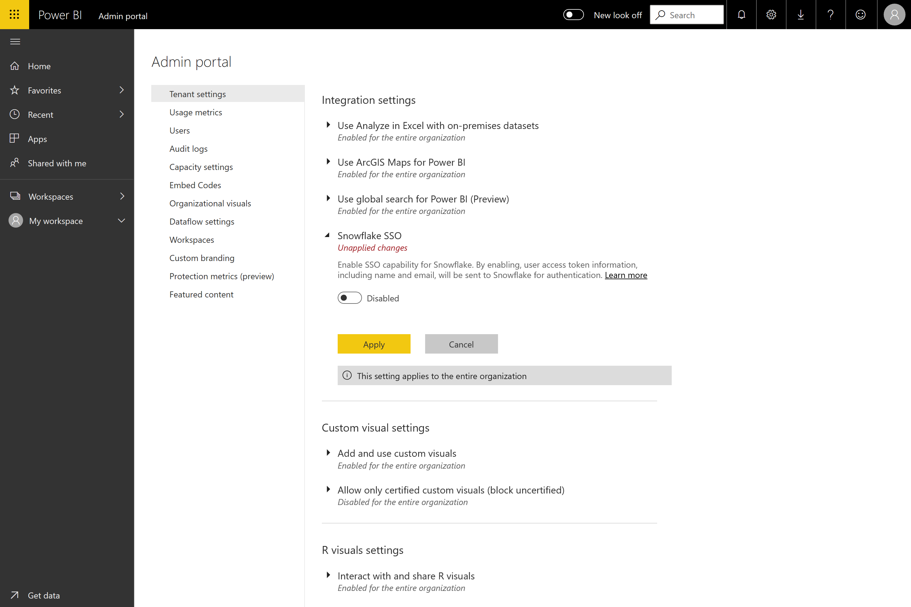
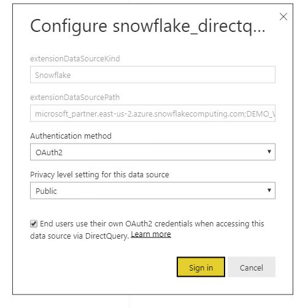

#  Connecting to Snowflake in Power BI Service

## Introduction

Connecting to Snowflake in the Power BI service only differs from other connectors in one way, which is that an additional capability is offered for AAD (with an option for SSO). Different parts of the integration require different administrative roles across Snowflake, Power BI, and Azure. You can also choose to enable AAD authentication without using SSO. Basic authentication works similarly to other connectors in the service.

If you're interested in configuring AAD integration, as well as optionally enabling SSO:
* If you are the Snowflake admin, look at the 'Snowflake configuration' section.
* (SSO) If you are a Power BI admin, look at the 'Power BI Service configuration - Admin Portal' section
* (SSO) If you are a Power BI dataset creator, look at the 'Power BI Service configuration - Enabling a dataset' section

## Snowflake Configuration

To enable  Snowflake  integration with Power BI AAD, a user with  Snowflake  admin privileges for the account needs to run the following security integration in  Snowflake.

```
create security integration powerbi
    type = external_oauth
    enabled = true
    external_oauth_type = azure
    external_oauth_issuer = '<AZURE_AD_ISSUER>'
    external_oauth_jws_keys_url = 'https://login.windows.net/common/discovery/keys'
    external_oauth_audience_list = ('https://analysis.windows.net/powerbi/connector/Snowflake')
    external_oauth_token_user_mapping_claim = 'upn'
    external_oauth_snowflake_user_mapping_attribute = 'login_name';
```
where you set ```<AZURE_AD_ISSUER>``` equal to ```https://sts.windows.net/<aad_tenant_id>/``` (e.g. https://sts.windows.net/a828b821-f44f-4698-85b2-3c6749302698/)

To get your Azure Active Directory ID:
* Go to 'Azure Active Directory' in the Azure Portal
* Select Properties on the menu along the left-hand side
* Copy the 'Directory ID'

Note: these settings are for the public production tenants. If you're using sovereign cloud, then modify these settings accordingly.

To make sure that the mapping will work properly between the user attribute and the incoming token, you can grab all user attributes with ```desc user user_name``` and search for the attribute "login_name". This attribute should match the upn value of the user in Azure AD.

The DEFAULT_ROLE user attribute of the user is what will be applied to the user in the AAD session.

Note: Some users with the highly privileged roles of Account Admin or Security Admin may not be able to use this integration. To fix this, please contact  Snowflake  support.

## Power BI Service configuration

### Admin Portal

If you want to enable SSO, the tenant admin is required to go to the Admin Portal and approve sending Power BI AAD credentials to  Snowflake.



Navigate to your "Admin Portal", select the "Tenant Settings" sidebar item, scroll down to "Integration Settings" and you will see an option for "Snowflake  SSO".

As warned, you have to manually enable this to consent to sending your AAD token to the  Snowflake  servers. To enable it, click the 'Disabled' toggle, , press apply and wait for the settings change to take effect. It may take up to an hour for the service to propagate the configuration.

Once this is done you will be able to use reports with SSO.

### Configuring a Dataset with AAD

Once a report based on the Snowflake connector has been published to the web, in the Power BI web service, the dataset creator needs to navigate to the appropriate workspace, select 'Datasets', and select 'Settings' (under the '...' menu for additional actions next to the relevant dataset).

On the Datasets settings page, the dataset creator needs to select 'Data source credentials' and sign in. The dataset can be signed into Snowflake with Basic credentials or OAuth2 (AAD) credentials. If you choose to use AAD, the dataset can be enabled to use SSO. When this first user goes to sign in to Snowflake  for the dataset, they'll have to log in using their Oauth2 credentials via AAD. They need to select the option that other users will have their Oauth2 credentials used to retrieve data. This will enable AAD SSO.



Once this is done, any additional users should automatically use their AAD authentication to connect to data from that Snowflake dataset.

If you choose not to enable SSO, then users refreshing the report will use the credentials of the user who signed in, like most other Power BI reports.

### Troubleshooting

If you run into any issues with the integration, please refer to the Snowflake [troubleshooting guide](https://docs.snowflake.net/manuals/LIMITEDACCESS/oauth-powerbi.html).

