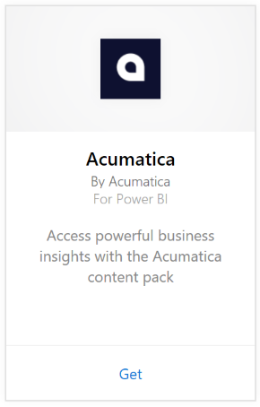
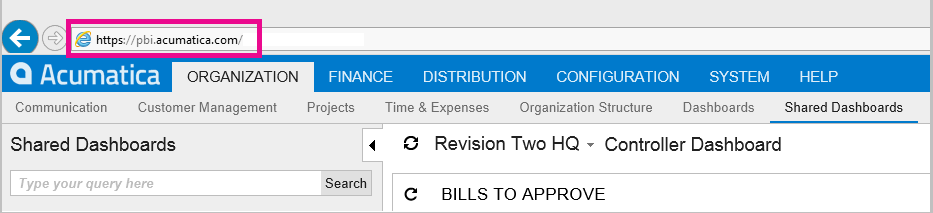

# Connect to Acumatica with Power BI
The Power BI Acumatica content pack allows to you quickly gain insights into your opportunity data. Power BI retrieves your data, including opportunities, accounts, and customers, then builds a default dashboard and related reports based on that data.

Connect to the [Acumatica content pack](https://app.powerbi.com/getdata/services/acumatica) or read more about the [Acumatica integration](https://powerbi.microsoft.com/integrations/acumatica) with Power BI.

>[!NOTE]
>This content pack requires Acumatica v5.2 or higher.

## How to connect
1. Select **Get Data** at the bottom of the left navigation pane.
   
   
2. In the **Services** box, select **Get**.
   
   
3. Select **Acumatica** \> **Get**.
   
   
4. Enter your Acumatica OData endpoint. An OData endpoint allows an external system to request data from Acumatica. Acumatica OData endpoint is formatted as follows and should us HTTPS:
   
     `https://[sitedomain]/odata/[companyname]`
   
   The Company Name is only required if you have a multi-company deployment. More information about finding this parameter in your Acumatica account is included below.
   
   
5. For Authentication Method, select **Basic**. Enter your username and password from your Acumatica account, then click **Sign In**.
   
    
6. After Power BI imports the data you will see a new dashboard, report, and dataset in the left navigation pane. New items are marked with a yellow asterisk \* which disappears once selected, choosing the dashboard will show a similar layout to the one below:
   
    

**What now?**

* Try [asking a question in the Q&A box](consumer/end-user-q-and-a.md) at the top of the dashboard
* [Change the tiles](service-dashboard-edit-tile.md) in the dashboard.
* [Select a tile](consumer/end-user-tiles.md) to open the underlying report.
* While your dataset will be scheduled to refresh daily, you can change the refresh schedule or try refreshing it on demand using **Refresh Now**

## System requirements
This content pack requires Acumatica v5.2 or higher, please confirm the version with your Acumatica admin.

## Finding parameters
**Acumatica OData Endpoint**

The Acumatica OData endpoint is formatted as follows and should us HTTPS:

    https://[sitedomain]/odata/[companyname]

The Application Site Domain can be found in your browser’s address bar when you’re signed into Acumatica. In the example below, the site domain is `https://pbi.acumatica.com` so the OData endpoint to provide would be `https://pbi.acumatica.com/odata`.

 

The Company Name is only required if you have a multi-company deployment. You can find this information from your Acumatica sign in page.

## Troubleshooting
If you’re not able to login, verify the Acumatica OData endpoint you provided is formatted correctly.

    https://<application site domain>/odata/<company name>

If you're having trouble connecting, please confirm with your admin your version of Acumatica. This content pack requires version 5.2 or later.

## Next steps
[Get started in Power BI](service-get-started.md)

[Get data in Power BI](service-get-data.md)

