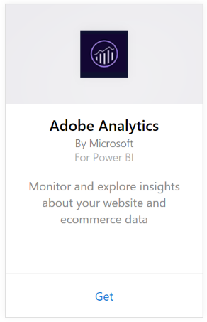
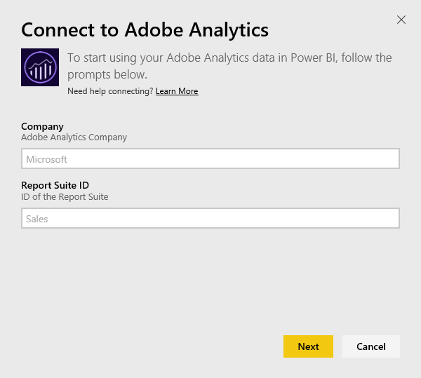
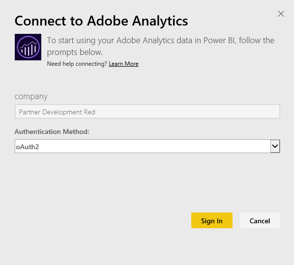

# Connect to Adobe Analytics with Power BI
Connecting to Adobe Analytics through Power BI starts by connecting to your Adobe Analytics Marketing Cloud account. You get an app with a Power BI dashboard and a set of Power BI reports that provide insights about your site traffic and user dimensions. The data is refreshed automatically once per day. You can interact with the dashboard and reports, but you can't save changes.

Connect to [Adobe Analytics](https://app.powerbi.com/getdata/services/adobe-analytics) or read more about the [Adobe Analytics integration](https://powerbi.microsoft.com/integrations/adobe-analytics) with Power BI.

## How to connect
[!INCLUDE [powerbi-service-apps-get-more-apps](./includes/powerbi-service-apps-get-more-apps.md)]

3. Select **Adobe Analytics** \>  **Get**.
   
   
4. Power BI connects to a specific Adobe Analytics Company and Report Suite ID (not the Report Suite name). See details on [finding those parameters](#FindingParams) below.
   
   
5. For **Authentication Method**, select **oAuth2** \> **Sign In**. When prompted, enter your Adobe Analytics credentials. 
   
    
   
    
6. Click **Accept** to allow Power BI to access your Adobe Analytics data.
   
   
7. After you approve, the import process begins automatically. 

## View the Adobe Analytics dashboard and reports
[!INCLUDE [powerbi-service-apps-open-app](./includes/powerbi-service-apps-open-app.md)]

   

[!INCLUDE [powerbi-service-apps-open-app](./includes/powerbi-service-apps-what-now.md)]

## What's included
Power BI uses the Adobe Analytics Report API to define and run reports for the following tables:

| **Table Name** | **Column Details** |
| --- | --- |
| Products |elements=  "product" (top 25)   metrics="cartadditions", "cartremovals", "carts", "cartviews", "checkouts", "revenue", "units" |
| Browsers |elements= "browser" (top 25)   metrics="bounces", "bouncerate", "visitors", "visits", "uniquevisitors", "totaltimespent", "pageviews" |
| Pages |elements= "page" (top 25)   metrics="cartadditions", "cartremovals", "carts", "cartviews", "checkouts", "revenue", "units", "visits", "uniquevisitors", "pageviews", "bounces", "bouncerate", "totaltimespent" |
| JavaScript Enabled |elements=  "javascriptenabled”, “browser” (top 25) |
| Mobile OS |elements= "mobileos"(top 25)  metrics="bounces", "bouncerate", "visitors", "visits", "uniquevisitors", "totaltimespent", "cartadditions", "cartremovals", "checkouts", "revenue", "units", "pageviews" |
| Search Engines Keywords |elements= "searchengine" "searchenginekeyword"   metrics="bounces", "bouncerate", "visitors", "visits", "entries", "uniquevisitors", "totaltimespent", "cartadditions", "cartremovals", "carts", "cartviews", "checkouts", "revenue", "units", "pageviews" |
| Search Engine to Products |elements= "searchengine", "product"   metrics="bounces", "bouncerate", "visitors", "visits", "entries", "uniquevisitors", "totaltimespent", "cartadditions", "cartremovals", "carts", "cartviews", "checkouts", "revenue", "units", "pageviews" |
| Referring Pages |elements= "referrer" (top 15), “page" (top 10)   metrics="bounces", "bouncerate", "visitors", "visits", "entries", "uniquevisitors", "totaltimespent", "cartadditions", "cartremovals", "carts", "cartviews", "checkouts", "revenue", "units", "pageviews" |
| Geocountry Pages |elements= "geocountry" (Top 20), "page"   metrics="bounces", "bouncerate", "visitors", "visits", "entries", "uniquevisitors", "totaltimespent", "cartadditions", "cartremovals", "carts", "cartviews", "checkouts", "revenue", "units", "pageviews" |
| Geocountry Product |elements= "geocountry" (Top 20), "product"  metrics="bounces", "bouncerate", "visitors", "visits", "entries", "uniquevisitors", "totaltimespent", "cartadditions", "cartremovals", "carts", "cartviews", "checkouts", "revenue", "units" |
| Country and Region Lookup |elements= "geocountry" (Top 200)   metrics="bounces", "bouncerate", "visitors", "visits", "entries", "uniquevisitors", "totaltimespent", "cartadditions", "cartremovals", "carts", "cartviews", "checkouts", "revenue", "units" |
| Language |elements= "language", "browser" (Top 25)   metrics="bounces", "bouncerate", "visitors", "visits", "uniquevisitors", "totaltimespent", "pageviews", "cartadditions", "cartremovals", "checkouts", "carts", "cartviews" |
| Search Engines Look Up |elements= "searchengine" (top 100)   metrics="bounces", "bouncerate", "visitors", "visits", "entries", "uniquevisitors", "totaltimespent", "cartadditions", "cartremovals", "carts", "cartviews", "checkouts", "revenue", "units" |
| Browser Lookup |elements= "browser" (top 25) |

## System requirements
Access to [Adobe Analytics](http://www.adobe.com/marketing-cloud/web-analytics.html) is required, including access to the correct parameters as described below.

## Finding parameters
**Company**

The Company value can be found in the top right of your account once you're signed in. The value is case and spacing sensitive. Enter it exactly as you see in your account.

**Report Suite ID**

The Suite ID is created when the Report Suite is created. You can contact your administrator to identify the ID value. This is not the Report Suite name.

From Adobe [documentation](https://marketing.adobe.com/resources/help/en_US/reference/new_report_suite.html):

## Troubleshooting
If you're seeing an error after providing your credentials indicating you do not have permissions, confirm with your admin that you have access to the Adobe Analytics API. Also confirm the Adobe ID provided is linked to your Marketing Cloud Organization (associated to an Adobe Analytics company).

If you've successfully passed the credentials screen  before encountering an error, it's possible the reports are taking too long to complete. A common error is in the form *"Failed to get data from the Adobe Analytics report. Contents included &quot;referrer, page&quot;, approximate duration was xx seconds"*. Review the "What's included" section and compare to the size of your Adobe instance. Unfortunately there isn't a way to work around this timeout today. However, we're considering updates to better support larger instances, provide feedback to the Power BI team at https://ideas.powerbi.com

## Next steps
* [What are apps in Power BI?](service-create-distribute-apps.md)
* [Get data in Power BI](service-get-data.md)
* More questions? [Try asking the Power BI Community](http://community.powerbi.com/)

