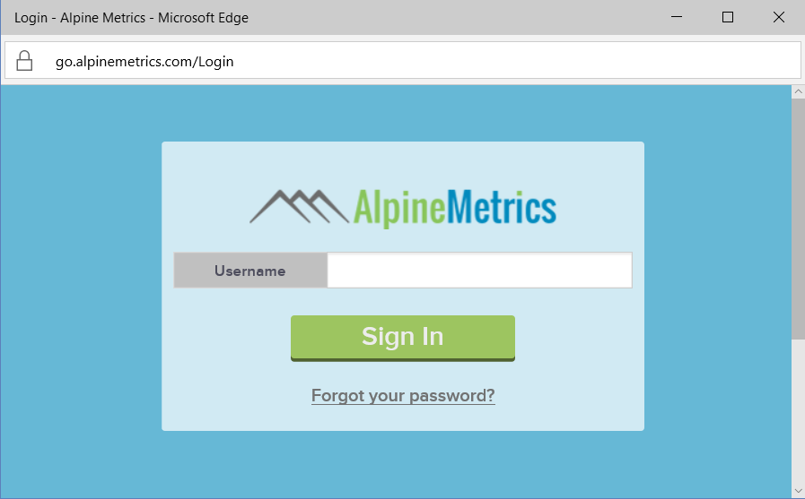

# Connect to Alpine Metrics Sales Predictions with Power BI
Alpine Metrics provides state of the art Predictive Sales Process Optimization in the cloud and on demand for sales organizations large and small. The Alpine Metrics Sales Predictions content pack for Power BI includes metrics such as potential and predicted sales and risks, allowing you deeper insight into the future of your business. 

Connect to the [Alpine Metrics Sales Predictions content pack](https://app.powerbi.com/getdata/services/alpine-metrics) for Power BI.

## How to connect
1. Select Get Data at the bottom of the left navigation pane.  
   
    
2. In the **Services** box, select **Get**.  
   
    
3. Select **AlpineMetrics Sales Predictions**, then select **Get**.  
   
    
4. Select **OAuth 2** and then **Sign In**. When prompted, provide your AlpineMetrics credentials.
   
    
   
    
5. Once connected, a dashboard, report and dataset will automatically be loaded. When completed, the tiles will update with data from your account.
   
    

**What now?**

* Try [asking a question in the Q&A box](consumer/end-user-q-and-a.md) at the top of the dashboard
* [Change the tiles](service-dashboard-edit-tile.md) in the dashboard.
* [Select a tile](consumer/end-user-tiles.md) to open the underlying report.
* While your dataset will be scheduled to refresh daily, you can change the refresh schedule or try refreshing it on demand using **Refresh Now**

## What's included
The content pack includes data from the following tables:  

    - Account    
    - Business    
    - Country    
    - Industry    
    - Opportunity  
    - Person  
    - Prediction    
    - Prediction History    
    - Product  
    - Region    

## System requirements
An Alpine Metrics account with permissions to the above tables is required in order to instantiate this content pack.

## Next steps
[What is Power BI?](power-bi-overview.md)

[Power BI - Basic Concepts](consumer/end-user-basic-concepts.md)

