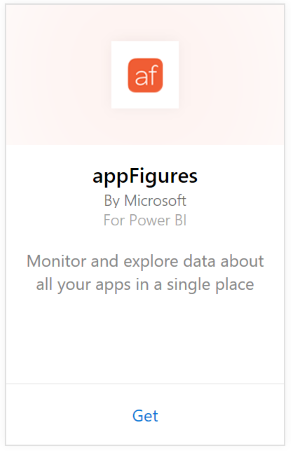

# Connect to appFigures with Power BI
Tracking important statistics about your apps is easy with Power BI and the appFigures content pack. Power BI retrieves your data, including app sales, downloads, and ad statistics, then builds a default dashboard and related reports based on that data.

Connect to the [appFigures content pack](https://app.powerbi.com/getdata/services/appfigures) or read more about the [appFigures integration](https://powerbi.microsoft.com/integrations/appfigures) with Power BI.

## How to connect
1. Select **Get Data** at the bottom of the left navigation pane.
   
   
2. In the **Services** box, select **Get**.
   
   
3. Select **appFigures** \>  **Get**.
   
   
4. For **Authentication Method**, select **oAuth2** \> **Sign In**. When prompted, enter your appFigures credentials and follow the appFigures authentication process.
   
   The first time you connect, Power BI prompts you to allow read-only access to your account. Select **Allow** to begin the import process. This can take a few minutes depending on the volume of data in your account.
   
   
5. After Power BI imports the data you will see a new dashboard, report, and dataset in the left navigation pane. New items are marked with a yellow asterisk \*:
   
    
6. Select the appFigures dashboard. This is the default dashboard that Power BI creates to display your data. You can modify this dashboard to display your data in any way you want.
   
    

**What now?**

* Try [asking a question in the Q&A box](consumer/end-user-q-and-a.md) at the top of the dashboard
* [Change the tiles](service-dashboard-edit-tile.md) in the dashboard.
* [Select a tile](consumer/end-user-tiles.md) to open the underlying report.
* While your dataset will be scheduled to refresh daily, you can change the refresh schedule or try refreshing it on demand using **Refresh Now**

## What's included
The following data is available from appFigures in Power BI.

| **Table Name** | **Description** |
| --- | --- |
| Countries |This table provides country name information. |
| Dates |This table contains dates from today back to the earliest PublishDate of apps that are Active and Visible in your appFigures account. |
| Events |This table contains download, sales, and ad information for each app, by country, on a daily basis. Note that both app and in-app purchase information is all in this single table—you can use the <strong>Type</strong> column to differentiate. |
| Inapps |This table contains data about the different types of In-App Purchases that are associated with Active, Visible apps on your appFigures account. |
| Products |This table contains data about the different apps that are Active and Visible on your appFigures account. |

## Troubleshooting
If data from some of your apps is not showing up in Power BI, check to make sure that those apps are Visible and Active on the **apps** tab of the appFigures site.

## Next steps
* [Get started in Power BI](service-get-started.md)
* [Get data in Power BI](service-get-data.md)

