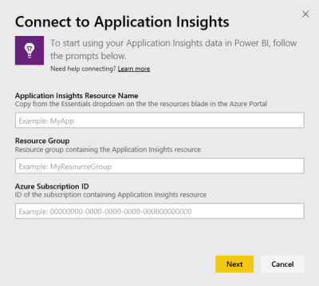
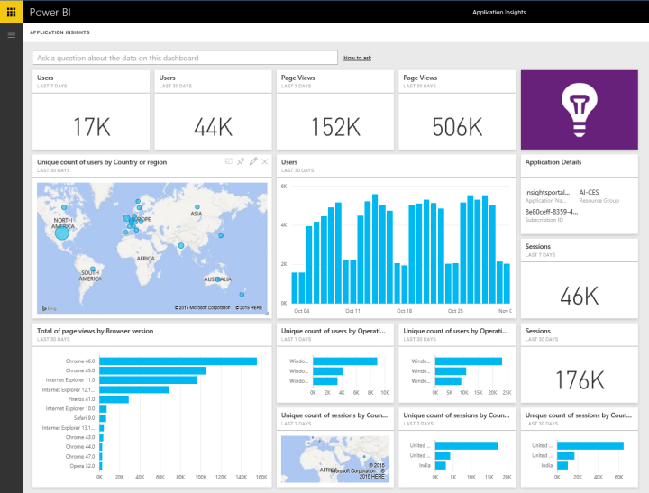

# Connect to Application Insights with Power BI
Use Power BI to create powerful custom dashboards from [Application Insights](/azure/application-insights/app-insights-overview/) telemetry. Envision your app telemetry in new ways. Combine metrics from multiple apps or component services onto one dashboard. This first release of the Power BI content pack for Application Insights includes widgets for common usage-related metrics such as active users, page view, sessions, browser and OS version, and geographic distribution of users in a map.

Connect to the [Application Insights content pack for Power BI](https://app.powerbi.com/getdata/services/application-insights).

>[!NOTE]
>This integration method is now **deprecated**. To learn more about the preferred method of connecting Application Insights to Power BI use the [export analytic query functionality](https://docs.microsoft.com/azure/application-insights/app-insights-export-power-bi#export-analytics-queries).

## How to connect
1. Select **Get Data** at the bottom of the left navigation pane.
   
    
2. In the **Services** box, select **Get**.
   
    
3. Select **Application Insights** > **Get**.
   
    
4. Provide the details of the application you want to connect to, including **Application Insights Resource Name**, **Resource Group**, and **Subscription ID**. See [Finding your Application Insights parameters](#FindingAppInsightsParams) below for more details.
   
        
5. Select **Sign In** and follow the screens to connect.
   
    
6. The import process begins automatically. When complete, a notification is shown and a new dashboard, report, and dataset appear in the Navigation Pane marked with an asterisk.  Select the dashboard to view your imported data.
   
    

**What now?**

* Try [asking a question in the Q&A box](consumer/end-user-q-and-a.md) at the top of the dashboard
* [Change the tiles](service-dashboard-edit-tile.md) in the dashboard.
* [Select a tile](consumer/end-user-tiles.md) to open the underlying report.
* While your dataset will be scheduled to refresh daily, you can change the refresh schedule or try refreshing it on demand using **Refresh Now**

## What's included
The Application Insights content pack includes the following tables and metrics:  

    ´´´
    - ApplicationDetails  
    - UniqueUsersLast7Days   
    - UniqueUsersLast30Days   
    - UniqueUsersDailyLast30Days  
    - UniqueUsersByCountryLast7Days  
    - UniqueUsersByCountryLast30Days   
    - PageViewsDailyLast30Days   
    - SessionsLast7Days   
    - SessionsLast30Days  
    - PageViewsByBrowserVersionDailyLast30Days   
    - UniqueUsersByOperatingSystemLast7Days   
    - UniqueUsersByOperatingSystemLast30Days    
    - SessionsDailyLast30Days   
    - SessionsByCountryLast7Days   
    - SessionsByCountryLast30Days   
    - PageViewsByCountryDailyLast30Days  
    ´´´ 

## Finding parameters
Your Resource Name, Resource Group and Subscription ID can all be found in the Azure Portal. Selecting the Name will open a detailed view and you can use the Essentials drop-down to find all the values you need.

Copy and paste these into the fields into Power BI:

## Next steps
[Get started in Power BI](service-get-started.md)

[Get data in Power BI](service-get-data.md)

