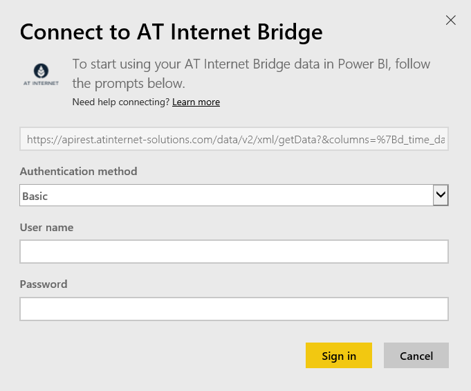

# Connect to AT Internet Bridge with Power BI
AT Internet helps you to extract immediate value from your data using its unified digital analytics platform, the Analytics Suite. The AT Internet Bridge content pack for Power BI includes data around visits, sources, localization and devices for your site.

Connect to the [AT Internet Bridge content pack](https://app.powerbi.com/getdata/services/at-internet-bridge) for Power BI.

## How to connect
1. Select **Get Data** at the bottom of the left navigation pane.
   
    
2. In the **Services** box, select **Get**.
   
    
3. Select **AT Internet Bridge** \> **Get**.
   
   
4. Specify the AT Internet Website Number you'd like to connect to.
   
   
5. Select **Basic** as the Authentication Mechanism, provide your AT Internet username and password, and click **Sign In**.
   
   
6. Click **Connect** to begin the import process. When complete, a new dashboard, report and model will appear in the Navigation Pane. Select the dashboard to view your imported data.
   
    

**What now?**

* Try [asking a question in the Q&A box](consumer/end-user-q-and-a.md) at the top of the dashboard
* [Change the tiles](service-dashboard-edit-tile.md) in the dashboard.
* [Select a tile](consumer/end-user-tiles.md) to open the underlying report.
* While your dataset will be scheduled to refresh daily, you can change the refresh schedule or try refreshing it on demand using **Refresh Now**

## What's included
This content pack contains data from the last 45 days in the following tables:  

    - Conversion  
    - Devices  
    - Localization  
    - Sources  
    - Global Visits  

## Next steps
[What is Power BI?](power-bi-overview.md)

[Power BI - Basic Concepts](consumer/end-user-basic-concepts.md)

