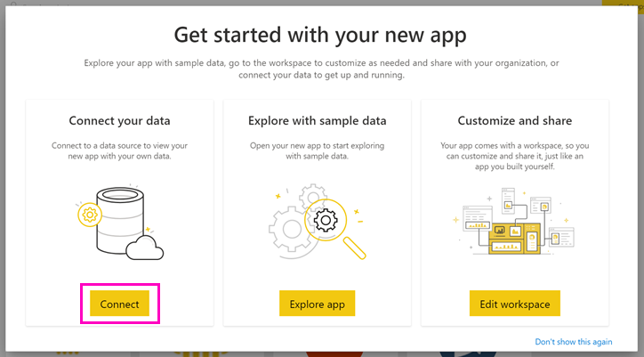

# Connect the Azure Carbon Calculator
The Azure Carbon Calculator provides Microsoft Azure customers with a personalized view into of the estimated carbon footprint of the Azure cloud services they consume. For the first time, our customers can quantify the estimated carbon emissions associated for with a given time period, service, and location.  

The Azure Carbon Dashboard Calculator provides insight into the estimated carbon emissions of consumed cloud services along with an estimate of emissions savings from running the services on Azure instead of their own datacenters. Additionally, customers can explore the [renewable energy projects](https://aka.ms/sustainabilityfundinvestments) that Microsoft has invested in as part of its carbon neutral commitment.

To use this app, you will need information from the Azure Enterprise Portal. Your enterprise’s system administrators may be able to help you obtain this information. Please review these instructions and obtain the required information prior to installing the App. 

This connector version only supports enterprise enrollments from [https://ea.azure.com](https://ea.azure.com/). China enrollments aren't currently supported.

## How to connect
[!INCLUDE [powerbi-service-apps-get-more-apps](./includes/powerbi-service-apps-get-more-apps.md)]

3. Select **Azure Carbon Calculator** \> **Get it now**.
4. In **Install this Power BI App?** select **Install**.
5. In the **Apps** pane, select the **Azure Carbon Calculator** tile.
6. In **Get started with your new app**, select **Connect**.

    

7. Enter the **Company name, User enrollment number,** and **Number of months \> Sign In.** See details on [finding these parameters](https://docs.microsoft.com/power-bi/service-connect-to-github#FindingParams) below.

    

8. For **Authentication method**, select **Key**, and for **Privacy level**, select **Organizational**.
9. For **Key**, enter your **Access key \> Sign In**.

    

10. The import process begins automatically. When complete, a new dashboard, report, and model appear in the **Navigation Pane**. Select the report to view your imported data.

## Finding parameters

To find your company **Enrollment ID** and **Access key**, work with your Azure administrator to get the required information. Your administrator will

1. Log into the [Azure enterprise Portal](https://ea.azure.com), and click on **Manage** on the left-hand ribbon and obtain the **Enrollment Number** as shown below
2. From the [Azure Enterprise Portal](https://ea.azure.com), click on **Reports** and then API Access Key, as shown below to obtain the Primary Enrollment Account Key

## Using the App

To update the parameters at any point, navigate to the **Dataset** settings and access the associated with the app workspace, and update the tenant ID, company name, or months of data. After applying your parameters, click **Refresh** to reload the data with the new parameters applied.