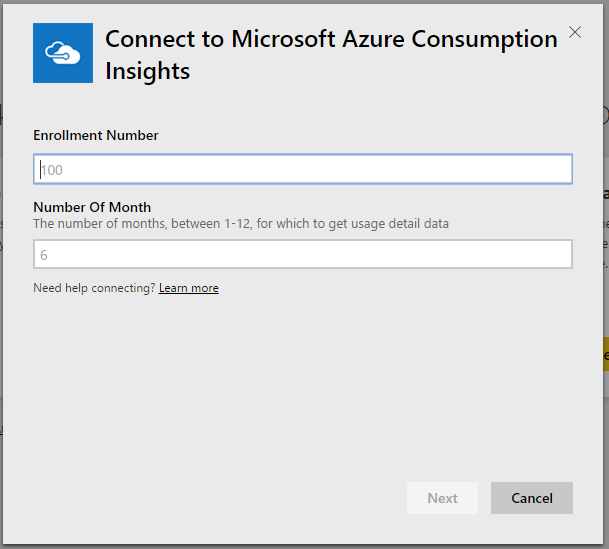

# Connect to Microsoft Azure Consumption Insights with Power BI
Explore and monitor your Microsoft Azure consumption data in the Power BI service with the Power BI content pack. The data is automatically refreshed once a day.

Connect to the [Microsoft Azure Consumption Insights content pack](https://app.powerbi.com/getdata/services/azureconsumption) for the Power BI service.

> [!NOTE]
> For a more customized setup, try using the [Azure Consumption Insights connector](desktop-connect-azure-consumption-insights.md) in Power BI Desktop.

## How to connect
1. In the Power BI service, select **Get Data** at the bottom of the left navigation pane.
   
    
2. In the **Services** box, select **Get**.
   
   
3. Select **Microsoft Azure Consumption Insights** \> **Get it now**. 
   
   
4. Provide the number months of data you want to import and your Azure Enterprise enrollment number. See details on [finding these parameters](#FindingParams) below.
   
    
5. Provide your Access key to connect. You can find your enrollment key in the Azure EA Portal. 
   
    
6. The import process begins automatically. When complete, a new dashboard, report, and model appear in the Navigation Pane. Select the dashboard to view your imported data.
   
   

**What now?**

* Try [asking a question in the Q&A box](consumer/end-user-q-and-a.md) at the top of the dashboard
* [Change the tiles](service-dashboard-edit-tile.md) in the dashboard.
* [Select a tile](consumer/end-user-tiles.md) to open the underlying report.
* While your dataset is scheduled to refresh daily, you can change the refresh schedule or try refreshing it on demand using **Refresh Now**

## What's included
The Microsoft Azure Consumption Insights content pack includes monthly reporting data for the month range you provided when connecting. The range is a moving window, so the dates included are updated as the dataset refreshes.

## System Requirements
The content pack requires access to the Enterprise features within the Azure portal. 

## Finding parameters
Power BI reporting is available for EA Direct, Partner, and Indirect Customers who can view billing information. Read below for details about finding each of the values the connection flow expects.

**Number of Months**

* The number of months (1-36) of data from today you'd like to import.

**Enrollment Number**

* Your Azure Enterprise enrollment number, which you can find at the  [Azure Enterprise Portal](https://ea.azure.com/) home screen under **Enrollment Detail**.
  
    

**Access Key**

* You can find your access key in the Azure Enterprise portal, under **Download Usage** > **API Access Key**.
  
    

**Additional Help**

* For additional help setting up the Azure Enterprise Power BI Pack, sign in to the Azure Enterprise Portal and view the API Help File under **Help**. You can also find additional instructions under **Reports** -> **Download Usage** -> **API Access Key**.
* For a more customized setup, try using the [Azure Consumption Insights connector](desktop-connect-azure-consumption-insights.md) in Power BI Desktop.

## Next steps

[Azure Consumption Insights connector](desktop-connect-azure-consumption-insights.md) in Power BI Desktop

[Get data in Power BI](service-get-data.md)

